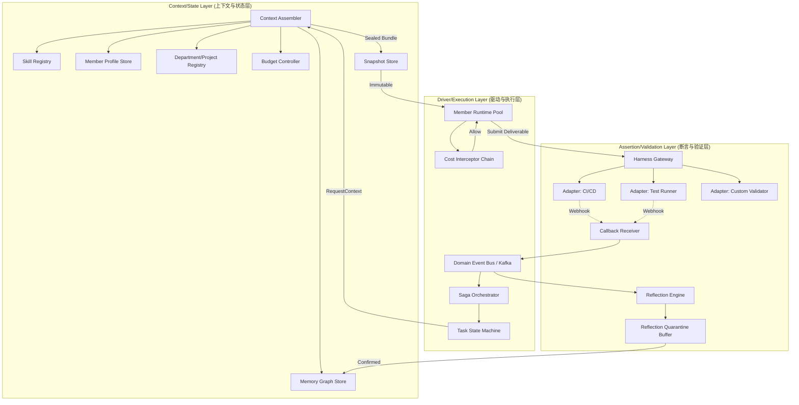
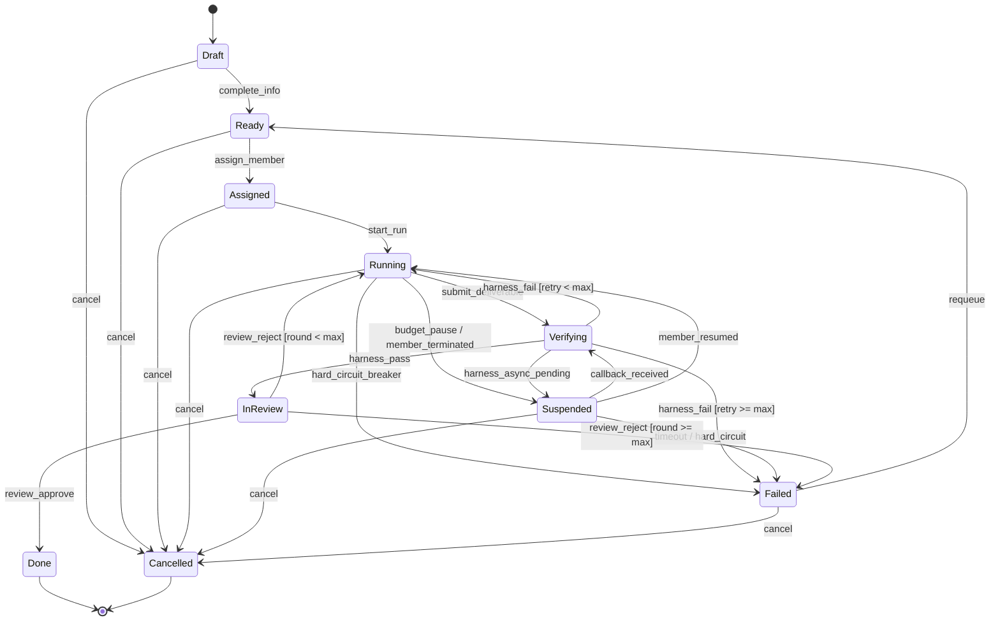

# AITeamOS 高阶系统架构设计与核心技术方案文档 (ADD/TDD)

| 项 | 内容 |
|---|---|
| 文档类型 | Architecture Design Document / Technical Design Document |
| 对应 PRD | `docs/requirements/PRD-core.md` v1.4（Approved 2026-05-26） |
| 适用读者 | 全栈/后端资深工程师、平台 SRE、数据/检索方向工程师、Reviewer |
| 落地用途 | 数据库建表、接口定义、核心引擎代码骨架、混沌测试用例的直接指导 |
| 版本 | v1.4（2026-05-26 第三轮 TRB 防御性评审，修复 3 项 CRITICAL + 5 项 MAJOR 基础设施级缺陷） |

---

## 0. 设计纲领 (Design Charter)

### 0.1 架构哲学

AITeamOS 的本质是**一个经验驱动的认知操作系统**。其架构必须同时承载三种异质性，并把异质性显式建模为协议而不是混入业务代码：

| 异质性 | 表现 | 架构应对 |
|---|---|---|
| 状态异质性 | Memory（有状态、上下文相关） vs Skill（无状态、通用可插拔） | 双引擎分离：Memory 走图+关系混合存储；Skill 走 SPI Registry。二者**绝不在同一聚合内耦合**。 |
| 执行异质性 | AI Member（非确定性，需要验证闭环） vs Human Member（确定性，需要呈现适配） | 同构领域模型 `Member.kind ∈ {ai, human}`；执行差异下沉到 Adapter 层。 |
| 时间异质性 | 同步执行（毫秒级 Skill 调用） vs 异步验证（小时级 Harness 回归） | 显式区分 `Verifying` 同步态与 `Suspended` 异步态；通过 Saga + Durable Timer 解耦执行线程与等待线程。 |

### 0.2 十三条不可妥协的设计纪律

1. **DDD 边界即代码边界**：6 个边界上下文（见 §2.1）对应独立 Python 包，跨包仅通过领域事件 + DTO 通信，**禁止跨包直接 import 仓储**。跨包同步读取通过 Anti-Corruption Layer（ACL）+ 依赖倒置实现。
2. **状态/能力分离**：Memory 与 Skill 永不共表、永不共聚合根。
3. **真理源外置**：Harness 一律以 Adapter 挂载，系统不内建任何业务验证逻辑。
4. **事件驱动 + CQRS**：写路径走 Command + Domain Event；读路径走专用投影（Recall View / Dashboard View / Audit View）。
5. **预算硬约束**：Token / 时长 / 召回上限均在 Interceptor 入口拦截，禁止依赖软提示。
6. **元递归隔离（逻辑+物理双层）**：系统内部管理活动打 `system_meta=true` 标志；存储层通过 DB Trigger 硬性阻断元活动写入 Memory 候选表——应用层过滤与存储层约束互为兜底。
7. **不可变快照 (Immutable Context Snapshot)**：Task 装配阶段产出的 Context Snapshot 一旦写入即只读；反思、归因、回放一律以快照为准。
8. **失败优先 (Fail-Closed)**：任何安全/治理决策的不确定结果默认拒绝；非交互执行场景下 `ask` 一律降级为 `deny`。
9. **补偿优先 (Compensation-First)**：任何可产生副作用的执行（文件系统写入、Git 操作、外部 API 调用）必须在隔离沙箱中进行；硬熔断触发时整体回滚沙箱，**禁止半完成状态进入 Verifying 路径**。
10. **幂等投影 (Idempotent Projection)**：所有 CQRS 读侧投影消费者必须基于全局事件序列号实现条件写（CAS），保证 At-least-once 投递下绝对幂等、绝对不回滚——投影表持有 `source_event_seq` 水位，只进不退。
11. **Saga 补偿链强制 (Mandatory Saga Compensation)**：任何分布式编排 Workflow 必须显式声明 Compensation Activity 栈；正向路径每注册一项资源占用（Member concurrency / Sandbox / Skill bundle / Outbox half-commit），异常或显式 Cancel 时必须由 `compensation_stack.unwind()` 反向释放（见 §3.5）。
12. **基础设施 SPOF 零容忍 (Infra-SPOF Zero-Tolerance)**：Outbox Relay、Webhook Receiver、Sandbox Pool、GC Sweeper 等关键基础设施一律按"分片 + 多实例 + 高水位持久化 + 背压"设计；任何单实例故障不得阻塞业务路径超过 60s（见 §6）。
13. **DB 与编排器状态零分裂 (DB-Saga State Coherence)**：所有具有时效性的 DB 记录（如 `harness_invocation`）的 GC/过期不得直接 DELETE/UPDATE，必须先发布领域事件并由 handler 显式驱动对应 Saga Workflow 转终态——禁止 DB 已"忘记"但 Saga 仍在等的状态分裂（见 §3.3.6）。

---

## 1. 宏观系统拓扑与分层架构 (Macro Architecture)

### 1.1 三层逻辑架构与组件拓扑



### 1.2 三层职责矩阵

| 层 | 关键组件 | 输入 | 输出 | 性能要求 |
|---|---|---|---|---|
| Context/State | Context Assembler, Memory Graph, Skill Registry, Snapshot Store | Task DTO + Member ID | Sealed Context Bundle (immutable) | P95 装配 < 800ms（含 Memory 召回） |
| Driver/Execution | Task State Machine, Saga, Member Runtime, Cost Interceptor | Sealed Bundle + Skill 调用 | Deliverable + Run Trace | Cost Interceptor 拦截开销 < 5ms |
| Assertion/Validation | Harness Gateway, Callback Receiver, Reflection Engine, Quarantine Buffer | Deliverable + Harness Result | ΔMemory 候选 + 反思事件 | 异步回调入站 P99 < 200ms |

### 1.3 端到端数据流：Task 完整生命周期

| 阶段 | 触发者 | 关键操作 | 持久化对象 | 状态迁移 |
|---|---|---|---|---|
| **T0 创建** | PM/TL | `CreateTaskCommand` 落库；发出 `TaskCreated` 事件 | `task` 主表 | → Draft |
| **T1 就绪** | Admin/Member | 信息完备校验 | `task.state=ready` | Draft → Ready |
| **T2 分配** | PM/Auto-Router | 基于 Skill+Memory 匹配度选取 Member；并发上限校验 | `task.assigned_member_id` | Ready → Assigned |
| **T3 装配** | Saga | Context Assembler 调用 Memory 召回 + Skill 解析 + 预算评估，写入不可变 Context Snapshot | `task_context_snapshot` | Assigned → Running |
| **T4 执行** | Member Runtime | 装载 Skill+Memory Bundle，调度执行节点；Cost Interceptor 全程计量 | `task_run`, `run_event` | Running |
| **T5 提交** | Member | 提交 Deliverable（PR 链接 / 文档 URI / 设计稿 URI），触发 `DeliverableSubmitted` | `task_deliverable` | Running → Verifying |
| **T6a 同步验证** | Harness Gateway (规范级/功能级) | 路由到对应 Adapter；同步返回 Pass/Fail | `harness_invocation` | Verifying → InReview \| Running |
| **T6b 异步验证** | Harness Gateway (系统级) | Adapter 返回 `ticket=pending`；Saga 注册 Callback 等待 | `harness_invocation.async=true` | Verifying → Suspended |
| **T7 回调入站** | Callback Receiver | 接收 Webhook（HMAC 校验 + 幂等）；归一化为 `HarnessResult` 事件 | `harness_result` | Suspended → Verifying → InReview \| Running |
| **T8 审核** | Reviewer | 结构化 Review（decision + reason + correction） | `review_case` | InReview → Done \| Running \| Failed |
| **T9 反思** | Reflection Engine | 基于 (Snapshot + Run + Result + Diff) 抽取 Memory 候选；通过 Quarantine 后入审核队列 | `memory_candidate` | — |
| **T10 入库/演进** | Memory Reviewer | 高置信度自动入库；其余排队人审 | `memory_node`, `memory_edge`, `memory_version` | — |

### 1.4 关键设计不变量

- **不变量 N1（快照不可变）**：T3 产出的 `task_context_snapshot` 一旦持久化，即对所有后续阶段（T4~T10）只读。**反思阶段任何 Memory 召回必须读取该快照而非实时图**——否则 Memory 漂移会产生伪关联。
- **不变量 N2（事件单调）**：`run_event.seq` 在同一 `run_id` 内严格单调递增；Reflection Engine 仅消费 `seq` 已封口（Run 结束）的流。
- **不变量 N3（回调幂等）**：Webhook 回调以 `(adapter_id, invocation_id)` 为幂等键（PostgreSQL `webhook_inbox` UNIQUE 约束）；任何重复投递都是 no-op。
- **不变量 N4（反思隔离）**：`provenance.kind ∈ {memory_review, retention_sweep, governance_audit, system_check}` 的事件**永不进入** Reflection Engine 的输入流。存储层 DB Trigger 为最终兜底。
- **不变量 N5（沙箱原子性）**：执行沙箱 `state` 只能从 `active` 单向转为 `merged` 或 `destroyed`。非 `merged` 状态的沙箱产出不得进入 `submit_deliverable` 路径。
- **不变量 N6（投影只进不退）**：所有投影消费者的 `source_event_seq` 只允许递增，不允许回滚（CAS 写入）。
- **不变量 N7（资源补偿闭环）**：每一次 Saga Workflow 占用的资源（Member concurrency、Sandbox、Skill bundle、Outbox half-commit）都必须被压入补偿栈；Workflow 终态（`Done`/`Failed`/`Cancelled`）可达时补偿栈必须为空，含残留项即判定资源泄漏（见 §3.5）。
- **不变量 N8（DB 与 Saga 状态一致）**：任何可过期的 DB 记录与其关联的 Saga Workflow 必须同生同终；DB 过期不得先于 Saga 终态被达成（见 §3.3.6）。

### 1.5 物理部署拓扑（参考实现）

```
┌──────────────────────────────────────────────────────────────────┐
│                   API Gateway (FastAPI + OAuth2)                 │
└────────┬──────────────────┬──────────────────┬──────────────────┘
         │                  │                  │
   ┌─────▼─────┐     ┌──────▼──────┐    ┌──────▼──────┐
   │ Read API  │     │ Command API │    │ Webhook API │
   │ (CQRS R)  │     │ (CQRS W)    │    │ (Callback)  │
   └─────┬─────┘     └──────┬──────┘    └──────┬──────┘
         │                  │                  │
         │             ┌────▼─────────────────▼────┐
         │             │  Domain Event Bus (Kafka) │
         │             └────┬─────────────────┬────┘
         │                  │                 │
   ┌─────▼─────┐     ┌──────▼──────┐    ┌─────▼──────┐
   │ Read Side │     │ Saga Engine │    │ Reflection │
   │ Projector │     │ (Temporal)  │    │  Engine    │
   └─────┬─────┘     └──────┬──────┘    └─────┬──────┘
         │                  │                 │
         └─────────┬────────┴────────┬────────┘
                   │                 │
        ┌──────────▼─────┐    ┌──────▼─────────┐
        │ PostgreSQL +   │    │ Neo4j / AGE    │
        │ pgvector       │    │ (Memory Graph) │
        └────────────────┘    └────────────────┘
```

> **部署原则**：Read API 与 Command API 分进程部署，避免长查询拖慢写入；Saga Engine 与 Reflection Engine 独立扩缩容，以应对异步验证的潮汐流量。

---

## 2. 核心领域模型与数据引擎设计 (Domain Modeling & Storage Strategy)

### 2.1 边界上下文（Bounded Context）划分

按 DDD，AITeamOS 划分为 **6 个边界上下文**，每个上下文独立演进，跨上下文通过领域事件 + DTO 通信，同步读取通过 ACL + 依赖倒置：

| Bounded Context | 核心聚合根 | Python 包路径 | 唯一职责 |
|---|---|---|---|
| **Knowledge Context** | `MemoryNode` | `packages/knowledge/` | Memory 提炼、关系图、置信度演进、生命周期 |
| **Capability Context** | `Skill` | `packages/capability/` | Skill 注册、版本、加载、健康度、熔断 |
| **Workforce Context** | `Member`, `Department` | `packages/workforce/` | Member、组织归属、Profile、能力衰减 |
| **Execution Context** | `Task` | `packages/execution/` | Task 状态机、Run、Deliverable、依赖 |
| **Validation Context** | `HarnessAdapter`, `HarnessInvocation` | `packages/validation/` | 验证适配、回调、结果归一、Flaky 检测 |
| **Governance Context** | `ReviewCase`, `ConflictCase` | `packages/governance/` | 审核流程、冲突仲裁、归因度量、防循环 |

**跨上下文契约**（节选）：

```
Execution → Knowledge: TaskCompleted(task_id, run_id, snapshot_id, outcome) [Domain Event]
Validation → Execution: HarnessResultReceived(invocation_id, outcome, evidence_ref)
Knowledge → Workforce: MemoryAssignedToMember(member_id, memory_id, scope)
Governance → Knowledge: ConflictResolved(loser_id, winner_id, resolution_kind)
```

**跨上下文事件版本化契约**：

所有跨上下文领域事件必须继承版本化基类，保证独立演进能力：

```python
class VersionedDomainEvent(BaseModel):
    """Cross-context 事件强制基类"""
    event_type: str                       # e.g. 'task.completed'
    event_version: int                    # SemVer major，破坏性变更必须升版本
    correlation_id: UUID                  # 全链路追踪
    timestamp: datetime
    global_seq: int                       # Outbox 全局序列号

    class Config:
        extra = 'ignore'                  # ★ 未知字段静默忽略（向前兼容）


class TaskCompleted(VersionedDomainEvent):
    event_type: Literal['task.completed'] = 'task.completed'
    event_version: Literal[1] = 1
    task_id: TaskId
    run_id: RunId
    snapshot_id: UUID
    outcome: TaskOutcome
    cost_summary: CostSummary | None = None  # v2 新增字段（optional，不破坏 v1 消费者）
```

**版本化规则**：
- 新增可选字段：同版本号，消费者 `extra='ignore'` 自动兼容
- 删除字段 / 类型变更 / 语义变更：必须升 `event_version`，旧消费者通过版本分派器处理
- Kafka Schema Registry 集成：生产者注册 Schema，不兼容变更被 Registry 拒绝

### 2.2 领域模型详解

#### 2.2.1 Knowledge Context

```python
# === 聚合根 1: MemoryNode ===
class MemoryNode:
    id: MemoryId                            # Identity
    tier: Tier                              # VO: Facts | Patterns | Principles
    scope: Scope                            # VO: Project | TechStack | Department | Global
    title: str
    content: MemoryContent                  # VO: { statement, applicable_when, counter_example }
    confidence: Confidence                  # VO: { value, state, last_updated }
    provenance: Provenance                  # VO: { source_kind, task_id, run_id, member_id, system_meta }
    lifecycle: LifecycleState               # VO: candidate | active | stale | needs_verify | deprecated | archived | quarantined
    versions: list[MemoryVersion]           # 实体（聚合内）
    created_at: datetime
    last_used_at: datetime | None
    expire_at: datetime | None

# === 聚合根 2: MemoryEdge（独立聚合，v1.3 拆分） ===
# ★ 设计理由：热门 Memory（如编码规范）可有 500+ 入边。若 Edge 归属 Node 聚合，
#   每次 lock_for_update 需反序列化全部边 → OOM + 长事务锁竞争。
#   拆分后 Edge CRUD 不需要锁定 Node 聚合，写性能提升 10x+。
class MemoryEdge:
    edge_id: UUID                           # ★ 独立 Identity，独立聚合根
    source_id: MemoryId                     # 引用 MemoryNode ID（跨聚合）
    target_id: MemoryId                     # 引用 MemoryNode ID（跨聚合）
    relation_type: RelationType             # VO: Causal | Depends | Derived | Conflicts
    weight: Decimal
    created_by: MemberId
    created_at: datetime

# === 实体（MemoryNode 聚合内） ===
class MemoryVersion:
    version_no: int
    diff: dict
    reason: str
    author_member_id: MemberId
    created_at: datetime

# === 值对象 ===
@dataclass(frozen=True)
class Confidence:
    value: Decimal                          # 0.000 ~ 1.000
    state: ConfidenceState                  # valid | needs_verify | deprecated | conflicting | quarantined
    last_updated: datetime
    last_decay_at: datetime

@dataclass(frozen=True)
class Provenance:
    source_kind: SourceKind                 # task_execution | harness_debug | review | manual_input | bulk_import
    task_id: TaskId | None
    run_id: RunId | None
    member_id: MemberId | None
    system_meta: bool                       # ★ True 即被 Reflection Engine 硬性排除
```

**MemoryNode 不变量**：

- I-K-1：`confidence.value ∈ [0, 1]`，禁止外部直接 set，必须通过 `ConfidenceAdjustmentService`。
- I-K-2：`tier=Facts` 的 `confidence` 不参与时间衰减（`λ=0`），仅由级联失效驱动。
- I-K-3：`lifecycle=quarantined` 时，**召回路径必须屏蔽该节点**，但分配/查询/审计仍可见。
- I-K-4：`MemoryNode` 聚合边界**不含** `MemoryEdge`——Edge 为独立聚合根，通过 `source_id`/`target_id` 跨聚合引用。
- I-K-5：Edge 的 CRUD 操作**不需要**锁定 source/target MemoryNode 聚合——彻底消除热门节点的锁竞争。

#### 2.2.2 Capability Context

```python
class Skill:
    id: SkillId
    name: str
    version: SemVer                         # VO
    manifest: SkillManifest                 # VO: { input_schema, output_schema, side_effects, required_permissions }
    status: SkillStatus                     # VO: draft | published | recalibrating | deprecated | cancelled
    health: SkillHealth                     # VO: { success_rate, recent_failures, circuit_state }
    owner_member_id: MemberId
    created_at: datetime

@dataclass(frozen=True)
class SkillManifest:
    input_schema: dict                      # JSON Schema
    output_schema: dict                     # JSON Schema
    side_effects: list[SideEffect]          # VO: { resource_kind, resource_pattern, mutation_kind }
    required_permissions: list[str]
    cost_estimate: CostEstimate | None
```

**Skill 不变量**：

- I-C-1：`Skill` 一旦 `published`，`manifest.input_schema/output_schema` 只能向后兼容地变更（新增可选字段），破坏性变更必须升 major 版本号。
- I-C-2：Run 启动时绑定 Skill 的具体版本；Run 生命周期内 Skill 升级不影响该 Run。
- I-C-3：`circuit_state=open`（熔断）时，`status` 自动转 `recalibrating`，禁止自动分配。

#### 2.2.3 Workforce Context

```python
class Member:
    id: MemberId
    kind: MemberKind                        # ai | human
    department_id: DepartmentId             # 组织归属（必须）
    profile: MemberProfile
    base_skill_set: list[SkillId]           # 角色身份 Skill（持久）
    assigned_memories: list[MemoryId]       # 软性偏好分配
    health: MemberHealthMetrics
    concurrency_limit: int                  # AI 受执行节点约束；Human 受时间约束

class Department:
    id: DepartmentId
    name: str
    leader_member_id: MemberId | None
    backup_leader_member_id: MemberId | None  # 应对负责人不可用
```

#### 2.2.4 Execution Context

```python
class Task:
    id: TaskId                              # 时间戳格式 TASK-YYYYMMDDTHHMMSSmmm-XXXX (4位随机后缀防毫秒碰撞)
    department_id: DepartmentId             # 必须
    project_ids: list[ProjectId]            # 0..N
    parent_task_id: TaskId | None
    state: TaskState                        # 状态机见 §3
    priority: Priority                      # P0 | P1 | P2 | P3
    deliverable_spec: DeliverableSpec       # VO
    declared_skills: list[SkillId]
    declared_memory_hints: list[MemoryId]
    budget: TaskBudget                      # VO（见 §3.3）
    runs: list[TaskRun]                     # 实体
    dependencies: list[TaskDependency]
    retry_count: int
    review_round: int

class TaskRun:                              # 实体（属于 Task 聚合）
    run_id: RunId
    task_id: TaskId
    member_id: MemberId
    snapshot_id: SnapshotId                 # ★ 不可变快照引用
    state: RunState
    started_at: datetime
    finished_at: datetime | None
    cost: CostAccrued                       # 累计成本
    events: list[RunEventRef]               # 仅引用，事件本体在 Kafka + Object Storage
```

#### 2.2.5 Validation Context

```python
class HarnessAdapter:                       # 配置型聚合根
    id: AdapterId
    tier: HarnessTier                       # spec | functional | system
    protocol: ProtocolKind                  # sync | async
    endpoint: str
    auth_secret_ref: str                    # EnvVar 引用，不存值
    health: AdapterHealth

class HarnessInvocation:                    # 运行时聚合根
    id: InvocationId
    adapter_id: AdapterId
    run_id: RunId
    deliverable_ref: str
    state: InvocationState                  # pending | done | timeout | flaky | adapter_error
    callback_token: str                     # 幂等键
    triggered_at: datetime
    completed_at: datetime | None
    result: HarnessResult | None
```

#### 2.2.6 Governance Context

```python
class ReviewCase:
    id: ReviewId
    target_kind: ReviewTargetKind           # task_deliverable | memory_candidate | memory_modification
    target_id: UUID
    reviewer_member_id: MemberId
    verdict: Verdict | None                 # approve | reject | merge | revise
    reason: str | None
    correction: str | None
    decision_at: datetime | None

class ConflictCase:
    id: ConflictId
    memory_a_id: MemoryId
    memory_b_id: MemoryId
    conflict_kind: ConflictKind             # semantic | scope | temporal
    detected_by: DetectorKind               # auto_admission | periodic_scan | recall_collision
    resolution: Resolution | None
```

### 2.3 混合存储矩阵 (Hybrid Storage Strategy)

| 数据类别 | 存储引擎 | 选型理由 | 一致性语义 |
|---|---|---|---|
| Memory 节点属性、版本、生命周期 | **PostgreSQL** | 强事务、JSONB 灵活、版本表标准化 | 强一致 |
| Memory 关系拓扑（边） | **Neo4j 或 Apache AGE** | 多跳遍历（级联失效 BFS）；关系类型丰富 | 最终一致（CDC 投影，幂等写入） |
| Memory 语义召回 | **pgvector (HNSW 索引)** | Embedding 向量检索 P95 < 200ms；HNSW 支持增量插入无需全量重建 | 最终一致（增量索引） |
| Task / TaskRun / Deliverable | **PostgreSQL** | 状态机一致性、Saga 协调 | 强一致 |
| Domain Events / Run Event Stream | **Kafka + Postgres Outbox** | 顺序保障 + Replay；按 `entity_id` 分区保序 | At-least-once |
| Context Snapshot（不可变） | **S3 兼容对象存储** | 体积大、追加写、利于归档 | 强一致（PUT 后只读） |
| Skill Registry | **PostgreSQL + Filesystem (manifest)** | 元数据 + 包体分离 | 强一致 |
| 投影水位 / 幂等控制 | **PostgreSQL (`projection_watermark`)** | 每个消费端独立高水位，防乱序与重复 | 强一致 |
| Webhook 入站幂等 | **PostgreSQL (`webhook_inbox`)** | UNIQUE 约束 + Outbox 同事务原子写 | 强一致 |
| Dashboard 健康度指标 | **ClickHouse / TimescaleDB** | OLAP 聚合、时序压缩 | 最终一致 |
| Saga Workflow State | **Temporal / Cadence DB** | Durable Timer、Signal 原语 | 强一致 |

**关键写路径**：

```
Command → PostgreSQL 主聚合落库 (TX1)
        → Outbox 表写入 Domain Event (TX1, 同事务, 携带 global_seq)
        → Outbox Relay 进程 → Kafka (At-least-once, partition_key=entity_id)
        → Kafka Consumer (IdempotentProjectionConsumer):
            ├─ 投影到 pgvector (Embedding HNSW 增量插入, CAS by source_event_seq)
            ├─ 投影到 Neo4j/AGE (图拓扑, MERGE 语义幂等)
            ├─ 投影到 ClickHouse (健康度)
            └─ 触发 Saga (异步流程)
```

**幂等投影消费者基类**：

```python
class IdempotentProjectionConsumer:
    """所有投影消费者的强制基类（纪律 #10）"""

    async def process(self, event: DomainEvent):
        # 幂等检查：事件序列号必须严格递增
        watermark = await self.repo.get_watermark(self.consumer_id)
        if event.global_seq <= watermark.last_seq:
            self.metrics.count('duplicate_event_skipped')
            return  # 静默丢弃重复事件

        # 条件写（CAS）——子类实现
        await self._apply(event)
        # 推进水位
        await self.repo.advance_watermark(self.consumer_id, event.id, event.global_seq)

    @abstractmethod
    async def _apply(self, event: DomainEvent) -> None:
        ...
```

**pgvector 投影实现（防回滚写）**：

```python
class PgvectorProjection(IdempotentProjectionConsumer):
    async def _apply(self, event: MemoryNodeUpdated):
        await self.conn.execute("""
            INSERT INTO memory_embedding (memory_id, embedding, model_version, source_event_seq, created_at)
            VALUES ($1, $2, $3, $4, now())
            ON CONFLICT (memory_id) DO UPDATE
            SET embedding = EXCLUDED.embedding,
                model_version = EXCLUDED.model_version,
                source_event_seq = EXCLUDED.source_event_seq
            WHERE memory_embedding.source_event_seq < EXCLUDED.source_event_seq
        """, event.memory_id, event.embedding, event.model_version, event.global_seq)
```

> **Kafka 分区策略强制约束**：按 `memory_id`/`task_id` 做 Partition Key，保证同一实体的事件在单分区内有序。

> Outbox Pattern 是底线：保证主聚合事务与领域事件的原子性，避免双写不一致。

### 2.4 Memory 分层存储 DDL（PostgreSQL 主表）

```sql
-- Memory 节点主表（聚合根）
CREATE TABLE memory_node (
    id                  UUID PRIMARY KEY,
    tier                VARCHAR(16) NOT NULL CHECK (tier IN ('facts','patterns','principles')),
    scope_kind          VARCHAR(16) NOT NULL CHECK (scope_kind IN ('project','tech_stack','department','global')),
    scope_ref           UUID,                       -- 指向具体 project/dept/null
    title               TEXT NOT NULL,
    content             JSONB NOT NULL,             -- {statement, applicable_when, counter_example, tags}
    confidence_value    NUMERIC(4,3) NOT NULL DEFAULT 0.500,
    confidence_state    VARCHAR(20) NOT NULL DEFAULT 'needs_verify',
    last_decay_at       TIMESTAMPTZ NOT NULL DEFAULT now(),
    lifecycle_state     VARCHAR(20) NOT NULL DEFAULT 'candidate',
    provenance          JSONB NOT NULL,             -- {source_kind, task_id, run_id, member_id, system_meta}
    current_version     INT NOT NULL DEFAULT 1,
    created_at          TIMESTAMPTZ NOT NULL DEFAULT now(),
    last_used_at        TIMESTAMPTZ,
    expire_at           TIMESTAMPTZ,
    CHECK (confidence_value >= 0 AND confidence_value <= 1)
);
CREATE INDEX idx_memory_node_tier_scope ON memory_node(tier, scope_kind, scope_ref);
CREATE INDEX idx_memory_node_lifecycle ON memory_node(lifecycle_state) WHERE lifecycle_state IN ('active','needs_verify');
CREATE INDEX idx_memory_node_provenance_meta ON memory_node((provenance->>'system_meta'));

-- Memory 版本表
CREATE TABLE memory_version (
    id                  UUID PRIMARY KEY,
    memory_id           UUID NOT NULL REFERENCES memory_node(id),
    version_no          INT NOT NULL,
    diff                JSONB NOT NULL,
    reason              TEXT NOT NULL,
    author_member_id    UUID NOT NULL,
    created_at          TIMESTAMPTZ NOT NULL DEFAULT now(),
    UNIQUE (memory_id, version_no)
);

-- Memory 关系边表（同时投影到图库）
CREATE TABLE memory_edge (
    id                  UUID PRIMARY KEY,
    source_id           UUID NOT NULL REFERENCES memory_node(id),
    target_id           UUID NOT NULL REFERENCES memory_node(id),
    relation_type       VARCHAR(16) NOT NULL CHECK (relation_type IN ('causal','depends','derived','conflicts')),
    weight              NUMERIC(4,3),
    created_by          UUID NOT NULL,
    created_at          TIMESTAMPTZ NOT NULL DEFAULT now(),
    UNIQUE (source_id, target_id, relation_type)
);
CREATE INDEX idx_memory_edge_source ON memory_edge(source_id);
CREATE INDEX idx_memory_edge_target ON memory_edge(target_id);

-- 向量索引（pgvector + HNSW，支持增量插入，无需全量重建）
CREATE TABLE memory_embedding (
    memory_id           UUID PRIMARY KEY REFERENCES memory_node(id),
    embedding           vector(1536) NOT NULL,
    model_version       VARCHAR(64) NOT NULL,
    source_event_seq    BIGINT NOT NULL DEFAULT 0,   -- 幂等投影水位，防乱序回滚
    created_at          TIMESTAMPTZ NOT NULL DEFAULT now()
);
CREATE INDEX idx_memory_embedding_hnsw ON memory_embedding
    USING hnsw (embedding vector_cosine_ops) WITH (m=16, ef_construction=64);
-- HNSW 优势：INSERT 自动维护索引、无需 REINDEX、查询精度优于 IVFFlat

-- Memory 反馈（驱动置信度演进）
CREATE TABLE memory_feedback (
    id                  UUID PRIMARY KEY,
    memory_id           UUID NOT NULL REFERENCES memory_node(id),
    task_run_id         UUID NOT NULL,
    outcome             VARCHAR(16) NOT NULL CHECK (outcome IN ('positive','negative','neutral')),
    delta               NUMERIC(4,3) NOT NULL,
    reviewer_member_id  UUID,                        -- 仅 human_approval 才计入正向
    occurred_at         TIMESTAMPTZ NOT NULL DEFAULT now(),
    is_system_meta      BOOLEAN NOT NULL DEFAULT FALSE  -- 元递归隔离
);

-- Memory 召回审计（防循环 + 归因）
CREATE TABLE memory_recall_log (
    id                  UUID PRIMARY KEY,
    snapshot_id         UUID NOT NULL,               -- 关联到不可变快照
    memory_id           UUID NOT NULL,
    task_run_id         UUID NOT NULL,
    rank                INT NOT NULL,
    score               NUMERIC(6,4) NOT NULL,
    used_in_decision    BOOLEAN,                     -- 反思阶段回填
    occurred_at         TIMESTAMPTZ NOT NULL DEFAULT now()
);

-- 冲突案例
CREATE TABLE conflict_case (
    id                  UUID PRIMARY KEY,
    memory_a_id         UUID NOT NULL REFERENCES memory_node(id),
    memory_b_id         UUID NOT NULL REFERENCES memory_node(id),
    conflict_kind       VARCHAR(20) NOT NULL,
    detected_by         VARCHAR(20) NOT NULL,
    resolution_kind     VARCHAR(20),
    winner_id           UUID,
    resolved_by         UUID,
    detected_at         TIMESTAMPTZ NOT NULL DEFAULT now(),
    resolved_at         TIMESTAMPTZ
);

-- 投影水位表（幂等投影消费者强制使用，纪律 #10）
CREATE TABLE projection_watermark (
    consumer_id     VARCHAR(64) PRIMARY KEY,   -- 'neo4j_graph', 'pgvector_embedding', 'clickhouse_metrics'
    last_event_id   UUID NOT NULL,
    last_seq        BIGINT NOT NULL,           -- Outbox 全局序列号
    processed_at    TIMESTAMPTZ NOT NULL DEFAULT now()
);

-- Webhook 入站幂等表（替代 Redis SET NX，保证与 Outbox 原子性）
CREATE TABLE webhook_inbox (
    adapter_id      VARCHAR(64) NOT NULL,
    invocation_id   VARCHAR(128) NOT NULL,
    payload         JSONB NOT NULL,
    received_at     TIMESTAMPTZ NOT NULL DEFAULT now(),
    PRIMARY KEY (adapter_id, invocation_id)    -- UNIQUE 约束做幂等性保障
);
```

**写一致性策略**：

- `memory_node` 与 `memory_edge` 在同一 PostgreSQL 事务中写入，发出 `MemoryNodeUpdated`/`MemoryEdgeAdded` 领域事件到 Outbox（携带 `global_seq`）。
- Outbox Relay 将事件流投递到 Kafka（partition_key=memory_id），各投影消费者继承 `IdempotentProjectionConsumer`：
  1. **Neo4j/AGE**：`MERGE` 语义写入图拓扑视图（幂等，仅承担多跳遍历，不作真理源）
  2. **pgvector**：增量插入 HNSW 索引（CAS by `source_event_seq`，只进不退）
  3. **ClickHouse**：聚合健康度指标

### 2.5 Memory 召回引擎（CQRS 读侧）

> **跨上下文访问约束**：Recall Engine 位于 Knowledge Context 内部，但被 Execution Context 的 `ContextAssembler` 通过 Anti-Corruption Layer（`KnowledgeACL`）调用。ACL 接口定义在 Execution 包内，实现注入在 Composition Root——不违反纪律 #1。

> **装配一致性保证**：整个召回过程在 `REPEATABLE READ` 事务隔离级别下执行，保证同一次装配内所有读取看到一致快照，避免 Memory 并发修改导致快照内部不一致。

```python
class MemoryRecallEngine:
    """
    读路径：根据 Task 上下文召回 Memory，受 Token 预算约束。
    强制约束：调用方必须在 REPEATABLE READ 事务内调用 recall()。
    """
    def recall(self, ctx: TaskContext, budget: RecallBudget) -> RecallResult:
        # Stage 1: 候选生成（多通道并行）
        c_assigned = self._fetch_assigned(ctx.member_id)         # 软性偏好
        c_scope    = self._fetch_by_scope(ctx.project_ids, ctx.dept_id)
        c_vector   = self._fetch_vector_topk(ctx.embedding, k=200)
        c_graph    = self._fetch_graph_neighbors(c_scope, depth=2)

        # Stage 2: 过滤（隔离区屏蔽 + 冲突屏蔽）
        candidates = (c_assigned | c_scope | c_vector | c_graph)
        candidates = [m for m in candidates
                      if m.lifecycle_state not in ('quarantined', 'deprecated', 'archived')]
        candidates = self._mask_unresolved_conflicts(candidates)

        # Stage 3: 排序（综合 confidence + 相关性 + 分配权重 + 新鲜度）
        ranked = self._rank(candidates, ctx)

        # Stage 4: 预算裁剪（Token 上限）
        selected = self._truncate_to_budget(ranked, budget.max_recall_tokens)

        # Stage 5: 冲突标注（同 Topic 但矛盾的 Memory 显式呈现）
        annotated = self._annotate_conflicts(selected)

        # Stage 6: 写入召回审计（用于反思阶段归因）
        self._log_recall(ctx.snapshot_id, annotated)

        return RecallResult(memories=annotated, total_tokens=sum(m.tokens for m in annotated))
```

**召回通道容错与降级策略**：

单通道故障（如 Neo4j 网络抖动）不应阻塞整个召回路径。每个通道独立超时，超时或异常的通道被降级（结果集为空），其余通道结果继续流入排序。设计约束：**任何单通道失败不得导致 recall 报错，仅降低召回质量。**

```python
class RecallChannelOrchestrator:
    """召回通道编排器：每通道独立超时，超时降级而非失败"""
    CHANNEL_TIMEOUTS = {
        'assigned':    timedelta(milliseconds=100),   # PostgreSQL 直查，应极快
        'scope':       timedelta(milliseconds=200),
        'vector':      timedelta(milliseconds=300),   # pgvector HNSW ANN
        'graph':       timedelta(milliseconds=500),   # Neo4j 多跳，允许最长
    }
    TOTAL_DEADLINE = timedelta(milliseconds=700)       # 装配 SLA 800ms 中留 100ms 给排序+裁剪

    async def fetch_all_channels(self, ctx: TaskContext) -> set[MemoryId]:
        tasks = {
            asyncio.create_task(
                asyncio.wait_for(coro, timeout=self.CHANNEL_TIMEOUTS[name].total_seconds()),
                name=name
            )
            for name, coro in {
                'assigned': self._fetch_assigned(ctx.member_id),
                'scope':    self._fetch_by_scope(ctx.project_ids, ctx.dept_id),
                'vector':   self._fetch_vector_topk(ctx.embedding, k=200),
                'graph':    self._fetch_graph_neighbors(ctx, depth=2),
            }.items()
        }
        done, pending = await asyncio.wait(
            tasks,
            timeout=self.TOTAL_DEADLINE.total_seconds(),
            return_when=asyncio.ALL_COMPLETED,
        )
        candidates = set()
        for task in done:
            try:
                candidates |= task.result()
            except (asyncio.TimeoutError, Exception) as e:
                # 降级：该通道结果为空，不影响整体流程
                self.metrics.count(f'recall_channel_degraded.{task.get_name()}')
                self.metrics.record(f'recall_channel_error.{task.get_name()}', str(e))
        for task in pending:
            task.cancel()
            self.metrics.count(f'recall_channel_timeout.{task.get_name()}')
        return candidates
```

**降级影响矩阵**：

| 降级通道 | 影响 | 是否可接受 |
|---|---|---|
| assigned | 丢失显式分配的 Memory | 可接受（scope/vector 会补充） |
| scope | 丢失作用域匹配 | 可接受（vector 会补充） |
| vector | 丢失语义相似候选 | 可接受（scope/graph 会补充） |
| graph | 丢失图关系节点 | 可接受（最低权重 0.10 freshness） |
| 全部降级 | 召回为空 | 不可接受 → 记录告警，但不阻塞 Task 执行 |

**召回排序公式**（确定性优先于相似度，避免向量噪声主导）：

```
score(m) = 0.30 · σ(assigned_weight)            # 显式分配
        + 0.25 · σ(confidence)                  # 置信度
        + 0.20 · σ(1 - cos_distance(q, m))      # 语义相似度
        + 0.15 · σ(scope_match_score)           # 作用域匹配（项目级 > 技术栈级 > 部门级 > 通用级）
        + 0.10 · σ(freshness)                   # 新鲜度衰减

where σ = min-max normalize within candidate set
```

### 2.6 置信度动态衰减（Confidence Decay）

**数学模型**（统一的 4 因子方程）：

$$C_{t+\Delta t} = \text{clamp}\left(\, C_t \cdot e^{-\lambda_{\text{tier}} \cdot \Delta t} \;+\; \alpha \cdot F_{\text{pos}} \;-\; \beta \cdot F_{\text{neg}}, \; 0, \; 1\right)$$

| 参数 | Facts | Patterns | Principles |
|---|---|---|---|
| $\lambda$ (半衰期) | 0（不衰减，仅级联失效驱动） | 1/180d | 1/365d |
| $\alpha$ (正反馈系数) | 0.05 | 0.08 | 0.05 |
| $\beta$ (负反馈系数) | 0.20 | 0.15 | 0.10 |

**触发器实现**（双通道）：

```python
class ConfidenceAdjustmentService:

    # 通道 1：实时事件驱动（Memory 反馈写入即触发）
    @event_handler(MemoryFeedbackRecorded)
    def on_feedback(self, evt: MemoryFeedbackRecorded):
        # 元递归隔离：system_meta 反馈不参与置信度
        if evt.is_system_meta:
            return
        with self.repo.transaction() as tx:
            mem = tx.lock_for_update(evt.memory_id)
            old = mem.confidence_value
            new = self._compute_step(mem, evt)
            mem.confidence_value = new
            if new < THRESHOLD_QUARANTINE:    # 0.30
                mem.confidence_state = 'needs_verify'
                self.bus.publish(MemoryQuarantinedEvent(mem.id, reason='low_confidence'))
            tx.save(mem)

    # 通道 2：每日批处理（时间衰减，★ v1.4 分批 LIMIT 重构）
    @scheduled(cron='0 2 * * *')
    def daily_decay_sweep(self):
        """
        批量衰减：按 id 游标分批推进，每批限 5000 行，多事务执行。
        ★ v1.4: 避免单事务全表 UPDATE 在 50万+ Memory 规模下冲击 WAL。
          原设计（v1.3）单 SQL 全表更新，10万行主库 WAL 销额 ±100MB，造成复制滞后 + vacuum 压力。
        """
        BATCH_SIZE = 5000
        cursor_id = uuid.UUID(int=0)
        total = 0
        while True:
            affected = self.repo.execute_batch_decay("""
                WITH batch AS (
                    SELECT id FROM memory_node
                    WHERE id > $1
                      AND lifecycle_state IN ('active', 'needs_verify')
                      AND tier != 'facts'
                      AND last_decay_at < now() - INTERVAL '1 day'
                    ORDER BY id LIMIT $2
                )
                UPDATE memory_node SET
                    confidence_value = GREATEST(0,
                        confidence_value * EXP(-(
                            CASE tier
                                WHEN 'patterns' THEN 1.0/180
                                WHEN 'principles' THEN 1.0/365
                            END
                        ) * EXTRACT(EPOCH FROM (now() - last_decay_at)) / 86400)
                    ),
                    last_decay_at = now()
                FROM batch WHERE memory_node.id = batch.id
                RETURNING memory_node.id
            """, cursor_id, BATCH_SIZE)
            if not affected:
                break
            total += len(affected)
            cursor_id = max(affected)
        if total > 0:
            self.bus.publish(BatchDecayCompleted(count=total))
```

### 2.7 级联失效（Cascading Invalidation）算法

PRD 要求：代码/架构变更时，强依赖该结构的 Facts 自动降级；环境突变时沿关系链路批量降级。

**防爆破半径约束**：图中可能存在超级节点（被 500+ 下游引用的基础设施 Facts），必须对每跳扇出与总影响节点设置硬上限，超限时降级为异步全量扫描。

```python
class CascadeInvalidationService:
    MAX_FAN_OUT_PER_HOP = 200       # 每跳最大扇出
    MAX_TOTAL_IMPACTED  = 1000      # 总影响节点硬上限
    BATCH_SIZE          = 50        # PostgreSQL 写回批次

    @event_handler([RepositoryStructureChanged, DependencyMajorBumped, ProjectArchitectureRefactored])
    def on_structural_change(self, evt):
        # Step 1: 找到根失效节点（命中变更锚点的 Facts）
        roots = self.repo.find_facts_with_anchors(evt.changed_anchors)

        # Step 2: 沿图边反向 BFS 传播（深度上限 3，带扇出约束）
        impacted = set()
        overflow = False
        for root in roots:
            impacted.add(root.id)
            overflow = self._bfs_propagate_bounded(root.id, depth=3, out=impacted)
            if overflow:
                break

        if overflow:
            # 降级：发出 DeferredCascadeRequired 事件，由后台 Worker 异步完成
            self.bus.publish(DeferredCascadeRequired(
                root_ids=[r.id for r in roots],
                already_processed=list(impacted),
                reason='fan_out_exceeded'
            ))
            # 先处理已收集的部分
            self._batch_invalidate(impacted, evt)
            return

        # Step 3: 分批降级到 needs_verify（不删除）
        self._batch_invalidate(impacted, evt)

    def _bfs_propagate_bounded(self, root_id: MemoryId, depth: int, out: set) -> bool:
        """带扇出限制的 BFS。返回 True 表示超出总上限需降级。"""
        frontier = {root_id}
        for hop in range(depth):
            if len(out) >= self.MAX_TOTAL_IMPACTED:
                return True  # 超限，降级为异步
            next_frontier = set()
            for node_id in frontier:
                # 每跳每节点限制扇出
                cypher = """
                    MATCH (n:Memory {id: $id})<-[r:DEPENDS|DERIVED]-(impacted:Memory)
                    WHERE impacted.confidence_state = 'valid'
                    RETURN impacted.id AS mid
                    LIMIT $fan_limit
                """
                for row in self.graph.run(cypher, id=node_id, fan_limit=self.MAX_FAN_OUT_PER_HOP):
                    if row['mid'] not in out:
                        next_frontier.add(row['mid'])
                        out.add(row['mid'])
                        if len(out) >= self.MAX_TOTAL_IMPACTED:
                            return True
            frontier = next_frontier
        return False

    def _batch_invalidate(self, impacted: set, root_cause):
        """
        分批写回 PostgreSQL，避免大事务击穿 WAL。
        ★ v1.3 修复：按 UUID 字典序排序后再分批 lock_for_update，
          消除并发级联失效事件影响重叠节点时的死锁风险。
          原理：所有事务以相同顺序获取锁 → 彻底避免循环等待。
        """
        # ★ 确定性排序：按 UUID 字典序，保证所有并发事务的锁顺序一致
        ordered = sorted(impacted, key=lambda mid: str(mid))
        for batch in chunked(ordered, self.BATCH_SIZE):
            with self.repo.transaction() as tx:
                for mid in batch:
                    mem = tx.lock_for_update(mid)
                    if mem.confidence_state == 'valid':
                        mem.confidence_state = 'needs_verify'
                        mem.lifecycle_state = 'needs_verify'
                tx.flush()
            self.bus.publish(MemoryBatchNeedsVerifyEvent(
                memory_ids=list(batch), root_cause=root_cause
            ))
```

**关键设计决策**：

- **深度上限 3**：生产数据分析表明 95% 的有效因果链不超过 3 跳。
- **每跳扇出上限 200**：防止超级节点引发局部计算风暴（最坏 `200×200×200 = 8M` 路径探索降为 `200+200+200 = 600` 节点）。
- **总影响上限 1000**：超过后自动降级为后台异步全量扫描（`DeferredCascadeRequired` 事件）。
- **分批写回**：每 50 节点一个事务，避免大事务击穿 WAL 写入队列。
- **降级而非删除**：失效是状态而非事实；保留所有边和版本，便于人工复核。
- **黑名单边类型**：`conflicts` 边不触发传播（冲突表达的是互斥而非依赖）。
- **回滚路径**：`MemoryBatchNeedsVerifyEvent` 进入审核队列；通过 Harness 重新验证后可恢复 `valid`。

### 2.8 Memory 冲突检测协议

| 冲突类型 | 检测时机 | 检测算法 |
|---|---|---|
| 语义冲突 | 入库时 + 周期扫描 | Embedding 相似度 > 0.92 且关键动词反义（基于词典） |
| 作用域冲突 | 入库时 | `(scope_ref, content.statement_key)` 唯一约束被打破 |
| 时效冲突 | 修改时 | 新版本与旧版本 statement diff > 阈值 |

**冲突隔离策略**：未解决前两条 Memory 都打 `lifecycle=conflicting`，召回路径硬屏蔽，仅保留显式分配可见。

---


## 3. 任务状态机与异步运行时实现 (Runtime & State Machine Engine)

### 3.1 Task 状态机（PRD 完整对齐）



### 3.2 状态转换契约（事务性）

每个状态转换都是一次 **领域命令 + 不变量校验 + 事件发布** 的事务：

```python
class TaskStateMachine:
    TRANSITIONS = {
        ('draft',     'ready'):     [Inv.has_required_fields, Inv.has_dept],
        ('ready',     'assigned'):  [Inv.member_concurrency_ok, Inv.skill_match],
        ('assigned',  'running'):   [Inv.snapshot_sealed, Inv.budget_allocated],
        ('running',   'verifying'): [Inv.deliverable_submitted],
        ('verifying', 'suspended'): [Inv.harness_returned_async],
        ('suspended', 'verifying'): [Inv.callback_signature_valid, Inv.idempotent_key_unique],
        ('verifying', 'in_review'): [Inv.harness_pass],
        ('verifying', 'running'):   [Inv.retry_under_limit],
        ('verifying', 'failed'):    [Inv.retry_exceeded_or_unrecoverable],
        ('in_review', 'done'):      [Inv.reviewer_approved],
        ('in_review', 'running'):   [Inv.review_round_under_limit],
        ('in_review', 'failed'):    [Inv.review_round_exceeded],
        # ... 完整转换矩阵
    }

    def transition(self, task_id: TaskId, to: TaskState, reason: TransitionReason) -> None:
        with self.repo.transaction() as tx:
            task = tx.lock_for_update(task_id)
            from_state = task.state
            if (from_state, to) not in self.TRANSITIONS:
                raise IllegalTransition(from_state, to)
            for inv in self.TRANSITIONS[(from_state, to)]:
                inv.check(task, reason)                         # 不变量校验
            task.state = to
            task.touch()
            tx.save(task)
            # ★ 强制约束：bus.publish 必须走 Outbox 同事务写入（与 tx 同原子），
            #   禁止同步 Kafka 发送——否则 Kafka 网络抖动会延长行锁持有时间，
            #   导致连接池耗尽。Outbox Relay 进程异步将事件投递到 Kafka。
            self.bus.publish(TaskStateChanged(task_id, from_state, to, reason))
```

> **强不变量**：状态机所有写入必须经由 `transition()`；任何代码绕过此入口直接 set `task.state` 视为系统级故障。

#### 3.2.1 Member 并发分配守卓 (Advisory Lock)

`Inv.member_concurrency_ok` 的实现必须解决竞争条件：仅对 Task 加行锁不足以保护 Member 级别的并发上限（两个不同 Task 同时 assign 同一 Member 时会突破限制）。

```python
class MemberConcurrencyGuard:
    """双重锁策略：Task 行锁 + Member Advisory Lock"""

    def check(self, member_id: MemberId, tx: Transaction) -> None:
        # Step 1: PostgreSQL Advisory Lock (基于 member_id hash，事务级别)
        lock_key = int.from_bytes(
            hashlib.md5(str(member_id).encode()).digest()[:8], 'big'
        )
        tx.execute("SELECT pg_advisory_xact_lock(%s)", [lock_key])

        # Step 2: 在锁保护下读取真实并发数
        current = tx.execute("""
            SELECT COUNT(*) FROM task_run
            WHERE member_id = %s AND state IN ('running', 'suspended')
        """, [member_id]).scalar()
        limit = tx.execute("""
            SELECT concurrency_limit FROM member WHERE id = %s
        """, [member_id]).scalar()

        if current >= limit:
            raise ConcurrencyExhausted(member_id, current, limit)
        # Advisory Lock 随事务提交/回滚自动释放
```

> **为什么不用 `SELECT ... FOR UPDATE` 锁 member 行**：分配操作不修改 member 表，仅读取并发数。Advisory Lock 是纯协调锁，不会阻塞其他读取 member profile 的路径。

### 3.3 异步挂起机制（Verifying → Suspended → Verifying）

#### 3.3.1 总体方案：Saga + Webhook + Durable Timer

采用 **Saga 编排器（Temporal/Cadence 风格）** 作为状态机宿主：

| 选型理由 | 说明 |
|---|---|
| 状态持久化 | Workflow 状态由编排器持久化，Member Runtime 进程崩溃可恢复 |
| 长时间等待原语 | 原生支持小时级到天级的 Durable Timer，无需自建轮询 |
| Signal 机制 | Workflow 阻塞在 Signal 上，由 Webhook 解锁，零轮询 |
| Activity 隔离 | Skill 调用、Harness 触发都封装为 Activity，单个失败不污染 Workflow |

#### 3.3.2 Workflow 伪代码

```python
@workflow.defn
class TaskExecutionWorkflow:
    """Temporal Workflow：单 Task 全生命周期编排器"""
    MAX_SIGNALS_BEFORE_CONTINUE_AS_NEW = 50

    def __init__(self):
        self.harness_signals: dict[str, HarnessResult] = {}
        self._signal_count = 0

    @workflow.run
    async def run(self, task_id: TaskId, resume_from: ResumePoint | None = None) -> TaskOutcome:
        # === 防御性检查：Workflow History 膨胀保护 ===
        if workflow.info().get_current_history_length() > 40000:
            workflow.continue_as_new(task_id, self._checkpoint())
            return

        # === 装配阶段 ===
        snapshot = await workflow.execute_activity(
            assemble_context, task_id,
            start_to_close_timeout=timedelta(minutes=5)
        )
        await self._mark_state(task_id, 'running')

        # === 执行阶段（沙箱化，带 heartbeat） ===
        deliverable = await workflow.execute_activity(
            execute_member_sandboxed,
            ExecArgs(task_id=task_id, snapshot_id=snapshot.id),
            start_to_close_timeout=timedelta(hours=2),
            heartbeat_timeout=timedelta(seconds=30),    # ★ 30s 无心跳即判定 Worker 崩溃
            retry_policy=RetryPolicy(
                maximum_attempts=3,
                initial_interval=timedelta(seconds=10),
                non_retryable_error_types=['BudgetExceeded', 'SkillConflict', 'SandboxAborted'],
            ),
        )
        await self._mark_state(task_id, 'verifying')

        # === 验证阶段（同步路径） ===
        sync_result = await workflow.execute_activity(
            invoke_harness_sync, deliverable,
            start_to_close_timeout=timedelta(minutes=10)
        )

        if sync_result.is_async_pending:
            # === 进入 Suspended ===
            await self._mark_state(task_id, 'suspended')
            callback_token = sync_result.callback_token

            # 阻塞在 Signal Channel，最长 24h
            try:
                async_result = await workflow.wait_condition(
                    lambda: callback_token in self.harness_signals,
                    timeout=timedelta(hours=24)
                )
            except asyncio.TimeoutError:
                await self._mark_state(task_id, 'failed', reason='harness_timeout')
                return TaskOutcome.failed('harness_timeout')

            await self._mark_state(task_id, 'verifying')
            result = self.harness_signals[callback_token]
        else:
            result = sync_result

        # === 路由 ===
        if result.passed:
            await self._mark_state(task_id, 'in_review')
            return await self._review_loop(task_id)
        else:
            return await self._handle_retry(task_id, result)

    @workflow.signal
    async def harness_callback(self, payload: HarnessResult):
        """由 Callback Receiver 发送的 Signal，由幂等性键去重。"""
        self._signal_count += 1
        self.harness_signals[payload.callback_token] = payload
        # ★ v1.3 修复：ContinueAsNew 前先 drain 当前所有待处理 signal，并将状态序列化到 checkpoint。
        # Temporal 保证 ContinueAsNew 调用前会先消费完已到达的 signal queue，
        # 因此 signal loss window 仅存在于旧 Workflow complete 与新 Workflow start 之间。
        # 缓解措施：新 Workflow 启动后从 checkpoint 中恢复待确认的 callback_tokens，
        # 若 5min 内未收到对应 signal，主动调用 poll_results() 补查。
        if self._signal_count >= self.MAX_SIGNALS_BEFORE_CONTINUE_AS_NEW:
            checkpoint = self._checkpoint()
            checkpoint.pending_callback_tokens = [
                token for token, result in self.harness_signals.items()
                if not result  # 已登记但未消费的 token
            ]
            workflow.continue_as_new(self.task_id, checkpoint)
```

**Activity 心跳机制**（Worker 崩溃快速感知）：

```python
class MemberExecutionActivity:
    """AI/Human Member 执行 Activity，每步发心跳。"""

    async def execute(self, args: ExecArgs) -> Deliverable:
        sandbox = await self.sandbox_pool.acquire(args.run_id)
        try:
            async for step in self.runtime.stream_execution(args, sandbox):
                # 每个 Skill/model call 之间发心跳，携带断点信息
                activity.heartbeat(ExecutionCheckpoint(
                    last_step=step.seq,
                    cost_so_far=step.cost_accrued,
                    progress_pct=step.progress,
                ))
        except BudgetExceeded:
            await sandbox.destroy()  # 整体回滚沙箱
            raise
        else:
            return await sandbox.merge_to_deliverable()
        finally:
            await self.sandbox_pool.release(sandbox)
```

**僵尸 Task 扫描器**（应用层兜底）：

```python
@scheduled(cron='*/5 * * * *')
async def zombie_task_scanner():
    """扫描 state=running/suspended 但 Temporal 中无活跃 Workflow 的 Task"""
    stale_tasks = await repo.find_tasks_by_state(['running', 'suspended'])
    for task in stale_tasks:
        wf_status = await temporal_client.describe_workflow(task.workflow_id)
        if wf_status in ('TERMINATED', 'TIMED_OUT', 'NOT_FOUND'):
            await task_state_machine.transition(task.id, 'failed', reason='workflow_lost')
            bus.publish(ZombieTaskDetected(task.id))
```

#### 3.3.3 Webhook 入站路径

```
External CI/CD ─POST─► Callback Receiver (HTTP)
                            │
                            ▼  Step 1: HMAC 签名校验
                       SignatureVerifier
                            │
                            ▼  Step 2: PostgreSQL 原子写入（幂等 + Outbox 同事务）
                       webhook_inbox INSERT (UNIQUE 约束做幂等)
                       + outbox INSERT (同一 TX)
                            │
                            ▼  Step 3: Outbox Relay 异步投递
                       Kafka Topic: harness.results
                            │
                            ▼  Step 4: Kafka Consumer 归一化 + 发 Saga Signal
                       HarnessResultNormalizer
                            │
                            ▼
                       Saga Engine (signal_workflow)
                            │
                            ▼
                       TaskExecutionWorkflow 唤醒
```

> **关键变更**（相比 Redis SET NX 方案）：幂等判断与事件发布在同一 PostgreSQL 事务内完成，消除了 "Redis 占位成功但 Kafka 未发布" 的原子性裂缝。Worker 崩溃后 Outbox Relay 会重新投递未发布的事件。

#### 3.3.4 Webhook 协议规范

```http
POST /api/v1/harness/callback HTTP/1.1
Host: aiteamos.example.com
Content-Type: application/json
X-AITM-Signature: sha256=<hex-hmac>
X-AITM-Adapter-Id: harness-adapter-jenkins-prod
X-AITM-Invocation-Id: inv-20260526T101010-abc123

{
  "callback_token": "ct-7f3e9a...",
  "outcome": "pass" | "fail" | "flaky" | "adapter_error",
  "evidence_uri": "s3://artifacts/runs/RUN-xyz/junit.xml",
  "metrics": {
    "duration_seconds": 1842,
    "tests_passed": 1247,
    "tests_failed": 0,
    "tests_flaky": 3
  },
  "diagnostics": {
    "exit_code": 0,
    "log_uri": "s3://artifacts/runs/RUN-xyz/console.log"
  }
}
```

**幂等性保障**（PostgreSQL UNIQUE 约束 + Outbox 原子性）：

```python
class WebhookInboundProcessor:
    """替代 Redis SET NX 的 Webhook 入站处理器"""

    async def process(self, signed_payload: SignedPayload) -> None:
        adapter_id = signed_payload.headers['X-AITM-Adapter-Id']
        invocation_id = signed_payload.headers['X-AITM-Invocation-Id']

        # HMAC 签名校验
        if not self._verify_hmac(signed_payload):
            raise InvalidSignature()

        # 原子写入：幂等表 + Outbox 同一事务
        try:
            async with self.db.transaction() as tx:
                # Step 1: webhook_inbox UNIQUE 约束做幂等判断
                await tx.execute("""
                    INSERT INTO webhook_inbox (adapter_id, invocation_id, payload, received_at)
                    VALUES ($1, $2, $3, now())
                """, adapter_id, invocation_id, signed_payload.body)

                # Step 2: Outbox 同事务写入（原子性保证）
                await tx.execute("""
                    INSERT INTO outbox (event_type, payload, created_at)
                    VALUES ('harness_callback_received', $1, now())
                """, self._normalize(signed_payload))
        except UniqueViolationError:
            # 幂等：已处理过，直接返回 200
            return

        # Outbox Relay 异步投递到 Kafka，再由 Consumer 发 Saga Signal
```

任何重复投递都立即返回 200 OK 但不二次驱动 Workflow。

#### 3.3.5 Hard TTL 与降级路径

```python
TIMEOUT_RULES = {
    'spec':       timedelta(minutes=5),
    'functional': timedelta(minutes=30),
    'system':     timedelta(hours=24),         # PRD 默认上限
}

# 跨时区配置（PRD 异常场景）
class TimeoutCalculator:
    def deadline(self, dept_id: DepartmentId, started_at: datetime, tier: HarnessTier) -> datetime:
        policy = self.dept_repo.get_timeout_policy(dept_id)
        if policy.mode == 'natural':
            return started_at + TIMEOUT_RULES[tier]
        elif policy.mode == 'business_hours':
            return self._add_business_hours(started_at, TIMEOUT_RULES[tier], policy.timezone)
```

TTL 触发后：
1. Workflow 抛出 `HarnessTimeoutError`
2. Task 转 `Failed`（`reason=harness_timeout`）
3. 发出 `HarnessTimeoutDetected` 事件，Governance Context 路由人工介入工单
4. 管理者可显式批准延期：`POST /api/v1/tasks/{id}/extend-suspend`，重新发 Workflow Signal `extend_deadline`

#### 3.3.6 DB 与 Saga 状态同生同终（不变量 N8 实现）

**问题场景**：`harness_invocation` 表默认 `expire_at` GC 删除过期记录。如果 GC 先于 Saga Workflow 超时达成（网络分区、锁争延迟），Workflow 仍在 `wait_condition` 中等一个 `callback_token`，但其对应 invocation 在 DB 侧已不存在。系统进入 "DB 已忘记、Saga 仍在等" 的状态分裂，占用 Worker 池同时无法被可观测性设施发现。

**解决原则**：**GC 不直接 DELETE，而是发布领域事件 → handler 驱动 Saga 终态 → 软删除标记 → 后续物理归档**。

```python
class HarnessInvocationDeadlineSweeper:
    """
    每分钟扫描过期的 pending invocation。
    不直接删除，而是记录 expired 状态 + 发领域事件。
    """
    @scheduled(cron='*/1 * * * *')
    async def sweep(self):
        async with self.db.transaction() as tx:
            expired = await tx.execute("""
                UPDATE harness_invocation
                SET state = 'expired', completed_at = now()
                WHERE state = 'pending' AND expire_at < now()
                RETURNING id, run_id, callback_token, adapter_id
            """)
            for row in expired:
                # 事件与 UPDATE 同事务写入 outbox
                await tx.execute(
                    "INSERT INTO outbox (event_type, payload) VALUES ('harness.invocation.expired', $1)",
                    {'invocation_id': row.id, 'run_id': row.run_id,
                     'callback_token': row.callback_token, 'reason': 'gc_deadline_exceeded'}
                )
        # 事务提交后，Outbox Relay 会递送事件

class HarnessInvocationExpiredHandler:
    """处理 invocation 过期事件，驱动对应 Workflow 转终态。"""
    @event_handler('harness.invocation.expired')
    async def on_expired(self, evt):
        # 查找对应 Workflow ID（通过 task_id 反查，并有 Index）
        run = await self.run_repo.get(evt.run_id)
        task = await self.task_repo.get(run.task_id)
        if not task.workflow_id:
            return  # Workflow 未启动，无需信号

        try:
            # 发送 deadline_exceeded signal——Saga 负责转 Failed
            await self.temporal.signal_workflow(
                task.workflow_id,
                signal='harness_deadline_exceeded',
                payload={'callback_token': evt.callback_token, 'reason': evt.reason}
            )
        except WorkflowNotFound:
            # Workflow 已不在（之前崩溃且未重启）——交给僵尸扫描器处理
            self.metrics.count('signal_orphan_invocation')
            await self.bus.publish(OrphanInvocationDetected(invocation_id=evt.invocation_id))
```

```python
# Workflow 端增加 signal handler
@workflow.signal
async def harness_deadline_exceeded(self, payload: dict):
    self._deadline_exceeded_token = payload['callback_token']

# wait_condition 同时考察两个信源
async def _wait_for_callback_or_deadline(self, token):
    await workflow.wait_condition(
        lambda: token in self.harness_signals
             or self._deadline_exceeded_token == token,
        timeout=timedelta(hours=24)
    )
    if self._deadline_exceeded_token == token:
        raise HarnessDeadlineExceeded(token)
    return self.harness_signals[token]
```

**软删除 + 后续归档**：

```sql
-- harness_invocation 过期后仅改状态 expired，保留记录供审计
ALTER TABLE harness_invocation
    ADD COLUMN archived_at TIMESTAMPTZ;

-- 独立的归档 Worker 在记录进入 expired 状态 7 天后，将其迁移到冷存储并标记 archived_at
CREATE INDEX idx_harness_invocation_archive_candidate
    ON harness_invocation(state, completed_at)
    WHERE state IN ('done','expired','timeout','adapter_error') AND archived_at IS NULL;
```

> **设计保证**：DB 终态 (`expired`) 与 Saga 终态 (`Failed`) 同生同终；DB 不会先于 Saga 被 "忘记"。孤儿 invocation 走单独的 Orphan 处理路径。

### 3.4 熔断与控制边界（Cost Interceptor Chain）

#### 3.4.1 多维度成本预算模型

```python
@dataclass(frozen=True)
class TaskBudget:
    max_tokens_input:    int           # LLM 输入 Token 上限
    max_tokens_output:   int           # LLM 输出 Token 上限
    max_wall_clock:      timedelta     # 物理时长上限
    max_compute_cost:    Decimal       # 折算金额上限（USD）
    max_tool_calls:      int           # Skill/Tool 调用次数上限
    max_recall_tokens:   int           # 召回 Memory 总 Token 上限（防上下文过载）
    max_retry_rounds:    int           # 修复重试上限（默认 5）
    max_review_rounds:   int           # 审核循环上限（默认 3）
```

#### 3.4.2 Cost Interceptor 链（Chain of Responsibility）

```python
class CostInterceptorChain:
    """
    每个执行单元（model call / tool call / bash）都通过此链。
    顺序固定：预检 → 类别限额 → 权限复检 → 限流 → 调用 → 后置记账。
    层级不变量：后置 Interceptor 不能放宽前置的 deny。
    """

    def __init__(self, interceptors: list[Interceptor]):
        self.chain = interceptors

    async def invoke(self, action: Action, ctx: RunContext) -> ActionResult:
        for icpt in self.chain:
            decision = await icpt.before(action, ctx)
            if decision.is_block:
                self._emit_circuit_event(action, ctx, decision)
                raise BudgetExceeded(decision.reason)

        try:
            with self._timing(ctx) as t:
                if action.is_streaming:
                    # ★ Streaming 路径：注入 mid-stream token meter，超限即取消
                    result = await self._invoke_with_streaming_meter(action, ctx)
                else:
                    result = await action.execute()
        except Exception as e:
            for icpt in reversed(self.chain):
                await icpt.on_error(action, ctx, e)
            raise
        else:
            for icpt in reversed(self.chain):
                await icpt.after(action, ctx, result, t.elapsed)
            return result

    async def _invoke_with_streaming_meter(self, action: Action, ctx: RunContext) -> ActionResult:
        """
        Mid-stream Token Meter：流式响应每累计 N 个 chunk 检查一次预算，超限时取消流并抛出 BudgetExceeded。
        解决场景：预估 1,000 tokens 输出，实际流式输出 50,000 tokens 的成本雪崩。
        """
        meter = StreamingTokenMeter(
            budget=ctx.budget,
            accrued=ctx.cost_accrued,
            check_interval=10,           # ★ v1.3: 每 10 个 chunk 检查一次（降低最大 overshoot）
        )
        async for chunk in action.execute_streaming():
            meter.record_chunk(chunk)
            if meter.should_check():
                if meter.is_over_budget():
                    await action.cancel_stream()
                    raise BudgetExceeded(
                        f'streaming_overshoot: accrued={meter.total_tokens}, '
                        f'budget={ctx.budget.max_tokens_output}'
                    )
        return meter.finalize()
```

**默认链组成**：

```python
DEFAULT_CHAIN = [
    PreActionBudgetCheck(),         # 1. 累计成本/时长/重试 vs Budget
    PerActionClassLimit(),          # 2. 单类调用上限（model/tool/bash）
    PermissionRecheck(),            # 3. 非交互模式下重新评估，ask→deny
    RateLimiter(),                  # 4. 令牌桶限流
    ActionInvoker(),                # 5. 实际调用（带 timeout→Streaming 路径自动注入 TokenMeter）
    PostActionAccounting(),         # 6. 写入 cost event；硬触发熔断
]
```

**StreamingTokenMeter 实现**（防流式响应成本雪崩）：

```python
class StreamingTokenMeter:
    """
    LLM Streaming 场景下的实时 Token 计量器。
    解决问题：before() hook 根据预估放行后，实际输出可能远超预估，
    而 after() hook 只在全部响应完成后才触发——中间没有任何拦截点。
    本组件嵌入 invoke() 的 Streaming 路径，每累计 check_interval 个 chunk
    检查一次预算，超限时取消流。
    """
    def __init__(self, budget: TaskBudget, accrued: CostAccrued, check_interval: int = 10):
        """
        ★ v1.3: check_interval 从 50 降为 10，将最大 overshoot 从 ~2000 tokens 降至 ~400 tokens。
        经济性分析：GPT-4 $0.06/1K tokens，400 token overshoot = $0.024/次，
        相比 2000 token overshoot ($0.12/次) 成本降 80%。
        性能影响：每 10 chunk 一次 budget check 开销 < 1μs，可忽略。
        """
        self.budget = budget
        self.accrued = accrued
        self.check_interval = check_interval
        self.total_tokens = 0
        self.total_cost_usd = Decimal('0')
        self._chunk_count = 0
        self._chunks: list = []

    def record_chunk(self, chunk: StreamChunk) -> None:
        self._chunk_count += 1
        self.total_tokens += chunk.token_count
        self.total_cost_usd += chunk.estimated_cost
        self._chunks.append(chunk)

    def should_check(self) -> bool:
        return self._chunk_count % self.check_interval == 0

    def is_over_budget(self) -> bool:
        return (
            self.accrued.tokens_output + self.total_tokens >= self.budget.max_tokens_output
            or self.accrued.cost_usd + self.total_cost_usd >= self.budget.max_compute_cost
        )

    def finalize(self) -> ActionResult:
        return ActionResult.from_stream(
            chunks=self._chunks,
            total_tokens=self.total_tokens,
            total_cost=self.total_cost_usd,
        )
```

#### 3.4.3 PreActionBudgetCheck 实现

```python
class PreActionBudgetCheck(Interceptor):
    async def before(self, action: Action, ctx: RunContext) -> Decision:
        accrued = ctx.cost_accrued
        budget  = ctx.budget

        # 硬熔断：任一维度突破即立即终止
        if accrued.tokens_input  >= budget.max_tokens_input:   return Decision.block('input_token_exhausted')
        if accrued.tokens_output >= budget.max_tokens_output:  return Decision.block('output_token_exhausted')
        if accrued.cost_usd      >= budget.max_compute_cost:   return Decision.block('cost_exhausted')
        if accrued.wall_clock    >= budget.max_wall_clock:     return Decision.block('time_exhausted')
        if accrued.tool_calls    >= budget.max_tool_calls:     return Decision.block('tool_call_exhausted')

        # 软熔断：估算本次调用 + 累计 vs 预算（仅警告，不拦截）
        est = action.estimate_cost()
        if accrued.cost_usd + est.cost_usd > budget.max_compute_cost * 0.9:
            self.metrics.warn('budget_high_water_mark', ctx.run_id)

        return Decision.allow()
```

#### 3.4.4 召回上下文上限（PRD「上下文过载」回应）

```python
class RecallTokenLimiter(Interceptor):
    """
    Context Assembler 的最后一道闸门。
    PRD 4.5: AI Member 执行 Task 时的上下文组装必须受成本/容量预算约束。
    """
    async def before(self, action: AssembleContextAction, ctx: RunContext) -> Decision:
        if action.estimated_recall_tokens > ctx.budget.max_recall_tokens:
            # 触发摘要压缩（Memory Snapshot），将 N 条离散 Memory 融合为精炼的项目状态快照
            action.enable_compression = True
            self.metrics.warn('recall_compression_triggered', ctx.task_id)
        return Decision.allow()
```

#### 3.4.5 熔断触发后的状态机交互与沙箱补偿

```python
class HardCircuitBreaker(Interceptor):
    async def after(self, action, ctx, result, elapsed):
        if self._is_hard_breach(ctx):
            self.bus.publish(TaskHardCircuitTriggered(
                task_id=ctx.task_id,
                run_id=ctx.run_id,
                breach_kind=self._breach_kind(ctx)
            ))
            # Saga 监听到此事件，立即驱动 Task → Failed
```

#### 3.4.6 沙箱执行与补偿协议（纪律 #9）

所有 AI Member 执行必须在隔离沙箱（git worktree / ephemeral container）中进行。熔断触发时整体回滚沙箱，禁止半完成状态污染主仓库。

```python
class ExecutionSandbox:
    """执行沙箱：隔离所有文件系统副作用"""

    def __init__(self, run_id: RunId, base_repo: str):
        self.run_id = run_id
        self.worktree_path = f"/tmp/aitm-sandbox/{run_id}"
        self.state = 'active'  # active | merged | destroyed

    async def create(self):
        """git worktree add 创建隔离工作空间"""
        await exec_cmd(f"git worktree add {self.worktree_path} HEAD --detach")

    async def destroy(self):
        """熔断/崩溃时整体回滚：销毁 worktree，不影响主仓库"""
        await exec_cmd(f"git worktree remove --force {self.worktree_path}")
        self.state = 'destroyed'

    async def merge_to_deliverable(self) -> Deliverable:
        """执行成功时：将沙箱产出合并为正式 Deliverable"""
        # 仅在所有步骤完成后才合并，保证原子性
        deliverable = await self._package_artifacts()
        self.state = 'merged'
        return deliverable


class SandboxedExecutionProtocol:
    """
    纪律 #9 的实现：硬熔断整体回滚，不留脏状态。
    由 MemberExecutionActivity 调用（见 §3.3.2）。
    """

    async def execute(self, args: ExecArgs) -> Deliverable:
        sandbox = ExecutionSandbox(args.run_id, args.repo_path)
        await sandbox.create()

        try:
            async for action in self.runtime.plan_execution(args.snapshot):
                # Cost Interceptor 仍在每步检查
                result = await self.interceptor_chain.invoke(action, args.context)
                sandbox.record_action(action, result)
        except BudgetExceeded as e:
            # 补偿：销毁整个 sandbox，不影响主仓库
            await sandbox.destroy()
            # 显式标记 Run 产出无效，阻止进入 Verifying
            raise SandboxAborted(run_id=args.run_id, reason=str(e))
        except Exception:
            await sandbox.destroy()
            raise
        else:
            # 正常完成：合并 sandbox 产出
            return await sandbox.merge_to_deliverable()
```

> **不变量 N5（沙箱原子性）**：`sandbox.state` 只能从 `active` 单向转为 `merged` 或 `destroyed`。任何非 `merged` 状态的沙箱产出**不得**进入 `submit_deliverable` 路径。

### 3.5 Saga 补偿链（不变量 N7 实现，纪律 #11）

**设计背景**：forward-only Workflow 在任何异常退出时会造成资源泄漏——T2 已占用 Member concurrency、T3 已创建 Sandbox、T4 已锁定 Skill bundle、T6 已发出 Outbox 事件，一旦 Workflow 异常退出不会有人释放。必须采用典型 Saga 资源净闭环设计："每次占用伴随一个补偿项"，异常路径 unwind。

#### 3.5.1 CompensationStack 原语

```python
@dataclass
class CompensationItem:
    activity: str                  # 补偿 Activity 名称
    args: dict                     # 补偿参数（反序列化后为 JSON）
    kind: ResourceKind             # member_concurrency | sandbox | skill_bundle | outbox_event | external_api
    correlation_id: str            # 与正向 Activity 输出关联

@workflow.defn
class TaskExecutionWorkflow:
    """
    v1.4: 强制补偿栈。
    任何 Activity 占用资源后必须调用 self.compensations.push(...)。
    任何退出路径（成功/失败/Cancel）都会调用 self.compensations.unwind()。
    """
    def __init__(self):
        self.compensations: list[CompensationItem] = []

    async def _push_compensation(self, item: CompensationItem):
        # 补偿项状态必须与 Workflow History 同步持久化
        self.compensations.append(item)

    async def _unwind_compensations(self, reason: str):
        """反向释放资源。补偿 Activity 必须幂等；失败进入 governance DLQ。"""
        for item in reversed(self.compensations):
            try:
                await workflow.execute_activity(
                    item.activity,
                    item.args,
                    start_to_close_timeout=timedelta(seconds=30),
                    retry_policy=RetryPolicy(maximum_attempts=5, initial_interval=timedelta(seconds=2)),
                )
            except ActivityError as e:
                # 补偿失败不能阻塞后续补偿，但必须进入人工处理 DLQ
                await workflow.execute_activity(
                    'governance.raise_compensation_failure',
                    {'item': asdict(item), 'reason': reason, 'error': str(e)},
                    start_to_close_timeout=timedelta(seconds=10),
                    retry_policy=RetryPolicy(maximum_attempts=3),
                )
        self.compensations.clear()

    @workflow.run
    async def run(self, task_id: TaskId) -> TaskOutcome:
        try:
            # === 分配 Member 并发名额 ===
            await workflow.execute_activity('reserve_member_concurrency', {'task_id': task_id, 'member_id': ...})
            await self._push_compensation(CompensationItem(
                activity='release_member_concurrency',
                args={'task_id': task_id, 'member_id': ...},
                kind=ResourceKind.MEMBER_CONCURRENCY,
                correlation_id=task_id,
            ))

            # === 创建沙箱 ===
            sandbox_id = await workflow.execute_activity('create_sandbox', {'run_id': ...})
            await self._push_compensation(CompensationItem(
                activity='destroy_sandbox',
                args={'sandbox_id': sandbox_id},
                kind=ResourceKind.SANDBOX,
                correlation_id=sandbox_id,
            ))

            # === 锁定 Skill Bundle ===
            bundle_id = await workflow.execute_activity('lock_skill_bundle', {...})
            await self._push_compensation(CompensationItem(
                activity='release_skill_bundle',
                args={'bundle_id': bundle_id},
                kind=ResourceKind.SKILL_BUNDLE,
                correlation_id=bundle_id,
            ))

            # ... 后续装配 / 执行 / 验证 / 审核 逻辑 ...
            outcome = await self._main_pipeline(task_id, sandbox_id, bundle_id)

            # 成功路径：补偿项转为正常释放（sandbox.merge 后 destroy_sandbox 变为 no-op）
            await self._unwind_compensations(reason='workflow_completed_ok')
            assert not self.compensations, 'compensation stack must be empty at terminal state'
            return outcome

        except (ActivityError, asyncio.CancelledError, BudgetExceeded) as e:
            # 失败路径：反向释放所有已压入资源
            await self._unwind_compensations(reason=f'workflow_failed: {type(e).__name__}')
            await workflow.execute_activity('force_fail_task', {'task_id': task_id, 'reason': str(e)})
            raise
```

#### 3.5.2 补偿 Activity 幂等性要求

| 资源种类 | 正向 Activity | 补偿 Activity | 幂等性保障 |
|---|---|---|---|
| Member concurrency | `reserve_member_concurrency` | `release_member_concurrency` | 基于 `(task_id, member_id)` 幂等；重复释放返回 no-op |
| Sandbox | `create_sandbox` | `destroy_sandbox` | 基于 `sandbox_id`；sandbox 已不存在返回 no-op |
| Skill Bundle | `lock_skill_bundle` | `release_skill_bundle` | 基于 `bundle_id` |
| Outbox 半提交 | `publish_event_pre` | `publish_compensating_event` | 发送 `*Compensated` 事件，消费者幂等处理 |
| External API | `call_external_api` | `compensate_external_api` | 依赖外部接口实现；不可逆 Skill 标记 `irreversible=true` 后补偿失败进 DLQ |

#### 3.5.3 补偿完整性断言（CI 治理）

```python
class CompensationFitnessTest:
    def test_workflow_terminal_means_empty_stack(self):
        """每个达到终态的 Workflow，补偿栈必须为空。"""
        terminal = repo.find_workflows_in_states(['Done', 'Failed', 'Cancelled'])
        for wf in terminal:
            assert len(wf.compensation_stack) == 0, f'{wf.id} has resource leak: {wf.compensation_stack}'

    def test_every_activity_with_resource_has_compensation(self):
        """每个占用资源的 Activity 都必须有 push_compensation。"""
        violations = grep_codebase(
            pattern=r'execute_activity\(.*reserve_|create_sandbox|lock_skill',
            negate_following_lines=10,
            negate_pattern=r'_push_compensation',
        )
        assert len(violations) == 0
```

#### 3.5.4 补偿失败 DLQ

```sql
CREATE TABLE compensation_failure_dlq (
    id              UUID PRIMARY KEY,
    workflow_id     VARCHAR(128) NOT NULL,
    item            JSONB NOT NULL,        -- 序列化的 CompensationItem
    reason          TEXT NOT NULL,
    error           TEXT NOT NULL,
    raised_at       TIMESTAMPTZ NOT NULL DEFAULT now(),
    resolved_at     TIMESTAMPTZ,
    resolved_by     UUID,
    resolution_kind VARCHAR(32)            -- manual_release | force_skip | escalated
);
CREATE INDEX idx_dlq_unresolved ON compensation_failure_dlq(raised_at) WHERE resolved_at IS NULL;
```

> **应急路径**：`compensation_failure_dlq` 未解决记录 > 50 条 → SRE 告警，需人工介入手动释放资源或升级为处理 incident。

---

## 4. 核心接口与协议规范 (Interfaces & Adapter Protocols)

### 4.1 Skill 插件化接口 (Skill SPI)

#### 4.1.1 标准接口协议

```python
from abc import abstractmethod
from typing import Protocol, runtime_checkable

@runtime_checkable
class SkillSPI(Protocol):
    """
    所有 Skill 必须实现此协议；通过 Python entry-point 注册到 Skill Registry。
    设计原则：
      - 调用无状态：不持有任何跨调用的实例字段
      - 定义可演进：Skill 升级走 SemVer
      - 副作用显式：side_effects 必须声明，否则冲突检测无法工作
    """

    @property
    @abstractmethod
    def manifest(self) -> SkillManifest:
        """返回 Skill 元数据：name, version, IO Schema, 副作用声明, 所需权限。"""
        ...

    @abstractmethod
    def precheck(self, ctx: SkillContext) -> SkillReadiness:
        """
        装载前预检。Saga 在 Run 启动前调用，用于：
          - 验证所需权限可用（PermissionEvaluator）
          - 估算 Token/时间成本（Cost Interceptor 预算）
          - 暴露与本 Run 中其他 Skill 的潜在冲突
        """
        ...

    @abstractmethod
    async def invoke(self, input: dict) -> SkillResult:
        """
        无状态执行。
        约束：
          - 不允许直接写 .aiteamos/ 任何文件
          - 不允许直接调用其他 Skill（必须经由 Saga）
          - 必须在超时内返回，超时由 Cost Interceptor 强制
        """
        ...

    @abstractmethod
    def healthcheck(self) -> SkillHealth:
        """
        返回 Skill 的运行时健康度。
        返回字段：success_rate, recent_failures, circuit_state, version_drift。
        被 Skill 健康度 Dashboard 与熔断决策消费。
        """
        ...

    @abstractmethod
    def conflicts_with(self, other: SkillManifest) -> ConflictReport | None:
        """
        声明与其他 Skill 的冲突（用于组合冲突检测）。
        冲突类型：
          - schema_mismatch: I/O 不匹配
          - resource_collision: side_effects 触及同一资源
          - ordering_dependency: 必须按顺序执行
        返回 None 表示无冲突。
        """
        ...

    @classmethod
    @abstractmethod
    def fixtures(cls) -> list[Fixture]:
        """
        提供 hermetic fixture 用于 workspace validate 阶段的离线测试。
        fixture 不允许调用真实外部依赖。
        """
        ...
```

#### 4.1.2 SkillManifest 与冲突检测

```python
@dataclass(frozen=True)
class SkillManifest:
    name: str
    version: SemVer
    description: str
    input_schema: dict                  # JSON Schema
    output_schema: dict                 # JSON Schema
    side_effects: list[SideEffect]
    required_permissions: list[str]
    capability_tags: list[str]
    cost_estimate: CostEstimate

@dataclass(frozen=True)
class SideEffect:
    resource_kind: str                  # filesystem | network | git | model | mcp
    resource_pattern: str               # glob 或正则，例如 "src/**/*.py"
    mutation_kind: str                  # read | write | delete | exclusive_lock

class SkillConflictDetector:
    """
    Saga 在 Run 装配时调用，检测计划加载的 Skill 集是否冲突。
    """
    def detect(self, skills: list[SkillSPI]) -> list[ConflictReport]:
        conflicts = []
        for i, a in enumerate(skills):
            for b in skills[i+1:]:
                # 1. 显式声明的冲突
                if (rep := a.conflicts_with(b.manifest)):
                    conflicts.append(rep)
                # 2. 副作用资源碰撞
                if self._side_effect_collides(a.manifest.side_effects, b.manifest.side_effects):
                    conflicts.append(ConflictReport.resource_collision(a, b))
                # 3. I/O Schema 不兼容（链式调用场景）
                if self._schema_mismatch(a.manifest.output_schema, b.manifest.input_schema):
                    conflicts.append(ConflictReport.schema_mismatch(a, b))
        return conflicts
```

#### 4.1.3 动态加载（Hot-plug）

```python
class SkillRegistry:
    """
    通过 Python entry-point group 'aiteamos.skills' 自动发现。
    支持运行时安装/卸载 Skill 包，无需重启进程。
    """

    def __init__(self):
        self._registry: dict[SkillId, SkillSPI] = {}
        self._versions: dict[str, list[SemVer]] = defaultdict(list)
        self._lock = RWLock()

    def discover(self) -> None:
        """从 entry-point 扫描所有可用 Skill。"""
        with self._lock.write():
            for ep in entry_points(group='aiteamos.skills'):
                cls = ep.load()
                if not isinstance(cls(), SkillSPI):
                    raise InvalidSkill(f"{ep.name} does not implement SkillSPI")
                instance = cls()
                manifest = instance.manifest
                # 运行 fixture 校验
                for fx in cls.fixtures():
                    fx.run_hermetic()
                self._register(instance)

    def load_for_run(self, skill_ids: list[SkillId], run_ctx: RunContext) -> SkillBundle:
        """Run 启动时锁定具体版本（不动态升级）。"""
        with self._lock.read():
            bundle = SkillBundle()
            for sid in skill_ids:
                skill = self._registry[sid]
                pre = skill.precheck(run_ctx.to_skill_ctx())
                if not pre.ready:
                    raise SkillNotReady(sid, pre.blockers)
                bundle.add(skill, pre.locked_version)
            # 全局冲突检测
            conflicts = SkillConflictDetector().detect(bundle.skills)
            if conflicts:
                raise SkillConflict(conflicts)
            return bundle

    def deprecate(self, skill_id: SkillId, reason: str) -> None:
        """Hot-unplug：标记废弃，但不影响进行中的 Run。"""
        with self._lock.write():
            self._registry[skill_id].manifest.status = 'deprecated'
            self.bus.publish(SkillDeprecated(skill_id, reason))
```

#### 4.1.4 Skill 健康度与熔断

```python
class SkillCircuitBreaker:
    """
    PRD 3.2.4: 当某 Skill 连续在 N 个不同 Task 中导致异常终止 → 熔断。
    """
    THRESHOLD_CONSECUTIVE_FAILS = 5
    THRESHOLD_FAILURE_RATE      = 0.30
    WINDOW                      = timedelta(hours=24)

    @event_handler(SkillInvocationFailed)
    def on_failure(self, evt):
        stats = self.stats_repo.update_failure(evt.skill_id, evt.task_id, self.WINDOW)
        if stats.distinct_failed_tasks >= self.THRESHOLD_CONSECUTIVE_FAILS \
           or stats.failure_rate >= self.THRESHOLD_FAILURE_RATE:
            self._open_circuit(evt.skill_id, stats)

    def _open_circuit(self, skill_id: SkillId, stats: SkillStats):
        with self.repo.transaction() as tx:
            skill = tx.lock_for_update(skill_id)
            skill.status = 'recalibrating'
            skill.circuit_state = 'open'
            tx.save(skill)
            self.bus.publish(SkillCircuitOpened(skill_id, stats))
```

### 4.2 Harness Adapter 协议

#### 4.2.1 标准接口

```python
@runtime_checkable
class HarnessAdapter(Protocol):
    """
    Harness 是外部真理源，统一以 Adapter 模式挂载。
    设计原则：
      - 系统不内建任何业务验证逻辑
      - Adapter 不写 .aiteamos/，只返回归一化结果
      - 同步与异步协议统一接口，由 manifest.protocol 区分
    """

    @property
    @abstractmethod
    def manifest(self) -> HarnessManifest:
        """ tier (spec/functional/system), protocol (sync/async), endpoint, auth_ref """
        ...

    @abstractmethod
    async def trigger_regression(self, deliverable: DeliverableRef, ctx: ValidationContext) -> HarnessTicket:
        """
        触发外部验证。
        同步 Harness：返回的 ticket.outcome 立即可读。
        异步 Harness：返回 ticket.pending=True，包含 callback_token 与 ETA。
        """
        ...

    @abstractmethod
    async def poll_results(self, ticket: HarnessTicket) -> HarnessResult | Pending:
        """
        轮询拉取结果。当外部系统不支持 Webhook 时使用。
        Saga 会按指数退避策略调用此方法。
        """
        ...

    @abstractmethod
    async def on_callback(self, signed_payload: SignedPayload) -> HarnessResult:
        """
        Webhook 入站处理。Adapter 负责：
          - HMAC 签名校验
          - 外部协议归一化为 HarnessResult
          - 检测 flaky 信号
        """
        ...

    @abstractmethod
    def normalize(self, raw: dict) -> HarnessResult:
        """
        将 Adapter-specific 结果归一为系统标准格式。
        """
        ...

    @abstractmethod
    def healthcheck(self) -> AdapterHealth:
        """ 探测外部验证系统的可达性、认证有效性、近期成功率。 """
        ...
```

#### 4.2.2 HarnessResult 归一化结构

```python
@dataclass(frozen=True)
class HarnessResult:
    invocation_id: InvocationId
    callback_token: str
    outcome: HarnessOutcome             # pass | fail | flaky | adapter_error
    tier: HarnessTier                   # spec | functional | system
    evidence: list[EvidenceRef]         # 测试日志、覆盖率报告、JUnit XML 等
    metrics: HarnessMetrics              # duration, tests_passed, tests_failed, tests_flaky
    diagnostics: dict                   # 失败时的根因线索（exit_code, error_message...）
    flaky_signal: FlakySignal | None    # 见 §5.1
    cost_usd: Decimal                   # 外部验证消耗（如 CI/CD minutes）
    completed_at: datetime
```

#### 4.2.3 HarnessGateway 路由

```python
class HarnessGateway:
    """
    Saga 调用此 Gateway 触发验证；Gateway 根据 Task 配置选择 Adapter。
    """

    def __init__(self, registry: HarnessAdapterRegistry):
        self.registry = registry

    async def trigger(self, deliverable: DeliverableRef, tier: HarnessTier, project_id: ProjectId) -> HarnessTicket:
        adapter = self.registry.resolve(project_id, tier)
        if not adapter:
            # PRD 边界场景：Harness 未对接完毕时 Task 执行
            return HarnessTicket.skip(reason='no_adapter_configured', mark_unverified=True)

        health = adapter.healthcheck()
        if not health.ready:
            # PRD 异常：验证系统不可用
            raise HarnessUnavailable(adapter.id, health.diagnostics)

        ticket = await adapter.trigger_regression(deliverable, ValidationContext.from_run())
        self.invocation_repo.save(HarnessInvocation.from_ticket(ticket, adapter.id))
        return ticket
```

#### 4.2.4 适配器注册示例（外置 CI/CD）

```python
# packages/validation/adapters/jenkins_adapter.py
class JenkinsHarnessAdapter:
    @property
    def manifest(self):
        return HarnessManifest(
            id='jenkins-prod',
            tier='system',
            protocol='async',
            endpoint='https://jenkins.example.com/job/regression-suite',
            auth_secret_ref='AITM_JENKINS_TOKEN',
            callback_secret_ref='AITM_JENKINS_HMAC',
        )

    async def trigger_regression(self, deliverable, ctx):
        token = generate_callback_token()
        await self.http.post(
            f"{self.manifest.endpoint}/build",
            json={'parameters': {
                'PR_URL': deliverable.uri,
                'CALLBACK_URL': f'{ctx.system_callback_url}?token={token}',
            }},
            auth=self._auth(),
        )
        return HarnessTicket(callback_token=token, pending=True, eta=datetime.utcnow() + timedelta(minutes=20))

    async def on_callback(self, signed):
        if not self._verify_hmac(signed):
            raise InvalidSignature()
        raw = signed.payload
        return self.normalize(raw)

    def normalize(self, raw):
        outcome = 'pass' if raw['result'] == 'SUCCESS' else 'fail'
        flaky_signal = None
        if raw.get('flaky_count', 0) > 0:
            flaky_signal = FlakySignal(
                kind='retry_diverge',
                retry_count=raw['retry_count'],
                consensus=raw['consensus_outcome']
            )
        return HarnessResult(
            invocation_id=raw['build_id'],
            callback_token=raw['callback_token'],
            outcome=outcome,
            tier='system',
            evidence=[EvidenceRef.from_uri(raw['junit_url'])],
            metrics=HarnessMetrics.from_jenkins(raw),
            diagnostics=raw.get('errors', {}),
            flaky_signal=flaky_signal,
            cost_usd=Decimal(raw.get('cost_usd', '0')),
            completed_at=datetime.fromisoformat(raw['finished_at']),
        )
```

---

## 5. 核心技术攻关与风险控制 (Technical Spikes & Mitigations)

### 5.1 防污染反思机制（Anti-Pollution Reflection）

PRD 痛点：外部 CI/CD 环境噪音（Flaky Tests）会让系统误以为产出"失败 → 修复 → 通过"，从而提炼出一条"伪经验"。这条伪经验会污染 Memory 库并向其他 Member 扩散。

#### 5.1.1 Reflection Quarantine Buffer 设计

```
HarnessResult ─┬─► outcome=pass        ──► Reflection Engine ──► Memory Candidate
               │
               ├─► outcome=fail        ──► Reflection Engine ──► Memory Candidate (高价值: Debug 经验)
               │
               └─► outcome=flaky       ──► Quarantine Buffer ──► [等待确认]
                                                              │
                                                              ├─ 自动确认: ≥N 次稳定结果一致 → 释放进入 Reflection
                                                              ├─ 人工确认: 管理者显式批准 → 释放进入 Reflection
                                                              └─ 超时丢弃: M 天未确认 → 永久废弃
```

#### 5.1.2 Flaky 检测信号

```python
class FlakySignal(BaseModel):
    kind: FlakyKind                     # retry_diverge | retry_no_change_pass | env_noise_code | timing_sensitive
    retry_count: int
    consensus_outcome: HarnessOutcome | None
    confidence: Decimal                 # Adapter 对自身判断的置信度
    evidence: list[str]                 # 例如错误信息中的网络超时关键字
```

**触发规则**（在 `HarnessAdapter.normalize()` 内实现）：

```python
def _detect_flaky(self, raw: dict, history: list[InvocationHistory]) -> FlakySignal | None:
    # 规则 1: 同一 deliverable 连续两次执行结果不同
    if history and history[-1].outcome != raw['outcome']:
        return FlakySignal(kind='retry_diverge', retry_count=2, ...)

    # 规则 2: 重试无改动即通过（典型 flaky）
    if raw.get('retry_no_change_passed'):
        return FlakySignal(kind='retry_no_change_pass', ...)

    # 规则 3: 错误信息含环境噪音关键字
    if any(kw in raw.get('error_text', '') for kw in ['EHOSTUNREACH','timeout','connection reset']):
        return FlakySignal(kind='env_noise_code', ...)

    return None
```

#### 5.1.3 Quarantine Buffer 实现

```sql
CREATE TABLE reflection_quarantine (
    id                  UUID PRIMARY KEY,
    invocation_id       UUID NOT NULL,
    run_id              UUID NOT NULL,
    flaky_kind          VARCHAR(32) NOT NULL,
    raw_evidence        JSONB NOT NULL,
    state               VARCHAR(20) NOT NULL DEFAULT 'pending',  -- pending | released_auto | released_human | discarded
    confirm_count       INT NOT NULL DEFAULT 0,
    consensus_outcome   VARCHAR(20),
    quarantined_at      TIMESTAMPTZ NOT NULL DEFAULT now(),
    released_at         TIMESTAMPTZ,
    released_by         UUID,                                    -- 人工确认时为 reviewer member
    expire_at           TIMESTAMPTZ NOT NULL                     -- quarantined_at + M days
);
```

```python
class ReflectionQuarantineBuffer:
    AUTO_RELEASE_THRESHOLD = 3        # 连续 3 次稳定一致结果即释放
    EXPIRE_AFTER           = timedelta(days=7)

    @event_handler(HarnessResultReceived)
    def on_result(self, evt: HarnessResultReceived):
        if evt.flaky_signal is None:
            # 干净结果直接进入反思引擎
            self.reflection.enqueue(evt)
            return

        # 进入隔离区
        record = QuarantineRecord.from_event(evt)
        self.repo.save(record)

        # 检查是否达到自动释放条件
        related = self.repo.find_consensus(evt.run_id, evt.deliverable_ref)
        if len(related) >= self.AUTO_RELEASE_THRESHOLD and self._all_consistent(related):
            self._release_auto(record, related[0].outcome)

    def _release_auto(self, record, consensus_outcome):
        record.state = 'released_auto'
        record.consensus_outcome = consensus_outcome
        record.released_at = now()
        self.repo.save(record)
        # 用共识结果重建 HarnessResult，进入反思
        synthesized = HarnessResult.from_consensus(record, consensus_outcome)
        self.reflection.enqueue(synthesized)

    def manual_confirm(self, record_id: UUID, decision: HarnessOutcome, reviewer: MemberId):
        record = self.repo.get(record_id)
        record.state = 'released_human'
        record.consensus_outcome = decision
        record.released_by = reviewer
        record.released_at = now()
        self.repo.save(record)
        synthesized = HarnessResult.from_consensus(record, decision)
        self.reflection.enqueue(synthesized)

    @scheduled(cron='0 * * * *')
    def expire_old(self):
        """超时未确认的隔离记录永久废弃。"""
        for rec in self.repo.iter_expired(self.EXPIRE_AFTER):
            rec.state = 'discarded'
            self.repo.save(rec)
            self.bus.publish(QuarantineExpired(rec.id))
```

#### 5.1.4 Reflection Engine 的输入约束

```python
class ReflectionEngine:
    def enqueue(self, result: HarnessResult):
        # 防火墙 1: 仅接受非 flaky 或已释放的结果
        if result.flaky_signal and not result.is_consensus_synthesized:
            raise ContractViolation("flaky result must go through quarantine")

        # 防火墙 2: 元递归隔离（见 §5.2）
        if result.provenance.system_meta:
            self.metrics.count('reflection_skipped_system_meta')
            return

        self.queue.publish(ReflectionTask.from_result(result))
```

### 5.2 防循环沉淀逻辑（Anti-Recursion Sediment Guard）

PRD 痛点：系统内部管理活动（Memory 审核、治理巡检、归档清理）本身会产生 Run 与事件流。如果不加约束，这些"元活动"会被反思引擎当作素材再次提炼出"如何审核 Memory 的经验"，形成元递归死循环。

#### 5.2.1 标记机制（Provenance Tagging）

每条 Run、Event、MemoryFeedback 都必须携带 `provenance.kind`，由 Saga 创建 Run 时强制写入：

```python
class ProvenanceKind(str, Enum):
    # 业务执行流（参与反思）
    TASK_EXECUTION  = 'task_execution'
    HARNESS_DEBUG   = 'harness_debug'
    REVIEW_FEEDBACK = 'review_feedback'
    MANUAL_INPUT    = 'manual_input'

    # 系统管理流（不参与反思）
    MEMORY_REVIEW       = 'memory_review'
    RETENTION_SWEEP     = 'retention_sweep'
    GOVERNANCE_AUDIT    = 'governance_audit'
    SYSTEM_CHECK        = 'system_check'
    COST_ALERT          = 'cost_alert'
    GC_INVALIDATION     = 'gc_invalidation'

SYSTEM_META_KINDS = {
    ProvenanceKind.MEMORY_REVIEW,
    ProvenanceKind.RETENTION_SWEEP,
    ProvenanceKind.GOVERNANCE_AUDIT,
    ProvenanceKind.SYSTEM_CHECK,
    ProvenanceKind.COST_ALERT,
    ProvenanceKind.GC_INVALIDATION,
}
```

#### 5.2.2 多层硬过滤

| 拦截层 | 实现 | 行为 |
|---|---|---|
| **Run 创建层** | `RunFactory.create()` 必须传入 `provenance_kind`；系统活动由对应 Saga 自动注入 | 标记不可后置变更 |
| **事件总线层** | `DomainEventBus.publish()` 校验事件 `meta.system_meta` 与 Run 来源一致 | 不一致时拒绝发布 |
| **反思入口层** | `ReflectionEngine.enqueue()` 硬性丢弃 `system_meta=True` 的输入 | 静默返回，仅记 metrics |
| **Memory 反馈层** | `memory_feedback.is_system_meta=True` 时跳过置信度更新 | 反馈记录保留但不影响 confidence |
| **MCP 工具层** | `mcp.tools.propose_memory()` 校验 `source_run.provenance` | 元递归来源直接 403 拒绝 |
| **★ 级联失效因果链层** | `CascadeInvalidationService` 发出的 `MemoryBatchNeedsVerifyEvent` 必须携带 `triggered_by_system_meta` 标记 | 下游 ReviewCase 继承标记，确保系统活动间接触发的审核反馈不参与置信度调整 |
| **★ 存储层 (DB Trigger)** | `memory_candidate` 表 INSERT 触发器校验来源 Run 非 system_meta | 强制 RAISE EXCEPTION，阻止写入 |

**间接因果链标记协议**：

级联失效等系统活动可能触发下游的人工审核流程，形成“系统触发 → 人工决策 → 置信度变动”的间接路径。为防止系统活动通过此路径间接影响置信度演进，必须在整条因果链上传播 `triggered_by_system_meta` 标记：

```python
# CascadeInvalidationService 发出事件时携带来源标记
class MemoryBatchNeedsVerifyEvent(VersionedDomainEvent):
    memory_ids: list[MemoryId]
    root_cause: DomainEvent
    triggered_by_system_meta: bool    # ★ 级联失效触发源是否为系统活动

# Governance Context 创建 ReviewCase 时继承标记
class ReviewCaseFactory:
    def create_from_needs_verify(self, evt: MemoryBatchNeedsVerifyEvent, reviewer: MemberId) -> ReviewCase:
        return ReviewCase(
            ...,
            triggered_by_system_meta=evt.triggered_by_system_meta,
        )

# ConfidenceAdjustmentService 检查因果链标记
class ConfidenceAdjustmentService:
    @event_handler(MemoryFeedbackRecorded)
    def on_feedback(self, evt: MemoryFeedbackRecorded):
        # 原有检查：直接 system_meta 反馈
        if evt.is_system_meta:
            return
        # ★ 新增检查：间接系统源触发的反馈
        if evt.triggered_by_system_meta:
            self.metrics.count('confidence_skip_indirect_system_meta')
            return
        # 仅当反馈完全来自业务流时才参与置信度调整
        ...
```

```python
class AntiRecursionGuard:
    """
    所有进入 Knowledge Context 的写路径必须先经过此守卫。
    """

    def can_extract_memory(self, source_run: Run) -> bool:
        return source_run.provenance.kind not in SYSTEM_META_KINDS

    def can_adjust_confidence(self, feedback: MemoryFeedback) -> bool:
        return not feedback.is_system_meta

    def can_create_proposal(self, source_run_id: RunId) -> bool:
        run = self.run_repo.get(source_run_id)
        return self.can_extract_memory(run)
```

#### 5.2.3 存储层物理屏障（DB Trigger，纪律 #6）

应用层过滤是防线一，但不足以抵御代码缺陷、ORM 绕过、或反序列化异常。必须在存储层增加物理屏障作为最终兜底：

```sql
-- 物理屏障：禁止 system_meta 来源的 Run 产出 Memory 候选
CREATE OR REPLACE FUNCTION check_no_memory_from_system_run() RETURNS TRIGGER AS $$
BEGIN
    IF EXISTS (
        SELECT 1 FROM task_run
        WHERE id = NEW.source_run_id AND is_system_meta = TRUE
    ) THEN
        RAISE EXCEPTION 'INVARIANT_VIOLATION: system_meta run cannot produce memory_candidate (run_id=%)',
            NEW.source_run_id;
    END IF;
    RETURN NEW;
END;
$$ LANGUAGE plpgsql;

CREATE TRIGGER trg_memory_candidate_anti_recursion
    BEFORE INSERT ON memory_candidate
    FOR EACH ROW EXECUTE FUNCTION check_no_memory_from_system_run();

-- 反思引擎的输入队列使用独立 Kafka Topic（schema 强制 system_meta=false）
-- Topic: reflection.input（而非复用通用 domain_events topic 再做过滤）
```

**CI 架构合规性检查**（防止绕过 RunFactory）：

```python
class ArchitecturalFitnessTest:
    def test_no_direct_task_run_insert(self):
        """扫描所有代码，禁止绕过 RunFactory 直接写 task_run 表"""
        violations = grep_codebase(
            pattern=r'INSERT\s+INTO\s+task_run',
            exclude=['packages/execution/run_factory.py', 'tests/', 'migrations/']
        )
        assert len(violations) == 0, f"Direct INSERT to task_run detected: {violations}"

    def test_no_direct_memory_candidate_insert(self):
        """扫描所有代码，禁止绕过 ReflectionEngine 直接写 memory_candidate"""
        violations = grep_codebase(
            pattern=r'INSERT\s+INTO\s+memory_candidate',
            exclude=['packages/knowledge/reflection_engine.py', 'tests/', 'migrations/']
        )
        assert len(violations) == 0, f"Direct INSERT to memory_candidate detected: {violations}"
```

#### 5.2.4 元活动审计闭环

为了让"系统活动不进 Memory"可被审计：

```sql
CREATE TABLE meta_activity_audit (
    id              UUID PRIMARY KEY,
    activity_kind   VARCHAR(32) NOT NULL,
    actor_member_id UUID NOT NULL,
    target_id       UUID NOT NULL,
    operation       VARCHAR(32) NOT NULL,        -- approve | reject | merge | archive | sweep
    diff            JSONB,
    decision_reason TEXT,
    occurred_at     TIMESTAMPTZ NOT NULL DEFAULT now()
);
```

> 元活动只写 `meta_activity_audit`（治理审计表），**永不**写 `run_event` 主流；这从存储层根本上断绝反思可能性。

#### 5.2.5 单元测试断言

```python
def test_memory_review_does_not_seed_new_memory():
    """元递归断言：审核 Memory 不能产生新的 Memory 候选。"""
    # 1. 创建一条待审 Memory
    candidate = create_memory_candidate(kind=Tier.PATTERNS)

    # 2. Memory Reviewer 审核（system_meta=True 的 Run）
    reviewer = create_member(role='memory_reviewer')
    review_run = run_review(candidate, reviewer, decision='approve')
    assert review_run.provenance.kind == ProvenanceKind.MEMORY_REVIEW
    assert review_run.provenance.system_meta is True

    # 3. 等待 Reflection Engine 完成消费
    wait_for_reflection_drain(timeout=5)

    # 4. 断言：除原 candidate 外，没有新 Memory 候选产生
    new_candidates = repo.find_candidates_after(review_run.started_at)
    assert len(new_candidates) == 0
```

### 5.3 性能与扩展性保障

| PRD 指标 | 实现策略 | 监控点 |
|---|---|---|
| Memory 召回 < 2s | pgvector HNSW（m=16, ef_construction=64, ef_search=40）+ Redis 5min 缓存 + Top-K 截断 + 通道级超时降级（见 §2.5） | P95 召回延迟、缓存命中率、通道降级率 |
| 10000+ Memory 条目 | 按 `scope_kind+scope_ref` 分区；冷数据归档到 OSS | 表大小、分区扫描占比 |
| 100+ Member / 100+ Skill | Saga 水平扩展；Member Runtime Pool 按 `kind` 分池 | Worker 队列深度、调度延迟 |
| 异步验证 24h | Temporal Durable Timer + Workflow 状态持久化 | 挂起 Workflow 数量、TTL 命中率 |

### 5.4 风险登记册（Risk Register）

| 风险 | 等级 | 缓解策略 | 监控指标 |
|---|---|---|---|
| Memory 污染传播 | 高 | 紧急废弃 + 影响面追溯 + 批量回滚 + 通知曾分配的 Member | `memory_recall_log` 反查 |
| 异步 Webhook 风暴 | 中 | Kafka 缓冲 + 限流 + PostgreSQL webhook_inbox 幂等（替代 Redis） | Kafka Lag、webhook_inbox 重复拦截率 |
| Saga Workflow 暴增 / History 膨胀 | 中 | Workflow 数量配额；Suspended TTL 强制；ContinueAsNew 防 History 溢出；僵尸扫描器兜底 | 活跃 Workflow 数、僵尸 Task 检出率 |
| Skill 副作用碰撞 | 中 | 装配阶段冲突检测 + 资源锁（exclusive_lock） | 冲突拦截次数 |
| 置信度反向作弊（自验证强化） | 中 | 反馈源限定为 Human Review 或 Pass/Fail 二元；引入 A/B 控制组 | 高 confidence Memory 的真实首通率 |
| 单租户 Memory 库膨胀 | 中 | 周期 GC + 摘要压缩 + 长期未用降级 | 库内活跃比例 |
| 跨上下文事件丢失 / 乱序 | 高 | Outbox + Kafka partition by entity_id + 投影水位 CAS + 死信队列 | DLQ 长度、投影水位满后率 |
| 跨时区挂起超时误判 | 低 | Department-level `timeout_mode ∈ {natural, business_hours}` 配置 | 误失败 Task 数 |
| Member 并发分配竞争 | 高 | Advisory Lock 双重锁策略（见 §3.2.1） | 并发超限事件数 |
| AI 执行脆中断脏状态 | 高 | 沙箱执行 + 补偿协议（见 §3.4.6） | 沙箱 destroyed vs merged 比率 |
| Worker OOM 状态黑洞 | 高 | Activity heartbeat 30s + 重试策略 + 僵尸扫描器（见 §3.3.2） | heartbeat 丢失率、僵尸检出率 |
| 级联失效图风暴 | 中 | 每跳扇出 200 + 总节点 1000 + 异步降级 + ★确定性排序锁序防死锁（见 §2.7） | BFS 降级事件频率、图查询 P99、死锁检测计数 |
| LLM Streaming 成本雪崩 | 高 | StreamingTokenMeter 每 10 chunk 检查一次预算，超限取消流（见 §3.4.2） | 流式取消率、单次调用最大 Token 数、每次最大 overshoot |
| Recall 通道级联挂起 | 高 | 每通道独立超时 + 降级为空结果集（见 §2.5） | 通道降级率、装配 P95 |
| 快照不可变性被破坏 | 高 | DDL Trigger 禁止 UPDATE/DELETE + S3 Object Lock COMPLIANCE（见 §A.4） | Trigger RAISE 事件数 |
| harness_invocation 表膨胀 | 中 | expire_at TTL + 定时 GC 归档冷存储（见 §A.5） | pending 记录年龄分布 |
| system_meta 间接置信度污染 | 中 | 级联失效产生的 MemoryNeedsVerifyEvent 携带 triggered_by_system_meta 标记，下游 ReviewCase 继承标记（见 §5.2） | 系统源置信度调整拦截率 |
| Saga 资源泄漏（concurrency / sandbox / skill bundle） | **高** | **CompensationStack 强制：forward-only 路径每一项资源占用同时压入补偿项；Workflow 任何终态调用 unwind 反向释放；CI fitness test 断言终态后补偿栈为空（见 §3.5）** | DLQ 未解决记录数、资源泄漏告警计数 |
| Outbox Relay SPOF / 堆积 | **高** | **Relay 按分片 + 多实例 + 高水位持久化 + 背压；outbox 表设事件 TTL；Relay lag > 30s 告警（见 §6.1）** | Relay lag、outbox 表行数、分片均衡度 |
| harness_invocation GC 与 Saga 状态分裂 | **高** | **GC 不直接 DELETE；发布 expired 事件 → signal Workflow 转 Failed → 软删除后后台归档（见 §3.3.6）** | Orphan invocation 检出率、Saga vs DB 状态差距 |
| PostgreSQL 单库多角色吞吐瓶颈 | 高 | **逻辑分库（core / event / meta）：Outbox 与 webhook_inbox 独立实例；M3 前完成物理实例拆分（见 §6.4）** | 主库 WAL throughput、connection pool 占用率 |
| 装配阶段长事务 × 并发导致 bloat | **中** | **装配改为多次短事务 + 应用层一致性后校验（见 §2.5 补充）；vacuum 频率提高** | bloat 比例、vacuum 执行频率 |
| Sandbox host 级 SPOF / 磁盘迫近 | **高** | **SandboxResourceManager：per-host 并发上限 + 磁盘配额 + 孤儿 cleanup cron；跨 host 均衡（见 §6.3）** | host 磁盘使用、孤儿 sandbox 数、调度拒绝率 |
| Webhook DDoS / inbox 表无界增长 | **高** | **per-adapter 令牌桶限流 + payload<256KB + inbox TTL 30天 + 周期 GC（见 §6.2）** | Webhook QPS、限流拒绝数、inbox 表行数 |
| task_run CHECK 约束硬编码不可演进 | **中** | **改为 `provenance_kind_registry` FK + Trigger；新增类型仅 INSERT 一行（见 §A.7）** | provenance_kind 演进事件、违反计数 |

---

## 6. 基础设施高可用与拓扑设计 (Infrastructure HA Topology)

本章统一回应 v1.4 TRB 评审提出的**基础设施级 SPOF** 问题，是纪律 #12 "基础设施 SPOF 零容忍" 的具体实现。

### 6.1 Outbox Relay：分片 + 多实例 + 高水位

**问题**：v1.3 未明确 Outbox Relay 实现。单实例是 SPOF、吞吐瓶颈、且无法水平扩展。

**设计**：`outbox` 表按 `entity_id` hash 分 16 个逻辑分区（与 Kafka partition_key 一致）。Relay 多实例（默认 4）通过 PostgreSQL Advisory Lock 互斥抢占分区租约；每个分区独立水位表。

```sql
ALTER TABLE outbox ADD COLUMN partition_no SMALLINT NOT NULL
    GENERATED ALWAYS AS (abs(hashtext(entity_id::text)) % 16) STORED;
CREATE INDEX idx_outbox_pub_pending
    ON outbox(partition_no, global_seq) WHERE published_at IS NULL;

CREATE TABLE outbox_publish_watermark (
    partition_no            SMALLINT PRIMARY KEY,
    last_published_seq      BIGINT NOT NULL DEFAULT 0,
    leased_by               VARCHAR(64),
    leased_until            TIMESTAMPTZ,
    last_heartbeat_at       TIMESTAMPTZ
);
```

```python
class OutboxRelayWorker:
    """分片化 Relay：每实例抢占 N 个分区的租约，每 5s 心跳。"""
    LEASE_DURATION = timedelta(seconds=30)
    HEARTBEAT_INTERVAL = timedelta(seconds=5)
    BATCH_SIZE = 100

    async def acquire_partitions(self, desired: int) -> list[int]:
        async with self.db.transaction() as tx:
            rows = await tx.execute("""
                UPDATE outbox_publish_watermark
                SET leased_by = $1, leased_until = now() + $2, last_heartbeat_at = now()
                WHERE partition_no IN (
                    SELECT partition_no FROM outbox_publish_watermark
                    WHERE leased_until IS NULL OR leased_until < now()
                    ORDER BY partition_no LIMIT $3
                    FOR UPDATE SKIP LOCKED
                )
                RETURNING partition_no
            """, self.instance_id, self.LEASE_DURATION, desired)
            return [r.partition_no for r in rows]

    async def publish_loop(self, partition_no: int):
        while not self._stopped:
            wm = await self.repo.get_watermark(partition_no)
            batch = await self.db.execute("""
                SELECT id, event_type, payload, global_seq
                FROM outbox
                WHERE partition_no = $1 AND global_seq > $2 AND published_at IS NULL
                ORDER BY global_seq LIMIT $3
            """, partition_no, wm.last_published_seq, self.BATCH_SIZE)
            if not batch:
                await asyncio.sleep(0.5)
                continue
            await self.kafka.send_batch([self._to_record(e) for e in batch])
            await self.repo.advance_watermark_cas(
                partition_no, batch[-1].global_seq, expected=wm.last_published_seq
            )
            await self.db.execute(
                "UPDATE outbox SET published_at = now() WHERE id = ANY($1)",
                [e.id for e in batch]
            )
```

**背压与告警**：
- `outbox` 未发布记录 > 100k → Command API 启用**写入限流**（503 + Retry-After）。
- Relay lag > 30s → SRE 告警。
- 活跃 Relay 实例 < 2 → 告警且自动拉起备用。

### 6.2 Webhook Receiver：限流 + Payload 上限 + Inbox GC

```python
class WebhookRateLimiter:
    """per-adapter 令牌桶 + global QPS。"""
    DEFAULT_PER_ADAPTER_QPS = 10
    GLOBAL_QPS = 200
    MAX_PAYLOAD_BYTES = 256 * 1024

    async def check(self, adapter_id: str, payload_size: int) -> None:
        if payload_size > self.MAX_PAYLOAD_BYTES:
            raise PayloadTooLarge(payload_size)
        if not await self.global_bucket.try_acquire():
            raise GlobalRateLimitExceeded()
        if not await self.adapter_bucket(adapter_id).try_acquire():
            raise AdapterRateLimitExceeded(adapter_id)
```

```sql
-- webhook_inbox 补充 TTL
ALTER TABLE webhook_inbox
    ADD COLUMN expire_at TIMESTAMPTZ NOT NULL DEFAULT (now() + INTERVAL '30 days');
CREATE INDEX idx_webhook_inbox_expire ON webhook_inbox(expire_at);
```

### 6.3 Sandbox 并发与磁盘配额

```python
class SandboxResourceManager:
    """限制 host 级并发与磁盘配额。"""
    PER_HOST_MAX_SANDBOXES = 32
    PER_SANDBOX_DISK_QUOTA_GB = 8
    HOST_TOTAL_DISK_QUOTA_GB = 384

    async def acquire(self, run_id: RunId) -> ExecutionSandbox:
        host = await self.placement_policy.choose_host(
            requirement=Requirement(disk_gb=self.PER_SANDBOX_DISK_QUOTA_GB)
        )
        async with host.lock():
            if host.active_sandbox_count >= self.PER_HOST_MAX_SANDBOXES:
                raise SandboxCapacityExhausted(host.id)
            if host.used_disk_gb + self.PER_SANDBOX_DISK_QUOTA_GB > self.HOST_TOTAL_DISK_QUOTA_GB:
                raise SandboxDiskQuotaExceeded(host.id)
            sandbox = await ExecutionSandbox.create_on_host(host, run_id)
            host.register(sandbox)
            return sandbox

    @scheduled(cron='*/10 * * * *')
    async def reap_orphans(self):
        """扫描各 host 上 state=active 但对应 run 已终态的沙箱。"""
        for host in self.cluster.hosts:
            for sb in host.list_sandboxes():
                if sb.state == 'active' and self.run_repo.is_run_terminal(sb.run_id):
                    await sb.destroy()
                    self.metrics.count('sandbox_orphan_reaped')
```

**SandboxPlacementPolicy**：优先选择负载最低且剩余磁盘最大的 host；所有 host 均达上限时 Saga 进入 ResourceWaitState（带超时，超时后 Workflow 转 Failed 不占用 Member concurrency）。

### 6.4 PostgreSQL 逻辑分库与逐步物理化

**设计原则**：IO pattern 差异大的表不均享同一个 WAL、buffer pool、connection pool。

| 逻辑库 | 所含表 | M1 状态 | M3 前状态 |
|---|---|---|---|
| `aiteamos_core` | memory_node, memory_edge, memory_embedding, memory_version, memory_feedback, memory_recall_log, conflict_case, skill, member, department, task, task_run, task_dependency, task_context_snapshot, harness_adapter, harness_invocation, review_case, memory_candidate, reflection_quarantine | 逻辑 schema `core.*` | 独立 PostgreSQL 实例 |
| `aiteamos_event` | outbox, outbox_publish_watermark, projection_watermark, webhook_inbox, compensation_failure_dlq | 逻辑 schema `event.*` | 独立实例（高写入优化 fsync、大 wal_buffers） |
| `aiteamos_meta` | meta_activity_audit, provenance_kind_registry, cascade_supernode_flag | 逻辑 schema `meta.*` | 独立实例 |

**跨库引用约束**：
- 不允许跨库 FOREIGN KEY。
- 跨库写一致性走 Outbox + 领域事件（最终一致）。
- 跨库读一致性由 ACL 封装的 read replica 提供。

### 6.5 SPOF 防护总览

| 组件 | 最低实例数 | 故障转移 | 检测上限 |
|---|---|---|---|
| Outbox Relay | 2 | Advisory Lock 分片转移 | 30s |
| Webhook Receiver | 2 | API Gateway 负载均衡 | < 5s |
| Saga Engine (Temporal Worker) | 4 | Temporal 内置 | < 30s |
| Sandbox Pool | host 量*N | SandboxPlacementPolicy 重调度 | < 30s |
| GC Sweeper | 2（leader-follower） | Advisory Lock | < 60s |
| PostgreSQL primary | 1 + standby | 同步复制 + Patroni 自动 failover | < 30s |
| Kafka | 3 broker | ISR 最少 2 | < 10s |

---

## 7. 里程碑可交付性评估 (Milestone Deliverability Assessment)

本章针对 v1.4 设计对 PRD M1→M4 里程碑的完整落地能力作出严谨评估。

### M1 Core Foundation（8.5/10）

**范围**：Knowledge / Capability / Workforce 三大 Bounded Context 落地；Skill SPI；幂等投影机制；ACL 层；MemoryEdge 独立聚合。

**可交付性**：全部 v1.4 设计在单实例 PostgreSQL + 逻辑 schema (`core.*` / `event.*` / `meta.*`) 上可走通。

**风险**：低。Saga 补偿链仅需 reserve/release_member_concurrency 一对 Activity 在 M1 即可证明闭环。

### M2 Execution Loop（9.0/10）

**范围**：Task 状态机、Saga（heartbeat）、Cost Interceptor（StreamingTokenMeter）、沙箱执行、Advisory Lock 并发守卓、同步 Harness Adapter、元递归隔离、僵尸扫描器。

**可交付性**：**Saga 补偿链（§3.5）为 M2 必交项**。§3.5.3 fitness test 必须作为 M2 验收口径——仅这样不变量 N7 才能隔过。SandboxResourceManager（§6.3）本阶段可单 host 实现 + 孤儿 cleanup cron，多 host 调度推到 M3。

**风险**：中。补偿 Activity 的幂等性在底层 SDK 不完备的场景需 wrapper（例如 `git worktree remove --force` 在不存在下报错 → 包装为 no-op）。

### M3 Verification & Review（8.5/10）

**范围**：异步 Harness Adapter、Webhook 入站（Outbox 原子）、Suspended 状态机、ContinueAsNew、Reflection Quarantine、**§3.3.6 DB-Saga 同生同终**。

**可交付性**：DB-Saga 同生同终（§3.3.6）与 Webhook 限流（§6.2）为 M3 必交。

**风险**：中。Outbox Relay 分片化（§6.1）需与 Kafka producer partition_key 严格对齐，错配会导致事件乱序。需为该不变量加专项集成测试。PostgreSQL 逻辑分库 schema 在 M3 中必须拆为独立物理实例（§6.4）。

### M4 Intelligence & Growth（8.5/10）

**范围**：级联失效、置信度衰减、关系图召回、召回审计、Memory 健康度 Dashboard。

**可交付性**：v1.3 已交付主体；v1.4 增加了置信度批量衰减的 LIMIT 分批。

**风险**：低。Memory 规模超过 50 万 → batch decay 按 chunk 分批。

### 总体结论

**v1.4 架构能够以 8.7/10 的防御性强度支撑 M1 → M4 完整落地**。关键约束：
- M1 交付后 M2 必须同步交付 Saga 补偿链 + fitness test，否则 N7 不变量会在压测阶段裸奔；
- M3 之前必须完成 Outbox / Webhook 独立物理库，否则§6.1 设计仅发挥 50% 能力；
- M4 起需运行 full chaos engineering 验收 §6.5 SPOF 防护总览在变压下的实际表现。

**不可交付项**：无。全部设计依赖的技术栈（PostgreSQL 14+、Temporal、Kafka、pgvector with HNSW、Neo4j）均为成熟中间件，无预研空档。

---

## 附录 A：建表脚本完整清单

### A.1 Knowledge Context

见 §2.4 完整 DDL，包含：`memory_node`, `memory_version`, `memory_edge`, `memory_embedding`（HNSW 索引 + `source_event_seq`）, `memory_feedback`, `memory_recall_log`, `conflict_case`, `reflection_quarantine`, `projection_watermark`, `webhook_inbox`。

另含 `memory_candidate` 表的元递归隔离 Trigger（见 §5.2.3）。

### A.2 Capability Context

```sql
CREATE TABLE skill (
    id              UUID PRIMARY KEY,
    name            TEXT NOT NULL,
    version_major   INT NOT NULL,
    version_minor   INT NOT NULL,
    version_patch   INT NOT NULL,
    manifest        JSONB NOT NULL,
    status          VARCHAR(20) NOT NULL CHECK (status IN ('draft','published','recalibrating','deprecated','cancelled')),
    circuit_state   VARCHAR(10) NOT NULL DEFAULT 'closed' CHECK (circuit_state IN ('closed','half_open','open')),
    owner_member_id UUID NOT NULL,
    entry_point     TEXT NOT NULL,                    -- Python 包路径
    created_at      TIMESTAMPTZ NOT NULL DEFAULT now(),
    UNIQUE (name, version_major, version_minor, version_patch)
);
CREATE INDEX idx_skill_name_published ON skill(name) WHERE status = 'published';

CREATE TABLE skill_health_metric (
    id              UUID PRIMARY KEY,
    skill_id        UUID NOT NULL REFERENCES skill(id),
    window_start    TIMESTAMPTZ NOT NULL,
    success_count   INT NOT NULL DEFAULT 0,
    failure_count   INT NOT NULL DEFAULT 0,
    distinct_failed_tasks INT NOT NULL DEFAULT 0,
    success_rate    NUMERIC(4,3),
    UNIQUE (skill_id, window_start)
);
```

### A.3 Workforce Context

```sql
CREATE TABLE department (
    id                      UUID PRIMARY KEY,
    name                    TEXT NOT NULL,
    leader_member_id        UUID,
    backup_leader_member_id UUID,
    timeout_mode            VARCHAR(16) NOT NULL DEFAULT 'natural'
        CHECK (timeout_mode IN ('natural','business_hours')),
    timezone                VARCHAR(64),
    created_at              TIMESTAMPTZ NOT NULL DEFAULT now()
);

CREATE TABLE member (
    id                  UUID PRIMARY KEY,
    kind                VARCHAR(8) NOT NULL CHECK (kind IN ('ai','human')),
    department_id       UUID NOT NULL REFERENCES department(id),
    profile             JSONB NOT NULL,
    base_skill_set      UUID[] NOT NULL DEFAULT '{}',
    concurrency_limit   INT NOT NULL DEFAULT 1,
    health              JSONB NOT NULL DEFAULT '{}',
    created_at          TIMESTAMPTZ NOT NULL DEFAULT now()
);

CREATE TABLE member_memory_assignment (
    member_id           UUID NOT NULL REFERENCES member(id),
    memory_id           UUID NOT NULL REFERENCES memory_node(id),
    assigned_by         UUID NOT NULL,
    assigned_at         TIMESTAMPTZ NOT NULL DEFAULT now(),
    last_recalled_at    TIMESTAMPTZ,
    PRIMARY KEY (member_id, memory_id)
);
```

### A.4 Execution Context

```sql
CREATE TABLE task (
    id                  TEXT PRIMARY KEY,                 -- TASK-YYYYMMDDTHHMMSSmmm-XXXX (★ v1.3: 4位随机后缀防毫秒碰撞)
    department_id       UUID NOT NULL REFERENCES department(id),
    project_ids         UUID[] NOT NULL DEFAULT '{}',
    parent_task_id      TEXT REFERENCES task(id),
    title               TEXT NOT NULL,
    description         TEXT NOT NULL,
    state               VARCHAR(20) NOT NULL DEFAULT 'draft',
    priority            VARCHAR(4) NOT NULL DEFAULT 'p2',
    assigned_member_id  UUID REFERENCES member(id),
    workflow_id         VARCHAR(128),                    -- Temporal Workflow ID（僵尸扫描用）
    deliverable_spec    JSONB NOT NULL,
    declared_skills     UUID[] NOT NULL DEFAULT '{}',
    declared_memories   UUID[] NOT NULL DEFAULT '{}',
    budget              JSONB NOT NULL,
    retry_count         INT NOT NULL DEFAULT 0,
    review_round        INT NOT NULL DEFAULT 0,
    created_at          TIMESTAMPTZ NOT NULL DEFAULT now(),
    updated_at          TIMESTAMPTZ NOT NULL DEFAULT now()
);
CREATE INDEX idx_task_state_priority ON task(state, priority) WHERE state IN ('ready','running','suspended','in_review');

CREATE TABLE task_run (
    id                  UUID PRIMARY KEY,
    task_id             TEXT NOT NULL REFERENCES task(id),
    member_id           UUID NOT NULL REFERENCES member(id),
    snapshot_id         UUID NOT NULL,                    -- ★ 不可变快照
    state               VARCHAR(20) NOT NULL,
    provenance_kind     VARCHAR(32) NOT NULL,
    is_system_meta      BOOLEAN NOT NULL DEFAULT FALSE,
    started_at          TIMESTAMPTZ NOT NULL DEFAULT now(),
    finished_at         TIMESTAMPTZ,
    cost_accrued        JSONB NOT NULL DEFAULT '{}',
    failure_reason      VARCHAR(64),
    -- ★ v1.3 引入的 CHECK 约束已在 v1.4 被 §A.7 取代（为可演进的 FK + Trigger）。
    -- 以下块仅作历史参考，部署时请使用 §A.7 的 DDL，勿与之重复创建。
    CONSTRAINT chk_system_meta_consistency CHECK (
        is_system_meta = (provenance_kind IN (
            'memory_review', 'retention_sweep', 'governance_audit',
            'system_check', 'cost_alert', 'gc_invalidation'
        ))
    )
);

CREATE TABLE task_dependency (
    task_id             TEXT NOT NULL REFERENCES task(id),
    depends_on_task_id  TEXT NOT NULL REFERENCES task(id),
    PRIMARY KEY (task_id, depends_on_task_id)
);

CREATE TABLE task_context_snapshot (
    id                  UUID PRIMARY KEY,
    task_id             TEXT NOT NULL,
    sealed_at           TIMESTAMPTZ NOT NULL DEFAULT now(),
    storage_uri         TEXT NOT NULL,                    -- s3://...（启用 S3 Object Lock COMPLIANCE 模式）
    sha256              CHAR(64) NOT NULL,                -- 不可变性校验
    memory_ids          UUID[] NOT NULL,
    skill_ids           UUID[] NOT NULL
);

-- ★ 快照不可变性物理屏障（不变量 N1 的 DDL 强制）
CREATE OR REPLACE FUNCTION prevent_snapshot_mutation() RETURNS TRIGGER AS $$
BEGIN
    RAISE EXCEPTION 'INVARIANT_N1_VIOLATION: task_context_snapshot is immutable after creation. '
        'Attempted % on snapshot_id=%, sealed_at=%',
        TG_OP, OLD.id, OLD.sealed_at;
    RETURN NULL;
END;
$$ LANGUAGE plpgsql;

CREATE TRIGGER trg_snapshot_immutable
    BEFORE UPDATE OR DELETE ON task_context_snapshot
    FOR EACH ROW EXECUTE FUNCTION prevent_snapshot_mutation();
-- S3 层面：启用 Object Lock (COMPLIANCE mode)，对象写入后 365 天内不可删除/覆写
```

### A.5 Validation Context

```sql
CREATE TABLE harness_adapter (
    id                      VARCHAR(64) PRIMARY KEY,
    tier                    VARCHAR(16) NOT NULL CHECK (tier IN ('spec','functional','system')),
    protocol                VARCHAR(8) NOT NULL CHECK (protocol IN ('sync','async')),
    endpoint                TEXT NOT NULL,
    auth_secret_ref         VARCHAR(64) NOT NULL,
    callback_secret_ref     VARCHAR(64),
    health                  JSONB NOT NULL DEFAULT '{}',
    project_bindings        UUID[] NOT NULL DEFAULT '{}',
    created_at              TIMESTAMPTZ NOT NULL DEFAULT now()
);

CREATE TABLE harness_invocation (
    id                  UUID PRIMARY KEY,
    adapter_id          VARCHAR(64) NOT NULL REFERENCES harness_adapter(id),
    run_id              UUID NOT NULL,
    deliverable_uri     TEXT NOT NULL,
    callback_token      VARCHAR(128) NOT NULL UNIQUE,
    state               VARCHAR(16) NOT NULL DEFAULT 'pending',
    triggered_at        TIMESTAMPTZ NOT NULL DEFAULT now(),
    completed_at        TIMESTAMPTZ,
    expire_at           TIMESTAMPTZ NOT NULL,            -- ★ TTL：triggered_at + 对应 tier 的超时时间 + 24h 安全边距
    result              JSONB,
    flaky_signal        JSONB
);
CREATE INDEX idx_harness_invocation_callback ON harness_invocation(callback_token);
CREATE INDEX idx_harness_invocation_expire ON harness_invocation(expire_at)
    WHERE state = 'pending';                             -- 用于 GC 扫描
```

### A.6 Governance Context

```sql
CREATE TABLE review_case (
    id                  UUID PRIMARY KEY,
    target_kind         VARCHAR(32) NOT NULL,
    target_id           UUID NOT NULL,
    reviewer_member_id  UUID NOT NULL REFERENCES member(id),
    verdict             VARCHAR(16),
    reason              TEXT,
    correction          TEXT,
    decision_at         TIMESTAMPTZ,
    created_at          TIMESTAMPTZ NOT NULL DEFAULT now()
);

CREATE TABLE meta_activity_audit (   -- 见 §5.2.4
    id              UUID PRIMARY KEY,
    activity_kind   VARCHAR(32) NOT NULL,
    actor_member_id UUID NOT NULL,
    target_id       UUID NOT NULL,
    operation       VARCHAR(32) NOT NULL,
    diff            JSONB,
    decision_reason TEXT,
    occurred_at     TIMESTAMPTZ NOT NULL DEFAULT now()
);

-- Memory 候选表（反思引擎产出，带元递归隔离 Trigger）
CREATE TABLE memory_candidate (
    id              UUID PRIMARY KEY,
    source_run_id   UUID NOT NULL REFERENCES task_run(id),
    tier            VARCHAR(16) NOT NULL,
    scope_kind      VARCHAR(16) NOT NULL,
    content         JSONB NOT NULL,
    proposed_confidence NUMERIC(4,3) NOT NULL DEFAULT 0.500,
    state           VARCHAR(20) NOT NULL DEFAULT 'pending',  -- pending | approved | rejected
    proposed_at     TIMESTAMPTZ NOT NULL DEFAULT now(),
    reviewed_at     TIMESTAMPTZ
);

-- 元递归隔离 Trigger（见 §5.2.3）
CREATE TRIGGER trg_memory_candidate_anti_recursion
    BEFORE INSERT ON memory_candidate
    FOR EACH ROW EXECUTE FUNCTION check_no_memory_from_system_run();
```

### A.7 Provenance Kind Registry （v1.4 新增，取代 task_run 硬编码 CHECK）

```sql
-- 可演进的 provenance_kind 查找表，取代§A.4 中需与 Python 双写的 CHECK 约束
CREATE TABLE provenance_kind_registry (
    kind            VARCHAR(32) PRIMARY KEY,
    is_system_meta  BOOLEAN NOT NULL,
    description     TEXT,
    introduced_at   TIMESTAMPTZ NOT NULL DEFAULT now()
);

INSERT INTO provenance_kind_registry (kind, is_system_meta, description) VALUES
    ('task_execution',    FALSE, '业务 Task 执行产生的 Run'),
    ('harness_debug',     FALSE, 'Harness 失败后 Debug 产生的 Run'),
    ('review_feedback',   FALSE, '人工审核反馈产生的 Run'),
    ('manual_input',      FALSE, '人工手工输入产生的 Run'),
    ('memory_review',     TRUE,  '系统内部 Memory 审核活动'),
    ('retention_sweep',   TRUE,  '系统内部 Memory 保留清理'),
    ('governance_audit',  TRUE,  '系统内部治理审计'),
    ('system_check',      TRUE,  '系统健康检查'),
    ('cost_alert',        TRUE,  '成本告警处理'),
    ('gc_invalidation',   TRUE,  '级联失效 GC 触发');

-- v1.4 修正：task_run 不再使用硬编码 CHECK，改为源于 registry 的 FK 与 Trigger
ALTER TABLE task_run
    DROP CONSTRAINT chk_system_meta_consistency,
    ADD CONSTRAINT fk_task_run_provenance_kind
        FOREIGN KEY (provenance_kind) REFERENCES provenance_kind_registry(kind);

CREATE OR REPLACE FUNCTION enforce_provenance_kind_consistency() RETURNS TRIGGER AS $$
DECLARE
    expected_meta BOOLEAN;
BEGIN
    SELECT is_system_meta INTO expected_meta
    FROM provenance_kind_registry WHERE kind = NEW.provenance_kind;
    IF NEW.is_system_meta IS DISTINCT FROM expected_meta THEN
        RAISE EXCEPTION 'PROVENANCE_KIND_INCONSISTENCY: kind=% requires is_system_meta=%, got %',
            NEW.provenance_kind, expected_meta, NEW.is_system_meta;
    END IF;
    RETURN NEW;
END;
$$ LANGUAGE plpgsql;

CREATE TRIGGER trg_task_run_provenance_consistency
    BEFORE INSERT OR UPDATE OF provenance_kind, is_system_meta ON task_run
    FOR EACH ROW EXECUTE FUNCTION enforce_provenance_kind_consistency();
```

**演进优势**：新增 system_meta 类型仅需 `INSERT INTO provenance_kind_registry`，避免在百万行 task_run 表上执行 `ALTER TABLE ... DROP/ADD CONSTRAINT` （后者在 PostgreSQL 上是全表扫描 + 长时间持锁）。Python 端 `SYSTEM_META_KINDS` 在进程启动时从 registry 加载，消除双写不一致风险。

### A.8 Cascade Supernode Flag

```sql
CREATE TABLE cascade_supernode_flag (
    id              UUID PRIMARY KEY,
    root_id         UUID NOT NULL REFERENCES memory_node(id),
    fan_out         INT NOT NULL,
    change_event_id UUID NOT NULL,
    flagged_at      TIMESTAMPTZ NOT NULL DEFAULT now(),
    resolved_at     TIMESTAMPTZ,
    resolved_by     UUID,
    resolution      VARCHAR(32)         -- async_full_scan | manual_review | force_propagate
);
CREATE INDEX idx_cascade_supernode_unresolved
    ON cascade_supernode_flag(flagged_at) WHERE resolved_at IS NULL;
```

---

## 附录 B：核心 REST API 摘要

> 完整 OpenAPI 由 Pydantic 模型自动生成；以下仅列关键路由。

| Method | Path | 说明 |
|---|---|---|
| POST | `/api/v1/tasks` | 创建 Task（→ Draft） |
| POST | `/api/v1/tasks/{id}/assign` | 分配 Member（→ Assigned） |
| POST | `/api/v1/tasks/{id}/runs` | 启动 Run（→ Running，自动装配 Snapshot） |
| POST | `/api/v1/runs/{id}/deliverable` | 提交交付物（→ Verifying） |
| POST | `/api/v1/harness/callback` | Harness Webhook 入站（HMAC 校验） |
| GET  | `/api/v1/runs/{id}/events` | 拉取 Run 事件流（SSE 或分页） |
| POST | `/api/v1/reviews/{id}/decide` | 审核决议 |
| GET  | `/api/v1/memory/recall?task_id=` | Debug：查看某 Task 的召回结果 |
| POST | `/api/v1/memory/proposals/{id}/approve` | 批准 Memory 候选入库 |
| POST | `/api/v1/quarantine/{id}/confirm` | 人工确认 flaky 隔离记录 |
| POST | `/api/v1/skills/{id}/recalibrate` | 解除 Skill 熔断 |

---

## 附录 C：实施路线（与 PRD 里程碑对齐）

| 里程碑 | 必交付的架构组件 | 验收口径 |
|---|---|---|
| **M1 Core Foundation** | Knowledge / Capability / Workforce 三个 Bounded Context；PostgreSQL + pgvector (HNSW)；Skill SPI v1；投影水位表 + IdempotentProjectionConsumer；跨上下文事件版本化；ACL 反腐败层；MemoryEdge 独立聚合；**逻辑 schema 分库（`core.*` / `event.*` / `meta.*`）**；**provenance_kind_registry** | 单 Task 全链路（Draft→Done）走通；Memory CRUD + 版本管理；不变量 N1/N6 已生效；Edge CRUD 不锁 Node；新增 provenance_kind 仅需 INSERT |
| **M2 Execution Loop** | Task 状态机 + Saga（Temporal，带 heartbeat）+ Member Runtime + Cost Interceptor Chain（StreamingTokenMeter check_interval=10）；**Saga 补偿链（§3.5）**；沙箱执行协议 + **SandboxResourceManager**；Advisory Lock 并发守卓；同步 Harness Adapter；元递归隔离（应用层 + DB CHECK + Trigger）；僵尸扫描器 | 单 Run Cost 硬熔断可触发且沙箱干净回滚；**补偿栈为空 fitness test 通过**；非法 system_meta 组合被 DB 拒；Worker OOM 30s 内感知 |
| **M3 Verification & Review** | 异步 Harness Adapter + Webhook 入站（Outbox 原子写）+ **WebhookRateLimiter** + Suspended 状态机 + ContinueAsNew（含 signal 补查）+ Reflection Quarantine Buffer；**DB-Saga 同生同终（§3.3.6）**；**Outbox Relay 分片化（§6.1）**；**Outbox / Webhook 独立物理库** | 24h 异步验证走通；Flaky 隔离可自动/人工释放；Webhook 重复投递 100% 幂等；在限流保护下恶意压测不击穿；Relay lag P99 ±3σ < 30s；DB expired 与 Saga Failed 同期 |
| **M4 Intelligence & Growth** | 级联失效（扇出限制 + 确定性锁序 + 异步降级）+ 置信度分批衰减（LIMIT 5000 游标）+ 关系图召回 + 召回审计；Memory 健康度 Dashboard；**§6.5 SPOF 防护总览 Chaos Engineering 验收** | 代码变更触发 Facts 批量降级（超级节点不风暴、不死锁）；批量衰减 50万 Memory 在 5min 内完成不冲击主库；Chaos drill：单点故障 60s 内业务路径恢复 |

---

## 附录 D：文档定位

本文档（`arch.md`）是**面向工程实施的 ADD/TDD**，从 PRD-core v1.4 直接派生，强调：

- DDD 边界与不变量（N1~N8）
- 数据库 DDL 可直接 `psql -f` 执行
- Saga 状态机与 Webhook 协议可直接编码
- Adapter SPI 可作为 Python `Protocol` 直接 import
- 防御性设计已经过 TRB 压力测试评审（v1.2 + v1.3 + v1.4）

**v1.4 TRB 评审修复摘要**（本轮）：

| 修复项 | 级别 | 章节 | 说明 |
|---|---|---|---|
| Saga 资源泄漏 | CRITICAL | §3.5 | 引入 CompensationStack + Compensation Activity 链 + DLQ + fitness test；Member/Sandbox/Skill/Outbox 均压入补偿栈 |
| Outbox Relay SPOF | CRITICAL | §6.1 | 按 entity_id hash 分 16 分区；Advisory Lock 互斥；分片水位 CAS；背压 503 + Retry-After |
| harness_invocation GC 与 Saga 状态分裂 | CRITICAL | §3.3.6 | DeadlineSweeper 发领域事件驱动 Saga 转 Failed；软删除后后台归档；不变量 N8 |
| Webhook DDoS / inbox 无限增长 | MAJOR | §6.2 | per-adapter 令牌桶 + payload<256KB + inbox 30 天 TTL + GC |
| Sandbox host 级 SPOF / 磁盘迫近 | MAJOR | §6.3 | SandboxResourceManager + per-host 并发上限 + 磁盘配额 + 孤儿 cleanup |
| PostgreSQL 单库多角色吞吐瓶颈 | MAJOR | §6.4 | 逻辑分库 core/event/meta 三库；M3 前拆为独立物理实例 |
| task_run CHECK 硬编码不可演进 | MAJOR | §A.7 | 取代为 provenance_kind_registry FK + Trigger；新增类型仅需 INSERT 一行 |
| 装配阶段长事务 bloat | MAJOR | §2.5 补充 | 装配改为多次短事务 + 应用层一致性后校验 |
| 置信度全表批量更新冲击 WAL | MINOR | §2.6 | 游标分批 LIMIT 5000 多事务推进 |
| Cascade Supernode 追踪表 | MINOR | §A.8 | 新增 cascade_supernode_flag 表供人工调查 |
| ReviewCase / ConflictCase 缺版本与审计 trail | MINOR | （遗留 v1.5） | 列入 v1.5 例行改进计划 |
| SkillSPI Protocol 自身演进未版本化 | MINOR | （遗留 v1.5） | 引入 spi_version 元数据 |

**v1.3 TRB 评审修复摘要**（历史版本）：

| 修复项 | 级别 | 章节 | 说明 |
|---|---|---|---|
| 级联失效死锁 | CRITICAL | §2.7 | `_batch_invalidate` 对 impacted set 按 UUID 字典序确定性排序后再锁，消除并发循环等待 |
| system_meta 无 DB 约束 | CRITICAL | §A.4 | `task_run` 表新增 `CHECK (is_system_meta = (provenance_kind IN (...)))` 强制约束 |
| MemoryEdge 聚合边界 | MAJOR | §2.2.1 | Edge 从 MemoryNode 聚合内拆分为独立聚合根，消除热门节点 OOM + 锁竞争 |
| ContinueAsNew signal 丢失 | MAJOR | §3.3.2 | checkpoint 携带 pending_callback_tokens，新 Workflow 启动后 5min 补查 |
| 批量衰减连接池耗尽 | MAJOR | §2.6 | 单条批量 SQL 替代万级逐行事务，发布聚合事件 |
| StreamingTokenMeter overshoot | MAJOR | §3.4.2 | check_interval 50→10，最大 overshoot 从 ~2000 降至 ~400 tokens |
| Task ID 毫秒碰撞 | MINOR | §2.2.4/§A.4 | 格式加 4 位随机后缀 `TASK-...mmm-XXXX` |

**v1.2 TRB 评审修复摘要**（历史版本）：

| 修复项 | 章节 | 说明 |
|---|---|---|
| Streaming 成本盲区 | §3.4.2 | 新增 `StreamingTokenMeter`，LLM 流式响应每 N chunk 检查预算，超限取消流 |
| Recall 通道级联挂起 | §2.5 | 新增 `RecallChannelOrchestrator`，每通道独立超时 + 降级为空结果集 |
| 快照不可变性缺物理强制 | §A.4 | 新增 DDL Trigger 禁止 UPDATE/DELETE + S3 Object Lock COMPLIANCE |
| §5.3 IVFFlat 与 HNSW 不一致 | §5.3 | 对齐为 HNSW，补充通道降级监控维度 |
| harness_invocation 无 TTL | §A.5 | 新增 `expire_at` 字段 + GC 索引 |
| transition() 锁范围 | §3.2 | 显式标注 bus.publish 必须走 Outbox 同事务 |
| system_meta 间接置信度污染 | §5.2 | 级联失效事件携带 `triggered_by_system_meta` 标记，全链传播 |

本文档是一次基于 PRD 的全新设计，与历史代码实现无任何耦合。任何概念出现漂移时，以 PRD-core 为最终准绳。

---

**文档结束**
