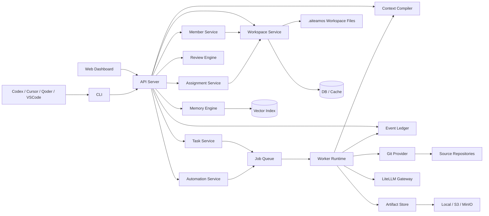
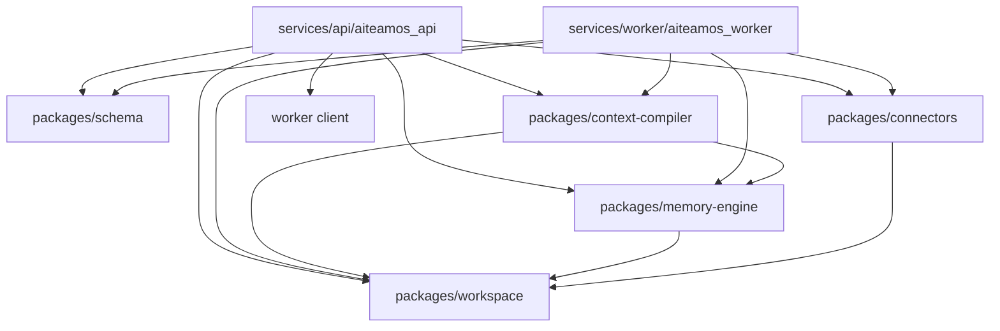
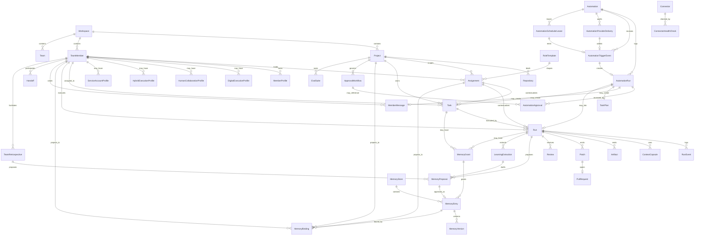
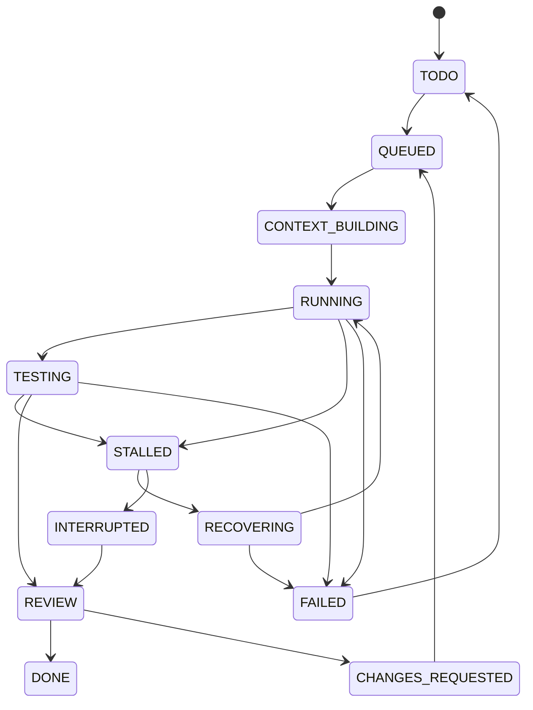

# AITEAMOS Architecture

## 1. 定位与设计假设

AITEAMOS 是 AI Team Management System，不是某个项目内部的 `agents/` 目录，也不是某个 IDE 的插件集合。它的核心对象是长期存在的 `TeamMember`，也就是可以被管理、分派、审查、成长和协作的团队成员。成员可以是 human、digital、hybrid 或 service；模型只是 digital/service/hybrid 执行时可调用的中央智能能力，可以来自 OpenAI、Anthropic、Gemini、本地模型或未来的 provider。

AITEAMOS 的产品和领域模型采用四个并列支柱：

- TeamMember-centric identity：成员是长期身份，有资料、能力、工作风格、工作方法、技能、权限、活动、绩效、成长记录和个人记忆。
- Project-centric operations：项目仍然是交付、repo、模块责任、权限边界、任务、runs、reviews 和项目知识的组织中心。
- Neutral Memory Fabric：memory 是中立资产，通过 store、entry、version、binding、grant、lineage、ACL 和 lifecycle 投影到 member、project、assignment、task、run、team 和 context capsule。
- Automation control plane：automations 是一级运行控制面，调度 human reminder、digital execution、hybrid assisted flow、service task、review、memory health 和 task planning。

本设计采用以下假设：

- AITEAMOS core 是开源软件，包含 dashboard、API server、CLI、worker runtime、context compiler、memory engine、connectors、schema definitions、self-hosting workspace。
- AITEAMOS core 默认不包含真实项目数据，只包含刻意公开的 self-hosting 数据。
- 具体成员、项目、assignment、memory、任务和 run 数据存在 AITEAMOS workspace 中。workspace 可以放在 source repo 的 `.aiteamos/`，也可以放在私有 shadow repo。
- `.aiteamos` 文件是 source of truth。数据库、vector index、dashboard cache、worker queue state 都是 derived state，必须可从 `.aiteamos` 重建。
- 大型 run artifacts、raw provider responses、tool logs、test logs、screenshots 不默认进入 Git，只通过 artifact manifest 引用。
- AITEAMOS 本项目可以用 embedded `.aiteamos/` 自举，但不能让 worker 无审查地修改自己的治理规则、安全边界、secret handling 或生产部署配置。

本文示例使用 AITEAMOS 自身的 embedded `.aiteamos/` workspace，例如推进 `aiteamos-architecture`、`aiteamos-backend-runtime`、`aiteamos-dashboard`、`aiteamos-manager` 等 assignment。示例只使用本仓库公开 self-hosting 数据，不依赖任何外部私有项目。

外部参考只作为设计启发，不作为 AITEAMOS 的产品复制目标：QoderWake 的 Waker 管理、项目绑定、personal/project memory separation、triggered tasks、skills、connectors、permissions；Qoder Cloud Agents 的 Memory Store / Entry / immutable Version / redaction 模型；Qoder CLI 的 allow / ask / deny permission policy、file/tool/command/network/MCP 保护面。

## 2. 总体架构



### Core module responsibilities

| Module | Responsibility |
|---|---|
| Web Dashboard | Provide fixed first-level navigation: Home, Projects, Employees, Tasks, Runs, Automations, Memory, Reviews, Skills, Permissions, Settings. |
| API Server | Own business API, auth, member/project indexing, task state transitions, review actions, derived DB updates, and permission explanation. |
| CLI | Provide thin operational entrypoints such as `serve`, `workspace validate`, and `workspace index`; task and review workflows remain dashboard/API-first. |
| Member Service | Manage TeamMember records, typed execution/collaboration profiles, project engagements, activity, performance, and growth records. |
| Assignment Service | Bind members to projects, modules, features, role templates, scopes, memory bindings, permission policies, and active time windows. |
| Worker Runtime | Execute approved managed digital tasks and linked service-created project work in isolated branch/worktree/container, call models, run commands, collect logs, produce patches and PRs. |
| Context Compiler | Build deterministic capsules from task, member, assignment, project, permissions, memory stores/grants, handoffs, docs, code, budget, and execution profile. |
| Memory Engine | Manage MemoryStore, MemoryEntry, immutable versions, bindings, grants, lineage, proposals, review, indexing, redaction, sharing, and lifecycle state. |
| Automation Service | Own scheduled/event/webhook/manual automations, dry-run, approval gates, automation run logs, and automation-scoped permissions. |
| Git Connector | GitHub-first integration with branch, PR, review comments, checks, and merge operations through a provider abstraction. |
| LiteLLM Gateway | Unified model gateway for OpenAI, Anthropic, Gemini, local models, budget limits, fallback, rate limits, and cost accounting. |
| Event Ledger | Append-only run event stream for model calls, tool calls, commands, test results, diffs, errors, reviews, and artifact references. |
| Review Engine | Enforce diff scope, test status, reviewer approval, governance rules, merge readiness, and memory promotion policy. |

### Target package and service split



Target package boundaries:

| Package / service | Ownership |
|---|---|
| `packages/schema` | Versioned manifest models, JSON Schema, OpenAPI schema inputs, and generated Dashboard contract source. |
| `packages/workspace` | File-first workspace loading, validation, indexing, projections, mutations, permissions, readiness, and derived-cache rebuild. |
| `packages/context-compiler` | Deterministic context capsule assembly, source selection, redaction decisions, and launch-plan materialization. |
| `packages/memory-engine` | Memory extraction, review queue projection, promotion policy helpers, conflict detection, versioning, grants, bindings, and lifecycle behavior. |
| `packages/connectors` | Connector adapter interface, admission, normalization, redaction, dedupe, health checks, replay evidence, and fixture eval hooks. |
| `services/api/aiteamos_api` | HTTP/MCP route registration, auth/session boundary, request/response DTO binding, and dependency injection into packages. |
| `services/worker/aiteamos_worker` | Managed task execution process, model gateway use, sandbox/worktree lifecycle, command execution, run events, and patch/artifact emission. |

### AITEAMOS core vs AITEAMOS workspace

```text
aiteamos-core/
  apps/dashboard/
  services/
  services/worker/
  packages/schema/
  packages/context-compiler/
  packages/memory-engine/
  packages/connectors/
  .aiteamos/
  docs/

project-or-shadow-workspace/
  .aiteamos/
    workspace.yaml
    project.yaml
    repositories/
    members/
    teams/
    role_templates/
    assignments/
    tasks/
    runs/
    memory/
      stores/
      entries/
      versions/
      bindings/
      grants/
      proposals/
      reviews/
    learning_extractions/
    skills/
    connectors/
    permissions/
    automations/
      events/
      provider_deliveries/
      leases/
      runs/
      approvals/
    eval_suites/
    eval_results/
    im/
    artifacts/
```

AITEAMOS core provides software and schema. AITEAMOS workspace stores project-specific truth. Dashboard and DB may cache workspace state, but the authoritative data remains in `.aiteamos`.

## 3. Core domain model



| Entity | Meaning |
|---|---|
| Workspace | A versioned data root, either embedded or shadow. |
| Project | A managed engineering project, such as `aiteamos`. |
| Repository | A source repository binding; a project can bind multiple repos. |
| TeamMember | A durable team identity. `kind` is `human`, `digital`, `hybrid`, or `service`. |
| ProductUser | A dashboard/API login account mapped to at most one TeamMember for operational projections. |
| MemberProfile | Basic member metadata: display name, title, status, timezone, profile summary. |
| MemberAboutMe | Member self-description split into core capabilities, work style, and work method. |
| MemberCapability | A concrete ability with level, evidence, and related skills. |
| MemberWorkStyle | Behavioral preferences such as conservative, exploratory, test-first, review-heavy, or minimal-diff. |
| MemberWorkMethod | Operating methods such as read-docs-first, trace-failure-first, write-regression-before-fix, small-PR-first, handoff-on-contract-change. |
| MemberProjectEngagement | Summary of a member's active or historical participation in a project. |
| MemberAssignment / Assignment | A binding between member and project/module/feature/role context, including scope, permissions, memory bindings, and time window. |
| MemberActivity | Durable non-Git work activity for member and project projections, with source type and contribution kind. |
| GitActivity | Durable Git/provider activity evidence for member, project, repository, and assignment projections. |
| GitActivityImportReceipt | Durable reviewed import receipt for external/local Git evidence. It records provider/source, dedupe key, payload digest, redaction policy, review decision, and linked GitActivity records before provider sync becomes workspace source of truth. |
| GitActivityCorrelationReview | Durable reviewed correlation decision for GitActivityImportReceipt groups. It records the reviewer, receipts, correlation key, risk flags, evidence, optional promotion recommendation, and later imported GitActivity links without changing memory/growth state. |
| MemberGrowthRecord | Reviewed learning, promotion, seniority, or operating improvement evidence. |
| MemberPerformanceMetric | Derived metrics such as delivery cycle, review quality, test pass rate, cost, or handoff health. |
| DigitalExecutionProfile | Execution profile for `TeamMember.kind = digital`: model profile, worker runtime, context compiler, tool policy, connectors, and budget. |
| HumanCollaborationProfile | Collaboration profile for `kind = human`: contact, IDE/CLI entrypoints, review authority, approval scopes, and availability. |
| HybridExecutionProfile | Assisted execution profile for `kind = hybrid`: human plus IDE AI workflow and ingest policy. |
| ServiceAccountProfile | Automation profile for `kind = service`: owner, trigger sources, credential refs, and audit policy. |
| RoleTemplate | A reusable role blueprint, such as `system-architect`, `backend-engineer`, or `frontend-engineer`. |
| Task | A work item owned by a project and assigned to a TeamMember, optionally under an Assignment/RoleTemplate context. |
| Run | One execution attempt for a task by a TeamMember in managed, assisted IDE, manual, or service mode. |
| RunEvent | Append-only event item in a run ledger. |
| ContextCapsule | The compiled execution package for a member, task, assignment, project, memory grants, permission policy, and execution profile. |
| Artifact | A manifest entry for large or sensitive outputs stored outside Git. |
| Patch | A diff patch, commit range, or changed-file summary. Patch is optional for review-only work. |
| PullRequest | A provider-specific PR mapped back to a patch/run when a PR exists. |
| Review | Human or AI review result, comments, gate decisions, and optional review target link. |
| DecisionAuditRecord | Typed audit fact that distinguishes human approval, digital recommendation, service policy decision, and system check across reviews, permission requests/grants, and automation runs. |
| RiskAssessment | Typed risk-classifier evidence attached to a decision audit record. It records classifier identity, provider, risk level, recommended decision, signals, and whether human review is recommended, but it does not replace allow/ask/deny policy. |
| MemoryStore | A neutral memory repository scoped by project, member, team, domain, organization, temporary session, or import source. |
| MemoryEntry | A neutral durable memory entry. It is not owned by a role; it is projected through binding, grant, ACL, and lineage. |
| MemoryVersion | Immutable snapshot for every memory create/update/delete/redaction operation. |
| MemoryBinding | Durable relation that binds store/entry/collection to member, project, assignment, task, run, team, or context capsule. |
| MemoryGrant | Temporary task/run-scoped permission for a member to use selected memory stores or entries. |
| MemoryLineage | Source/evidence chain for a memory, including task, run, author, reviewer, diff, tests, review, and proposal. |
| MemoryProposal | Candidate memory extracted from a run journal. |
| LearningExtraction | Durable read-only extraction manifest keyed by run, extractor, dedupe key, and proposal drafts for memory, skill, growth, and retrospective queues. |
| MemberMessage | Structured member-to-member or member-to-channel communication. |
| Handoff | Explicit transfer, copy, or consultation packet between members. |
| TeamRetrospective | Multi-run, multi-message, or multi-handoff learning synthesis that creates pending team-level memory proposals. |
| Automation | Scheduled, event-driven, webhook, or manual operation that can target reminders, digital execution, hybrid flows, service accounts, reviews, memory health, or task planning. |
| AutomationTriggerEvent | Durable scheduler, webhook, git, test, or manual trigger fact. It records source payload, dedupe key, actor, and linked AutomationRun without executing worker code. |
| AutomationProviderDelivery | Durable connector/provider delivery receipt. It records delivery id, payload digest, connector, provider event type, replay/admission status, safe headers, normalized summary, and linked AutomationTriggerEvent without storing raw provider bodies or signatures. |
| AutomationSchedulerLease | Durable cron tick lease keyed by automation and tick. It prevents multiple scheduler/API/worker processes from emitting duplicate AutomationTriggerEvents for the same tick. |
| AutomationRun | Durable control-plane attempt record for dry-run, trigger, approval, queued, blocked, failed, or control-plane output creation such as message, task plan, task, or linked run. |
| AutomationApproval | Durable human approval or rejection record for a pending AutomationRun. It records reviewer member, reviewer kind, satisfied gates, expiry, and decision audit; digital or service members may recommend but cannot satisfy governed automation approval gates. |
| ApprovalWorkflow | Common multi-stage approval orchestration source. Stages can be `every-of`, `any-of`, or `quorum`, each stage has SLA metadata, and optional escalation targets a TeamMember for review-request routing. |
| Skill | A reusable capability package with required permissions, owner, project fit, usage history, and lifecycle. |
| PermissionPolicy | Allow/ask/deny policy over files, tools, commands, network, MCP, sensitive paths, and temporary grants. |
| PermissionAction | Normalized action payload for permission checks, such as file read/write, Bash, WebFetch, Network, MCP, EnvVar, Connector, or ArtifactStore operations. |
| PermissionRequest | Durable approval request for a member/action under project, assignment, task, run, or automation context. |
| PermissionGrant | Expiring approval record created from a reviewed PermissionRequest and consumed by the effective permission evaluator. |
| Connector | Bridge to git, issue tracker, chat, calendar, MCP, artifact, model, or other external systems. |
| ConnectorHealthCheck | Durable connector readiness and provider-authorization audit. It records token-secret presence, app installation allowlists, observed repository/installation evidence, provider diagnostics, retention policy, blockers, and decision audit without storing secret values or raw provider credentials. |
| EvalSuite | Evaluation cases for model/member/task behavior. |
| EvalResult | Durable result for a suite execution, including pass rate, case outcomes, and evidence used by readiness, review, or memory promotion. |
| ModelProfile | Provider/model configuration, costs, capability tags, fallback policy. |
| BudgetPolicy | Per-project, per-member, per-assignment, or per-task cost and token limits. |
| ArtifactStore | Local/S3/MinIO/Git LFS style storage configuration. |

### Eval suite contract

`EvalSuite` manifests live under `.aiteamos/eval_suites/` as source-of-truth evaluation facts, not derived cache state. Each suite names its project and may bind members, assignments, and tasks. It owns `cases[]`, suite-level `goldenOutputs`, case-level `goldenOutputs` or `goldenOutputRefs`, a typed `judge.kind` of `human`, `model`, or `policy`, and `policy.autoPromoteThreshold` for later promotion/readiness consumers. `EvalResult` manifests live under `.aiteamos/eval_results/` and record the latest suite execution result, pass rate, case outcomes, and evidence. Workspace validation resolves all member, assignment, task, model profile, permission policy, EvalSuite, EvalResult, and golden-output references before any review gate, worker readiness check, or memory promotion is allowed to consume the suite.

Assignments may declare `spec.evalSuiteRequirements[]`. Each requirement names an `evalSuite`, optional changed-path glob patterns in `paths[]`, and an optional `minimumPassRate` override. Worker readiness and Review Gate must extract the run's planned or actual changed paths, match them against these globs, and fail closed when a matching requirement has no latest passing EvalResult at or above the required threshold. Requirements with nonmatching paths are reported as skipped, not silently ignored. These checks are read-only projections over `.aiteamos/assignments`, `.aiteamos/eval_suites`, `.aiteamos/eval_results`, and run diff/worker metadata; they must not execute the EvalSuite, mutate assignments, approve memory, or bypass human review.

Memory promotion may use a latest EvalResult pass rate as one confidence input only when that result meets the suite `policy.autoPromoteThreshold`. Approved MemoryEntry evidence can cite this lineage with `eval://<evalSuiteId>/<lastResultId>`, and the structured `evalEvidence[]` copy keeps `evalSuiteId`, `lastResultId`, pass rate, and threshold available to Dashboard/API consumers without scraping evidence strings.

TeamMember is the operational identity. ProductUser is the login identity. `ProductUser.spec.member` binds an authenticated product account to the TeamMember it may view or act through, and `TeamMember.spec.userBinding` mirrors that relationship for member-centric projections without storing token values or raw provider subjects. RoleTemplate is reusable vocabulary for responsibilities, while Assignment is the concrete project/module/feature binding that gives a member scope, permissions, memory bindings, and acceptance expectations. A single member can hold multiple active assignments across projects; a single project can have many members and assignments.

DigitalEmployee, HumanMember, HybridMember, and ServiceMember are not top-level identities. They are typed profiles for `TeamMember.kind`. Human, digital, hybrid, and service members can all receive tasks, produce runs, write journals, participate in reviews, propose memory, use skills, receive permissions, send messages, and perform handoffs. Their execution method and default permissions differ:

| Member kind | Execution and governance |
|---|---|
| human | Executes manually through dashboard, IDE, CLI, or external workflow; can review, approve memory, and approve governance changes when authorized. |
| digital | Executes through worker runtime, context compiler, LiteLLM/model gateway, tool policy, and model/budget profile; requires stricter default permission policy. |
| hybrid | Human uses Codex/Cursor/Qoder/VSCode or similar AI-assisted IDE flow; AITEAMOS ingests journal, diff/PR, artifacts, and memory proposals as untrusted until reviewed. |
| service | Automation or background service account such as CI, memory extractor, review bot, or scheduler; narrow permissions, stronger audit, and dry-run/approval gates by default. |

### Manager member

AITEAMOS should include one or more manager members. A manager is an AI PM plus technical lead for task planning, not a superuser. It may understand architecture, project goals, member scope, assignments, task history, run journals, reviews, and approved memory so it can decompose work and route it to the right members.

Allowed manager responsibilities:

- decompose a goal into timestamp-based tasks.
- recommend assigned members, assignments, priority, acceptance criteria, risks, and review gates.
- propose handoff plans between members.
- monitor task status and propose re-planning when work is blocked.
- create memory proposals about planning lessons.

Manager boundaries:

- It can propose task decomposition, but it cannot auto-merge.
- It can assign or recommend members within declared assignment scope, but it cannot bypass permission policy.
- It cannot approve its own memory proposals.
- It cannot directly modify security boundaries, secret handling, or production deployment configuration.
- Governance changes, role-template changes, permission changes, and memory promotion rules still require human review.

Manager input is a read-only projection, not a writable authority. The API exposes `GET /workspaces/{wsId}/manager/inbox?project=&assignment=` with a Pydantic `ManagerInputBundle` that aggregates `WorkspaceHealth`, `RunReviewGateRecord[]`, `ConnectorEscalationCandidate[]`, `ConnectorRemediationSuggestion[]`, `RetrospectiveSuggestionRecord[]`, `MemberGrowthSupportSignals`, and a `managerEvaluation` signal. `managerEvaluation` pairs past `MemberMessage(messageType=plan-recommendation)` records with human accepted/rejected outcomes, links the attached `TaskPlan` manifests, and cites the latest manager EvalSuite/EvalResult as evidence for model profile selection. This bundle is rebuilt from `.aiteamos/` plus review, connector, learning, and eval projections; the endpoint must not create tasks, task plans, messages, reviews, memory proposals, model profile changes, or permission changes. `GET /workspaces/{wsId}/manager/evaluation` exposes the same manager quality signal as a standalone read-only projection.

Manager execution uses the `manager_recommendation` AutomationRun target. This target may create a `MemberMessage` with `messageType: plan-recommendation` and may attach one draft `TaskPlan`; it must not create `Task` or `Run` manifests directly. A human or separately governed service must review or accept the recommendation before task manifests are written.

Task planning output should use this shape:

```yaml
apiVersion: aiteamos.dev/v1alpha1
kind: TaskPlan
metadata:
  id: PLAN-20260520T110018765
spec:
  goal: Add model profile configuration to the dashboard.
  subtasks:
    - title: Add ModelProfile schema and workspace manifests
      assignedMember: backend-digital
      assignment: aiteamos-backend-runtime
      priority: high
      acceptance:
        - ModelProfile manifests validate through Pydantic.
        - API can list model profiles.
      risks:
        - schema/API drift
      reviewGates:
        - schema review
    - title: Add model profile dashboard page
      assignedMember: frontend-human
      assignment: aiteamos-dashboard
      priority: normal
      acceptance:
        - Dashboard displays configured model profiles.
        - Dashboard does not invoke LLM providers.
      risks:
        - confusing configuration with execution
      reviewGates:
        - UI review
```

TaskPlan execution is a read-only derived view. `GET /workspaces/{wsId}/task-plans/execution-views` and `GET /workspaces/{wsId}/task-plans/{taskPlanId}/execution-view` rebuild `TaskPlanExecutionView` records from `.aiteamos/task_plans`, `.aiteamos/tasks`, `.aiteamos/runs`, `.aiteamos/reviews`, and `.aiteamos/memory/proposals`. Each subtask row links materialized tasks through `spec.sourceTaskPlan` and `spec.sourceTaskPlanSubtask`, follows those tasks into runs, reviews, and memory proposals, and reports actual state, drift, acceptance coverage, review gate coverage, and evidence refs. This projection must not create tasks, runs, reviews, retrospectives, memory proposals, permissions, or approved memory; it only explains plan-vs-actual state from source manifests.

TaskPlan closeout learning is an explicit write boundary. `POST /workspaces/{wsId}/task-plans/{taskPlanId}/retrospective` reloads the current `TaskPlanExecutionView`, requires a non-draft plan whose subtasks are completed unless the plan is rejected or superseded, and writes a `TeamRetrospective` with `spec.sourceTaskPlan` plus the linked source tasks and runs. The same write creates exactly one pending `MemoryProposal` with `sourceExtractorId: team-retrospective` and `task-plan:<id>` evidence. It must not mutate the TaskPlan, create or close tasks/runs/reviews, approve memory, or change permissions.

### Schema source of truth

Schema ownership is explicit:

- Pydantic models are the source of truth for `aiteamos.dev/v1alpha1` manifests.
- JSON Schema and OpenAPI are generated from Pydantic.
- TypeScript types for the dashboard are generated from JSON Schema/OpenAPI.
- The dashboard must not maintain a parallel Zod-only schema as a second source of truth. Zod may be used only as generated or adapter-level validation.

This keeps Python API, workspace loader, SQLite indexer, and React dashboard aligned while preserving a versioned file protocol.

## 4. Workspace and data separation

### Embedded workspace

```text
source-repo/
  lib/
  include/
  test/
  .aiteamos/
    workspace.yaml
    project.yaml
    members/
    assignments/
    tasks/
    runs/
    memory/
```

Embedded mode is convenient for AITEAMOS self-hosting and intentionally public workspaces. The risk is data leakage: prompts, failed attempts, task history, and memory may become part of the source repo. It should be used when the workspace data is intentionally shareable or sanitized.

### Shadow workspace

```text
private-product-repo/
  src/
  tests/
  docs/

private-product-aiteamos-shadow/
  .aiteamos/
    workspace.yaml
    project.yaml
    repositories/private-product.yaml
    members/
    assignments/
    tasks/
    runs/
    memory/
```

Shadow mode is recommended for high-value private projects. The workspace repo points to one or more source repos but keeps member profiles, assignments, memory, mistakes, raw run history, and prompt capsules separate from the source tree.

### Remote manifest backends

Shadow workspaces may also live behind a remote manifest backend. The Workspace Service accepts a `WorkspaceManifestBundle` descriptor from `http://`, `https://`, or `s3://` references. The descriptor lists every source manifest path, content hash, and optional size, all relative to the workspace root. A loader materializes the bundle into a derived local cache before validation, indexing, API projection, or Dashboard display. The remote bundle remains the source of truth; local materialization, SQLite, vector chunks, and dashboard projections are rebuildable derived state.

Remote manifest paths must be relative and must not contain `..` traversal. The loader verifies declared hashes before parsing manifests and fails closed on missing files, unsupported backends, hash mismatch, unsafe paths, or absent `workspace.yaml`. HTTP backends fetch files relative to the descriptor URL. S3-compatible backends fetch from an explicitly configured endpoint or mounted mirror; credentials and signed URLs stay in the operator secret store and never enter `.aiteamos/`, prompts, logs, Dashboard URL state, or exported bundles.

### Git tracking policy

Track:

- `workspace.yaml`, `project.yaml`, repository bindings, member manifests, team manifests, assignment manifests.
- task metadata, run metadata, concise journals, context manifests.
- diff patches, review decisions, memory proposals, memory stores, memory entries, memory bindings, memory grants.
- artifact manifests.

Do not track by default:

- raw provider responses.
- long tool logs and test logs.
- screenshots, videos, coverage dumps, build trees.
- embeddings, vector indexes, dashboard cache.
- secret-bearing environment dumps.

The database and indexes are rebuildable:

```bash
aiteamos workspace validate
aiteamos workspace index
aiteamos db rebuild --from .aiteamos
aiteamos vector rebuild --from .aiteamos
aiteamos serve --workspace .aiteamos
```

## 5. Versioned workspace protocol

Every workspace object uses Kubernetes-like manifests:

```yaml
apiVersion: aiteamos.dev/v1alpha1
kind: TeamMember
metadata:
  name: architect
spec:
  kind: digital
  profile:
    displayName: AITEAMOS Architect
  aboutMe:
    coreCapabilities:
      - AI-native software architecture
      - memory governance
    workStyle:
      - architecture-first
      - conservative
      - review-heavy
    workMethod:
      - read-docs-first
      - trace-contracts-before-edit
      - handoff-on-contract-change
---
apiVersion: aiteamos.dev/v1alpha1
kind: Assignment
metadata:
  name: aiteamos-architecture
spec:
  member: architect
  project: aiteamos
  roleTemplate: system-architect
  modules:
    - docs/
    - packages/schema/
  features:
    - team-member-operating-model
    - neutral-memory-fabric
    - governance
  responsibilities:
    - Own architecture decisions for TeamMember, Assignment, Memory Fabric, and governance.
    - Keep architecture and schema synchronized.
```

Task IDs should be timestamp-based instead of sequence-based. The recommended format is `TASK-YYYYMMDDTHHMMSSmmm`, for example `TASK-20260520T101022277`. This keeps IDs sortable, avoids a global counter, and reduces merge conflicts when multiple people or members create tasks concurrently.

Protocol operations:

- `validate`: schema validation, required references, path policy checks.
- `index`: rebuild DB/vector/dashboard cache from files.
- `export`: produce sanitized bundles for demo, review, or debugging.

Recommended workspace layout:

```text
.aiteamos/
  workspace.yaml
  project.yaml
  repositories/
  members/
  teams/
  role_templates/
  assignments/
  tasks/
  runs/
  memory/
    stores/
    entries/
    versions/
    bindings/
    grants/
    proposals/
    reviews/
  learning_extractions/
  skills/
  connectors/
    health/
  permissions/
  permission_requests/
  permission_grants/
  automations/
    events/
    provider_deliveries/
    leases/
    runs/
    approvals/
  approval_workflows/
  activity/
  git_activity/
    imports/
    correlations/
  im/
    retrospectives/
  artifacts/
    manifests/
    blob/
  indexes/
```

Workspace indexing contract: validation and indexing load `members/`, `assignments/`, execution profiles, neutral memory stores/entries/bindings/grants/proposals, learning extractions, automations, automation trigger events, automation scheduler leases, automation runs, approval workflows, member activity, git activity, git activity import receipts, git activity correlation reviews, skills, connectors, connector health checks, permission policies, permission requests, permission grants, tasks, runs, and reviews directly from manifests. Role-scoped member state is not a compatibility surface; role templates remain reusable responsibility vocabulary only. SQLite and vector manifests are derived caches and may be destructively rebuilt from `.aiteamos`.

### Data lifecycle policy

`.aiteamos/` remains the source of truth for lifecycle decisions. SQLite, vector indexes, dashboard caches, and export bundles are derived views and must be rebuildable from source manifests after retention, archive, or redaction decisions are applied. Delete requests do not physically remove source manifests; they create auditable lifecycle transitions, preserve object ids, and keep `decisionAudit` chains traceable. Secrets are never retained in lifecycle metadata, prompts, logs, exports, dashboard projections, or derived indexes.

Policy defaults use these fields unless a manifest-specific schema names a stricter field: `retentionPolicy`, `retainedUntil`, `lifecycle`, `archivedAt`, `redactedAt`, `redactionPolicy`, `exportPolicy`, and `decisionAudit`. `include` exports the manifest as-is after generic secret scanning, `sanitize` removes or masks sensitive fields, `manifest-only` keeps metadata without large/raw payloads, and `exclude` omits the object from sanitized bundles.

Member delete requests enter through `POST /workspaces/{wsId}/members/{id}/delete-request` with an `actorMember` and optional reason. The mutation archives the TeamMember, inventories linked `Run`, `MemberMessage`, `Handoff`, `GitActivity`, assignment, and member-memory-binding references, marks sensitive linked manifests `lifecycle=redacted`, appends a typed `decisionAudit` record to every changed source manifest, and returns the reference inventory plus redaction queue. It must not physically delete source manifests, tasks, reviews, import receipts, memory entries, derived indexes, or export history; sanitized exports honor the resulting `exportPolicy` values and cannot leak redacted prompt, journal, message, handoff, or provider-facing Git evidence.

| Manifest kind | Default retention | Archive default | Redact default | Export default |
|---|---|---|---|---|
| Workspace | workspace-lifetime | supersede by protocol update record | redact owner/contact metadata only | sanitize |
| Project | workspace-lifetime | lifecycle=archived when project is retired | redact external/customer identifiers | sanitize |
| Repository | workspace-lifetime | lifecycle=archived when repository is detached | redact private URLs and provider ids | sanitize |
| RoleTemplate | workspace-lifetime | lifecycle=archived when unused | redact embedded private examples | include |
| TeamMember | workspace-lifetime plus delete-request audit | lifecycle=archived; keep member id and kind | lifecycle=redacted; mask display name, user binding, contact fields | sanitize |
| ProductUser | workspace-lifetime plus account delete audit | lifecycle=archived; keep user id hash | lifecycle=redacted; mask identity provider subject and profile fields | sanitize |
| DigitalExecutionProfile | workspace-lifetime | lifecycle=archived when member is archived | redact model/provider notes that reveal private deployment policy | sanitize |
| HumanCollaborationProfile | workspace-lifetime | lifecycle=archived when member is archived | redact contact, availability, and private preference fields | sanitize |
| HybridExecutionProfile | workspace-lifetime | lifecycle=archived when member is archived | redact human-facing contact and private routing hints | sanitize |
| ServiceAccountProfile | workspace-lifetime | lifecycle=archived when service account is disabled | redact service owner contact and secret references beyond env names | sanitize |
| Team | workspace-lifetime | lifecycle=archived when team is retired | redact private roster notes | sanitize |
| Assignment | workspace-lifetime | lifecycle=archived when assignment ends | redact private module/customer labels | sanitize |
| MemberActivity | 365 days active, then archived | lifecycle=archived; keep actor, verb, object refs | redact free-text summary and provider details | sanitize |
| GitActivity | 365 days active, then archived | lifecycle=archived; keep commit/review lineage | lifecycle=redacted; mask refs, URLs, author metadata, and summaries | sanitize |
| GitActivityImportReceipt | 90 days active, then archived | lifecycle=archived; keep digest and reviewed decision | redact raw provider metadata; keep payload digest | manifest-only |
| GitActivityCorrelationReview | workspace-lifetime | lifecycle=archived when group is closed | redact reviewer notes only | sanitize |
| Task | workspace-lifetime | lifecycle=archived after closeout and retention window | redact requester/member free text; keep planRef and status | sanitize |
| TaskPlan | workspace-lifetime | lifecycle=archived after retrospective | redact planning notes that contain private context | sanitize |
| Run | 180 days active, then archived | lifecycle=archived; keep task/member/status and event digest | lifecycle=redacted; mask prompt, journal excerpts, model output refs | manifest-only |
| Review | workspace-lifetime | lifecycle=archived after final decision | redact reviewer comments only; keep decision and target refs | sanitize |
| MemoryStore | workspace-lifetime | lifecycle=archived when no active bindings remain | lifecycle=redacted; mask description and owner-private labels | sanitize |
| MemoryEntry | workspace-lifetime with freshness checks | lifecycle=archived when deprecated | lifecycle=redacted; mask content/title but keep evidence and lineage | sanitize |
| MemoryVersion | immutable workspace-lifetime | never archived independently; follows entry lifecycle | preserve immutable redaction snapshot, mask sensitive payload | manifest-only |
| MemoryBinding | workspace-lifetime or until target deleted | lifecycle=archived when target is archived | redact target detail but keep entry and target ids | sanitize |
| MemoryGrant | until expiry plus 180 days audit | lifecycle=archived when expired/revoked | redact grant rationale; keep grantee/grantor ids | sanitize |
| MemoryProposal | 180 days after resolution | lifecycle=archived when approved/rejected/superseded | redact proposed content; keep source evidence and decision | sanitize |
| LearningExtraction | 180 days after extraction | lifecycle=archived after proposals resolve | redact proposal drafts; keep dedupe keys and source refs | sanitize |
| MemberMessage | 180 days after resolution | lifecycle=archived when resolved and retention expires | redact body/resolution text; keep participants, attachments, and audit | sanitize |
| Handoff | workspace-lifetime while linked run/task exists | lifecycle=archived when both sides close | redact handoff notes; keep from/to/task/run refs | sanitize |
| TeamRetrospective | workspace-lifetime | lifecycle=archived when superseded | redact lessons/action text that contains private context | sanitize |
| Automation | workspace-lifetime | lifecycle=archived when disabled or replaced | redact target params that contain private selectors | sanitize |
| AutomationRun | 180 days active, then archived | lifecycle=archived; keep automation/status/decision audit | redact logs, blockers, and provider payload snippets | manifest-only |
| AutomationTriggerEvent | 90 days active, then archived | lifecycle=archived; keep dedupe key and automation ref | redact raw trigger payload metadata | manifest-only |
| AutomationProviderDelivery | 30 days active, then archived | lifecycle=archived; keep digest/replay decision | redact provider headers and raw payload excerpts | manifest-only |
| AutomationSchedulerLease | 30 days after expiry | lifecycle=archived when recovered or expired | redact worker host/process hints | sanitize |
| AutomationApproval | workspace-lifetime | lifecycle=archived after approval window closes | redact approver comments only | sanitize |
| ApprovalWorkflow | workspace-lifetime | lifecycle=archived after subject closes and audit retained | redact reviewer comments and escalation reasons only | sanitize |
| PermissionPolicy | workspace-lifetime | lifecycle=archived when replaced | redact private path patterns only when exported | sanitize |
| PermissionRequest | workspace-lifetime | lifecycle=archived after resolved and audit retained | redact request reason; keep decision and policy refs | sanitize |
| PermissionGrant | until expiry plus workspace-lifetime audit | lifecycle=archived when expired/revoked | redact grant reason; keep scope and decision refs | sanitize |
| Skill | workspace-lifetime | lifecycle=archived when deprecated | redact private usage notes and owner comments | sanitize |
| Connector | workspace-lifetime | lifecycle=archived when detached | redact provider ids beyond allowlisted names; never expose secrets | sanitize |
| ConnectorHealthCheck | 30 days active, then archived | lifecycle=archived; keep blocker/readiness summary | redact provider diagnostics that identify secrets or private repos | sanitize |
| EvalSuite | workspace-lifetime | lifecycle=archived when replaced | redact private cases/golden outputs in exported bundles | sanitize |
| EvalResult | 365 days active, then archived | lifecycle=archived; keep score/pass/fail evidence | redact judge notes and case payloads | sanitize |
| Artifact | 7 days active unless manifest overrides | lifecycle=archived; keep hash/uri/kind | redact URI or metadata; blobs follow store policy | manifest-only |
| ArtifactStore | workspace-lifetime | lifecycle=archived when store is detached | redact credentials, endpoints, and private bucket names | sanitize |
| ModelProfile | workspace-lifetime | lifecycle=archived when disabled | redact vendor account routing and private cost notes | sanitize |
| BudgetPolicy | workspace-lifetime | lifecycle=archived when replaced | redact private budget owner notes | sanitize |
| ContextManifest | 30 days active, then archived | lifecycle=archived with run/task lineage | redact selected source snippets and token accounting detail | manifest-only |

Run event ledgers are append-only JSONL, not standalone manifests. Every `RunEvent` entry carries `lifecycle`, `retainedUntil`, `exportPolicy`, and optional `decisionAudit` metadata that defaults from the parent `Run`; redaction events write `lifecycle=redacted`, `redactedAt`, and `redactionPolicy` on the event line while preserving the sequence number and parent run lineage.

Git activity import receipts under `git_activity/imports/` are admission records, not final contribution evidence. A local or provider adapter may write `candidate` or `needs-review` receipts with dedupe key, payload digest, redaction policy, normalized metadata, and decision audit, but only a reviewed import step may create linked `GitActivity` manifests. Git activity correlation reviews under `git_activity/correlations/` are reviewed reconciliation decisions over receipt groups; review creation can approve, reject, request changes, or archive a correlation group without mutating the receipts or creating `GitActivity`. A separate reviewed group-promotion step may consume an approved correlation review and link all selected receipts to one durable `GitActivity` when the group represents one contribution.

Connector health manifests use this shape:

```yaml
apiVersion: aiteamos.dev/v1alpha1
kind: ConnectorHealthCheck
metadata:
  id: CHEALTH-github-20260521T101010001
spec:
  connector: github
  provider: github
  connectorType: git
  project: aiteamos
  status: healthy
  readiness: ready
  tokenStatus: present
  installationStatus: authorized
  requiredSecrets:
    tokenEnv: AITEAMOS_GITHUB_TOKEN
    webhookSecretEnv: AITEAMOS_GITHUB_WEBHOOK_SECRET
  missingSecrets: []
  allowedRepositories:
    - example/aiteamos
  observedRepositories:
    - example/aiteamos
  allowedInstallationIds:
    - "12345"
  observedInstallationIds:
    - "12345"
  providerDiagnostics:
    status: ok
  retentionPolicy:
    deliveryRetentionDays: 30
  audit:
    secretsStored: false
    secretValuesObserved: false
    providerNetworkCalled: false
```

## 6. Self-hosting design for AITEAMOS

AITEAMOS supports self-hosting through an embedded `.aiteamos/` workspace in this repository. The same governance, review, memory, and worker boundaries apply when AITEAMOS manages its own tasks.

### Self-hosting reference workspace

The embedded self-hosting workspace follows the same target directory contract as any project workspace. The repository may contain public, sanitized self-hosting manifests, while private project state belongs in a shadow workspace.

```text
.aiteamos/
  workspace.yaml
  project.yaml
  repositories/
  members/
  teams/
  role_templates/
  assignments/
  execution_profiles/
    digital/
    human/
    hybrid/
    service/
  tasks/
  task_plans/
  runs/
  reviews/
  memory/
    stores/
    entries/
    versions/
    bindings/
    grants/
    proposals/
    reviews/
  learning_extractions/
  skills/
  connectors/
    health/
  permissions/
  permission_requests/
  permission_grants/
  automations/
    events/
    provider_deliveries/
    leases/
    runs/
    approvals/
  approval_workflows/
  activity/
  git_activity/
    imports/
    correlations/
  im/
    messages/
    handoffs/
    retrospectives/
  artifact_stores/
  artifacts/
    manifests/
  eval_suites/
  eval_results/
  model_profiles/
  budget_policies/
```

Self-hosting uses three practical operational modes:

| Mode | Description | Typical use |
|---|---|---|
| Protocol Mode | Humans use Git, Markdown, IDE, and LLMs while recording tasks/runs/journals in `.aiteamos`. | Manual, audit-heavy, or low-automation projects. |
| UI-first Review Mode | Dashboard reads `.aiteamos` through API/indexer, creates tasks, assigns members/assignments, shows runs/diffs, and reviews memory proposals. CLI remains a thin helper. | Human-led review and governance loop. |
| Managed Worker Mode | AITEAMOS creates isolated worktrees/containers, calls LiteLLM, runs tests, emits patch/PR, and feeds the same dashboard/review loop. | High-autonomy execution under review gates. |

Governance boundaries:

| Category | Rule |
|---|---|
| Automatically modifiable | frontend UI, ordinary backend APIs, tests, docs drafts, minor bug fixes. |
| Requires human review | database schema, worker sandbox, model invocation policy, permission system, memory promotion rules, auto-merge policy. |
| Must not be directly auto-modified | security boundary, secret handling, production deployment config. |

AITEAMOS may manage AITEAMOS, but it must not approve its own governance changes without human review.

## 7. Task execution lifecycle



End-to-end flow:

1. PM creates a task through the dashboard or API.
2. Task is assigned to a TeamMember and may reference an active Assignment/RoleTemplate context.
3. Context Compiler builds a ContextCapsule from task, member, assignment, project rules, docs, code, memory bindings/grants, handoffs, permission policy, recent failures, and git history.
4. For digital/service members, Worker creates an isolated branch/worktree/container. For human/hybrid members, the dashboard/API provides an assisted execution capsule for IDE/CLI use.
5. Model invocation, when used, happens through LiteLLM with member/project/assignment budget, rate, and fallback policy.
6. Commands, file reads, file modifications, tests, errors, and model calls are recorded as RunEvents.
7. Worker or human produces a review target, work journal, test result summary, and memory proposals. The review target may be a diff patch, PR URL, branch URL, or commit URL.
8. Review Engine verifies scope, checks, approvals, policy, and memory promotion.
9. Task is marked done, returned for changes, or failed with a captured failure reason.

Run recovery rules:

- Managed workers must emit heartbeat events while in `RUNNING` or `TESTING`.
- If a heartbeat lease expires, the API marks the run `STALLED` without deleting the worktree or artifacts.
- A reconciler inspects the branch/worktree, last event sequence, command log, and artifact manifest.
- If the run can continue safely, it moves to `RECOVERING` and then back to `RUNNING`.
- If the worktree is incomplete but reviewable, it moves to `INTERRUPTED` and then `REVIEW`.
- If recovery cannot prove ownership or idempotence, it moves to `FAILED` with a recovery report.

Example AITEAMOS self-hosting task:

```text
TASK-20260522T135731383: Switch architecture examples to AITEAMOS self-hosting
Member: architect
Assignment: aiteamos-architecture
Acceptance:
  - docs/architecture.md uses AITEAMOS self-hosting assignments in examples.
  - Workspace validation and index rebuild both pass from `.aiteamos/`.
  - Workspace validation and index rebuild evidence are attached to the run or review record.
```

## 8. Context Compiler

The Context Compiler builds deterministic context capsules. It should not be a loose prompt concatenator.

Input layers, in priority order:

1. Task statement and acceptance criteria.
2. TeamMember identity, member kind, About Me, execution/collaboration profile, and active assignment contract.
3. Permission policy, allowed writes, forbidden actions, temporary grants, and sensitive path policy.
4. Project rules and canonical architecture docs.
5. Repository map and relevant file excerpts.
6. Allowed memory stores, durable memory bindings, task/run memory grants, member memory, project memory, team/domain memory, and recent handoffs.
7. Recent related task/run/review outcomes and git history.
8. Model profile, budget policy, automation policy, and output contract.

Capsule structure:

```text
# Context Capsule
metadata
task
member identity
member kind
About Me: core capabilities / work style / work method
assignment contract
project rules
repository map
allowed writes
forbidden actions
relevant docs
relevant code
selected project memory
selected member memory
selected team/domain memory
granted memory from other members
recent handoff notes
mistake notebook
recent failures
verification commands
output contract
memory proposal instructions
context manifest
```

Freshness rules:

- Canonical project docs outrank episodic memory.
- Memory requires source, evidence, confidence, scope, lineage, ACL, lifecycle, and `lastVerifiedAt`.
- Stale memory is injected with warnings or excluded.
- Conflicting memory is never silently merged.
- Context budget uses deterministic priority tiers before vector similarity.
- Dedupe happens by memory entry id, lineage source, content hash, and semantic near-duplicate key.
- Project-private and member-private memory is never injected through a global view unless an explicit binding or grant authorizes it.
- A member working on different projects receives different memory sets because bindings/grants are resolved against project, assignment, task, run, team, and permission policy.

Shadow workspaces compile context by reading both source repo and `.aiteamos` workspace. Writes to code happen only in the task worktree. Writes to task/run/memory state happen only in the workspace.

The Context Compiler must produce reproducible capsules plus a context manifest. The manifest records source priority, included source counts, memory binding ids, memory grant ids, handoff ids, exclusions, freshness signals, ACL decisions, and budget decisions so reviewers can explain why a member or worker saw particular task, assignment, repository, memory, and history material.

For human and hybrid members, the capsule is an IDE/CLI assisted execution package. For digital and service members, the capsule is the worker runtime input. Hidden chain-of-thought is never a dependency; AITEAMOS relies on structured journal, event ledger, diffs, tests, reviews, and memory lineage.

Member-centric planning contract: run launch planning, task execution queue, and context compilation resolve `assignedMember`, active `assignment`, typed execution/collaboration profile, model defaults from member or assignment, effective permission policy references, active memory bindings, task/run memory grants, and recent handoff records. Role-template vocabulary is descriptive only and must not determine context visibility, model selection, memory injection, or branch ownership without an explicit assignment.

## 9. Neutral Memory Fabric

Memory is a neutral fabric, not a private property of a role, member, or project. Memory can be projected into Employee view, Project view, Assignment view, Task/Run view, and global governance view through explicit relationships.

Core memory objects:

| Object | Purpose |
|---|---|
| MemoryStore | A repository scoped by `project`, `member`, `team`, `domain`, `organization`, `temporary`, or `imported`. |
| MemoryEntry | Independent memory entry with path, title, content, kind, scope, evidence, confidence, freshness, ACL, tags, related objects, lifecycle, and index metadata. |
| MemoryVersion | Immutable create/update/delete/redact snapshot. Redaction masks sensitive content permanently while preserving audit metadata. |
| MemoryBinding | Durable binding between store/entry/collection and member, project, assignment, task, run, team, or context capsule. |
| MemoryGrant | Temporary task/run authorization for a member to read/reference/inject selected memory. |
| MemoryLineage | Source chain linking entry to task, run, author, reviewer, diff, tests, review, artifact, and proposal. |
| MemoryACL | Access control for read, write, reference, promote, export, and share. |
| MemoryLifecycle | `candidate`, `active`, `stale`, `deprecated`, `conflicted`, `redacted`, `archived`. |

| Type | Purpose |
|---|---|
| Semantic memory | Stable concepts and module responsibilities. |
| Episodic memory | Lessons from a specific task/run. |
| Procedural memory | Repeatable workflows and verification loops. |
| Decision memory | Reviewed architecture and policy decisions. |
| Mistake memory | Failure patterns, root causes, and recovery recipes. |
| Preference memory | Stable member, team, or project preference that affects execution style. |
| Skill memory | Experience about when and how to apply a skill. |
| Project-status memory | Current state, blockers, ownership, and progress summaries. |
| External-note memory | Imported notes from external tools, docs, issue trackers, or chats. |

### Learning loop

```mermaid
flowchart LR
  RunJournal[RunJournal] --> LearningExtractor[LearningExtractor]
  RunEvents[RunEvents] --> LearningExtractor
  Reviews[Reviews] --> LearningExtractor
  Handoffs[Handoffs and MemberMessages] --> LearningExtractor
  LearningExtractor --> ProposalKind{ProposalKind[]}
  ProposalKind --> MemoryDraft[MemoryProposal draft]
  ProposalKind --> SkillDraft[SkillProposal draft]
  ProposalKind --> GrowthDraft[GrowthSignal draft]
  ProposalKind --> RetrospectiveDraft[RetrospectiveCandidate draft]
  MemoryDraft --> Review[Human / Policy Review]
  Review --> Entry[MemoryEntry]
  Entry --> Version[MemoryVersion]
  Entry --> Binding[MemoryBinding]
  Review --> Rejected[Rejected]
  Binding --> Index[DB + Vector Index]
```

The LearningExtractor is a read-only projector over run journals, run events, reviews, handoffs, member messages, existing memory, skills, growth evidence, and retrospectives. Previewing or scoring a learning extraction must not write `.aiteamos` manifests, approve memory, update skills, mutate member profiles, close tasks, change permissions, or change run status. Durable writes happen only through explicit proposal admission APIs after human review or a policy gate approves the selected proposal kind. `LearningExtraction` manifests live under `.aiteamos/learning_extractions/` and capture `runId`, `extractedAt`, `dedupeKey`, extractor identity, source context, and proposal drafts. `MemoryProposal`, `SkillProposal`, `GrowthSignal`, and `RetrospectiveCandidate` share extraction evidence, source run/task ids, member and assignment context, extractor identity, confidence, dedupe key, warnings, and review guidance so repeated extraction can be explained and deduplicated across proposal classes. A repeated admission with the same `runId`, `extractorId`, proposal `kind`, and proposal `dedupeKey` returns the existing `LearningExtraction` manifest; a proposal `dedupeKey` collision across proposal classes is rejected before writing. A self-hosting baseline extraction uses deterministic `L-bootstrap-*` manifests to summarize the full `.aiteamos/runs/` history, record per-proposal-class dedupe and conflict rates, and prove that rerunning the extractor creates zero additional manifests. A `SkillProposal` draft may enter the skill queue only when `targetManifest.spec.evidence.successfulRuns[]` names at least one successful run and `targetManifest.spec.evidence.failedOrRecoveredRuns[]` names at least one failed or recovered run; otherwise the admission step skips the skill draft and records a warning while allowing lower-risk memory or growth drafts from the same extraction.

Auto-approval is allowed only for low-risk operational hints, such as a local CLI invocation pattern confirmed by tests. Human review is required for architecture decisions, permission policy, memory promotion rules, model invocation policy, release policy, and anything that changes the governance surface.

Auto-approval matrix:

| Condition | Auto-approval allowed? |
|---|---|
| Local workflow hint, backed by a successful command/test, no architecture or permission impact, confidence >= 0.85 | Yes |
| Mistake note that only describes a failed local command and its verified fix, confidence >= 0.85 | Yes |
| Any memory touching governance, permissions, security, schema, worker sandbox, model policy, or auto-merge | No |
| Any memory that conflicts with canonical docs or lacks evidence | No |
| Any decision memory or cross-member rule | No |

Even auto-approved memory should retain source run/task, evidence, confidence, reviewer or policy identity, lineage, ACL, lifecycle, and `lastVerifiedAt`.

Memory collaborates with project docs instead of replacing them. Project docs remain canonical. AITEAMOS memory should point to docs, explain operational lessons, and surface conflicts through Knowledge Health.

Memory extraction should support read-only preview before writing proposals. Proposals must include target store, proposed path, source run/task, member, assignment, evidence, confidence, extractor identity, dedupe key, and review guidance. Repeated extraction must be idempotent. Promotion gates must evaluate source existence, evidence, confidence, content quality, review guidance, ACL, lifecycle, and governance/security sensitivity before approval. Humans may edit proposals before approval and may repair approved memory, but approved-memory edits create a new immutable version and mark the entry stale until separate verification re-enables context injection.

Deletion semantics are non-destructive:

- deleting a member archives the TeamMember and removes or archives bindings; it does not delete memory entries.
- deleting an assignment removes assignment bindings; it does not delete memory entries.
- a new member can inherit, mount, borrow, or temporarily receive historical memory through MemoryBinding or MemoryGrant.
- task/run execution can temporarily mount another member, team, project, or domain store through an expiring grant.
- memory produced under an assignment is automatically related to member, assignment, project, task, and run through lineage and bindings, but it does not become assignment-private unless ACL says so.

Employee Memory tab must show personal memory, project-grouped memory, assignment-grouped memory, administrator-bound memory, temporary grants, produced proposals, and shared read-only memory. Project Memory tab must show project-level memory, member-grouped memory, assignment/module/feature grouped memory, administrator-bound memory, stale/conflict/sensitive memory, and proposals.

Memory proposal write contract: proposal write paths must record `member`, `assignment`, `project`, `sourceTask`, and `sourceRun` when that evidence is available. Approval creates a neutral `MemoryEntry`, an immutable `MemoryVersion`, and at least one `MemoryBinding`; it must not create role-owned memory. Tool/MCP proposals remain `pending-review` and may link to a run, but they cannot approve memory or mutate another member's memory store.

Memory read-projection contract: memory search, member memory views, project memory views, vector source manifests, and Knowledge Health read from `MemoryEntry`, `MemoryStore`, `MemoryBinding`, `MemoryGrant`, proposal metadata, lineage, lifecycle, sensitivity, and related project/member/assignment fields. They must not scan role-owned memory collections or emit `role` as the memory owner. The same `MemoryEntry` may appear in global Memory, Project Memory, Employee Memory, and Assignment-scoped views with different filters, but content projection must still respect lifecycle, sensitivity, ACL, bindings, and grants.

## 10. Event ledger and artifacts

`events.jsonl` is append-only. Example:

```json
{"seq":1,"type":"run.started","ts":"2026-05-20T10:00:00+08:00","run":"RUN-0001"}
{"seq":2,"type":"context.built","capsule":"prompt_capsule.md","tokens_estimated":18000}
{"seq":3,"type":"model.call","provider":"openai","model":"example-model","cost_usd":0.42}
{"seq":4,"type":"tool.command","cmd":"PYTHONPATH=examples/protocol-fixture python -m unittest discover examples/protocol-fixture/tests -q","exit_code":0}
{"seq":5,"type":"patch.created","path":"diff.patch"}
{"seq":6,"type":"memory.proposed","proposal":"MP-0001"}
```

The ledger records reasoning summaries and provider-visible thinking blocks when available, but AITEAMOS must not depend on hidden chain-of-thought. Long-term accountability comes from structured journal, commands, test results, diffs, review results, and approved memory.

Artifacts:

- `Artifact` objects store URI, hash, size, kind, and retention policy.
- Long logs and raw provider responses go to artifact storage.
- Artifact manifests can be tracked in Git; artifact blobs usually should not.
- Review-only work does not have to generate a `diff.patch`. It may store a review target manifest that points to a PR, branch, commit, external review URL, or internal run artifact ref.

## 11. GitOps and review

GitHub is the first concrete provider, but the design uses a `GitProvider` abstraction:

```ts
interface GitProvider {
  getRepository(id: string): RepositoryRef;
  createBranch(repo: RepositoryRef, base: string, name: string): BranchRef;
  createWorktree(repo: RepositoryRef, branch: BranchRef): WorktreeRef;
  getDiff(ref: WorktreeRef): Patch;
  createPullRequest(input: PullRequestInput): PullRequestRef;
  listChecks(pr: PullRequestRef): CheckRun[];
  addReviewComment(pr: PullRequestRef, comment: ReviewComment): void;
  mergePullRequest(pr: PullRequestRef, strategy: MergeStrategy): MergeResult;
}
```

Future providers: Gitea, Forgejo, local bare repo, patch-only review.

Review target manifest:

```yaml
apiVersion: aiteamos.dev/v1alpha1
kind: Review
metadata:
  id: REVIEW-20260520T102208682
spec:
  project: aiteamos
  task: TASK-20260520T102208682
  reviewer: qoder
  target:
    type: branch
    url: https://github.com/example/aiteamos/tree/aiteamos/TASK-20260520T102208682/architect/RUN-20260520T102208682
    ref: aiteamos/TASK-20260520T102208682/architect/RUN-20260520T102208682
  verdict: changes-requested
```

`target.type` can be `pull_request`, `branch`, `commit`, `diff_patch`, or `external_review`. This lets review workflows provide a PR, branch link, commit ref, or internal/external review artifact without forcing every review to emit a local diff file.

PR creation is one form of review target creation. If a provider cannot create a pull request, the system should preserve a reviewable branch, commit, diff patch, or external review target with an explanatory note. AITEAMOS must not auto-merge or bypass human review.

Branch naming:

```text
aiteamos/{taskId}/{memberName}/{runId}
```

Handoff should be explicit. A handoff records `fromMember`, `toMember`, `taskId`, `runId`, `sourceBranch`, `targetBranch`, `problem`, `knownContext`, `recommendedNextStep`, `sharedMemoryPack`, and whether ownership is transferred, copied, or consultative. Concurrent members should not write the same branch unless the Review Engine creates an explicit integration task.

Team collaboration uses structured objects:

| Object | Purpose |
|---|---|
| MemberMessage | Member-to-member or member-to-channel message with project/task/run links, workflow status, priority, resolution fields, and audit metadata. |
| TeamChannel | Project, team, incident, review, or automation channel. |
| AskForHelp | A message subtype that requests diagnosis, design advice, review, or execution support. |
| ReviewRequest | A structured request for code, memory, permission, governance, or handoff review. |
| KnowledgeShare | A proposed share of memory or operational learning; it cannot modify another member's memory without review. |
| Handoff | Transfer/copy/consult packet with branch, problem, known context, next step, and memory pack. |
| TeamRetrospective | Multi-run, multi-message, multi-handoff, or TaskPlan closeout synthesis with facilitator, participants, optional source TaskPlan, source runs/tasks/messages/handoffs, lessons, action items, and linked pending memory proposal. |

Collaboration write contract: member-facing tools use `actorMember`, `fromMember`, and `toMember`. `MemberMessage` is an audited communication object, not a memory write. `Handoff` can transfer, copy, or consult ownership; transfer may update `Task.assignedMember` and `Task.assignment`, but shared memory packs remain grants or proposals until reviewed. No member message, handoff, or MCP tool may emit approval, merge, closeout, policy mutation, or memory promotion events.

Collaboration workflow decision: `AskForHelp`, `ReviewRequest`, and `KnowledgeShare` remain `MemberMessage.messageType` subtypes until they need independent schemas. Workflow state lives on `MemberMessage.status`, `priority`, `requestedResponseBy`, `resolvedAt`, `resolvedByMember`, and `resolution`. `KnowledgeShare` still creates an expiring `MemoryGrant` plus an audited message; it does not write into the recipient's personal memory. `GET /workspaces/{wsId}/collaboration/overview` projects messages and handoffs by member, project, task, message type, and open/resolved state so Project and Employee views can show the same neutral collaboration records without adding a separate top-level Messages page.

Team retrospective decision: `TeamRetrospective` is a first-class collaboration manifest under `im/retrospectives/`. It aggregates explicit source TaskPlans, runs, tasks, messages, and handoffs into a reviewed learning packet. TaskPlan closeout retrospectives reuse the same manifest through `spec.sourceTaskPlan` so the source plan remains the durable anchor. Creating a retrospective may create exactly one `MemoryProposal` with `sourceExtractorId: team-retrospective` and evidence links back to the retrospective and its sources, including `task-plan:<id>` when applicable, but it must not create approved memory, mutate another member's personal memory, close tasks, approve reviews, or merge code. Project and Employee views show retrospectives as neutral collaboration records; Memory views show the linked proposal in the ordinary review queue.

Retrospective suggestion rule: policy-assisted aggregation is read-only derived state. `RetrospectiveSuggestionRecord` ranks task-scoped candidates from explicit runs, run journals, member messages, and handoffs, then returns a proposed `TeamRetrospective` payload for a facilitator to review. Suggestion generation must not call a model, write `.aiteamos` manifests, create memory proposals, approve memory, change permissions, close tasks, or mutate member memory. It is safe to expose in Project, Employee, Task, and MCP read views because it contains source ids, summaries, confidence, warnings, and a proposed payload, not durable governance state.

Auto-merge requires:

- clean diff within allowed scope.
- required tests/checks pass.
- no unresolved review comments.
- human approval or explicit low-risk auto-merge policy.
- no conflicts.
- permission check passes.
- secret scan passes.
- no prohibited governance/security file modifications.

Review Gate is read-only derived state. It summarizes whether a run is ready for human review by checking run status, journal presence, review target or `diff.patch`, assignment write-scope validation, matching assignment `evalSuiteRequirements[]`, local diff safety, worktree cleanliness, structured command results, external checks, effective permissions, and linked review records. The gate reports blockers and warnings, but it must not merge, mutate policy, or approve its own findings. Review-gate output includes `project`, `task`, `member`, `assignment`, `memberKind`, and per-requirement EvalSuite status so Project, Employee, Run, and Review views can project the same gate without rebuilding role-centric ownership.

Run Closeout Gate is separate from Review Gate. Review Gate answers whether a run is ready for human review; Closeout Gate requires review-ready state, no unresolved blockers, linked human approval, and no active sibling run on the same task before a run and task can move to `DONE`. Closeout writes a `run.closed` event only; it must not merge PRs, delete worktrees, or bypass memory review.

## 12. Dashboard design

| Page | Displays | Actions |
|---|---|---|
| Home | workspace overview, active projects, active members, open tasks, running/stalled runs, pending reviews, pending memory proposals, automation activity, connector operations health, cost/model summary, knowledge health alerts | validate, index, open queue, inspect alerts |
| Projects | project list and project detail tabs: Overview, Employees, Assignments / Ownership Map, Tasks, Runs, Memory, Skills, Permissions, Reviews, Automations, Git Activity, Knowledge Health, Settings; project-scoped connector failures and escalation review requests | create project, bind repos, inspect ownership, trigger index, inspect project-scoped permission requests/grants and connector escalation evidence |
| Employees | employee list backed by TeamMember; detail tabs: Overview, About Me, Projects / Assignments, Tasks, Runs, Memory, Skills, Permissions, Reviews, Automations, Messages, Git Activity, Performance / Growth, Settings; member-scoped connector failures and escalation review requests | create/archive member, assign project/module/feature, inspect activity, inspect member-scoped permission requests/grants and connector escalation evidence |
| Tasks | all tasks by project, member, assignment, status, blocked, needs review, recently completed, connector remediation tasks linked back to source TaskPlans and launch readiness | create, assign member, queue, link grants, inspect remediation task blockers |
| Runs | managed, assisted IDE, human/manual, service, failed/stalled, expensive, by model/member/project | inspect timeline, capsule, memory grants, tool calls, commands, diff/PR, tests, artifacts, journal, cost |
| Automations | scheduled, trigger-based, project, member, memory-health, review, task-planning, connector-failure-reminder and git-activity-correlation-promotion automations, provider delivery evidence, correlation promotion candidates, and connector operations health | create, pause, dry-run, trigger, approve, execute queued control-plane runs, inspect runs/failures/logs |
| Memory | global memory governance: stores, entries, proposals, bindings, grants, lineage, conflicts, stale, sensitive/redacted, orphaned, review queue, import/export, sharing audit | approve, reject, bind, grant, redact, export, repair |
| Reviews | code, memory, permission, governance, connector failure review requests, connector remediation task readiness, open queues, approved, changes requested, rejected, reviewer workload | approve, request changes, distinguish human/digital/service reviewer, inspect connector escalation evidence, resolve connector failure review requests with evidence checklist |
| Skills | catalog, member skill matrix, project and assignment requirements, usage history, gaps, proposals, required permissions | install/propose skill, bind to member/project, review gaps |
| Permissions | policies, effective permissions, pending requests, temporary grants, denied actions, sensitive paths, tool/command/network/MCP access, audit log, simulation/explain view | approve/reject request, grant, revoke, expire due grants, simulate |
| Settings | workspace, model profiles, LiteLLM, Git providers, artifact stores, connectors, connector health, archived connector evidence, connector failure reminders, connector failure escalations, schema contracts, users/admins, data retention, export/sanitize | configure, health-check, route explicit reminders, escalate repeated failures for review, create reminder automations, archive old evidence, export, sanitize |

Dashboard reads from DB/index/cache. Mutations must write back to `.aiteamos` manifests or artifact manifests.

Dashboard action guidance is read-only derived state. Task queues, launch plans, execution plans, closeout readiness, memory proposal queues, runtime diagnostics, and knowledge health should guide the UI without changing permissions, review policy, memory promotion, secret handling, or auto-merge behavior. Durable changes must happen through explicit task, run, review, and memory mutations.

First-level navigation is fixed and must remain: Home / Projects / Employees / Tasks / Runs / Automations / Memory / Reviews / Skills / Permissions / Settings. Projects and Employees are the two primary perspectives. Memory, Task, Run, Review, Skill, Permission, Connector, and Artifact remain neutral resources that can be projected into global, project, employee/member, and assignment-scoped views without being owned by one UI perspective.

Connector operations projection rule: connector readiness checks and provider delivery receipts are neutral governance evidence. `GET /workspaces/{wsId}/connectors/operations?connector=&project=&member=&assignment=&lifecycle=` returns a read-only overview with summary counts, per-connector rows, active/archived `ConnectorHealthCheck` records, and active/archived `AutomationProviderDelivery` records. Home shows global alert counts, Automations shows replay/admission health next to control-plane runs, Settings shows connector-oriented active versus archived evidence plus cleanup actions, Projects show project-scoped connector evidence, and Employees show member-owned connector evidence plus automations where the member is owner or service executor. The projection must not delete manifests, decide admission, expose secrets, or hide archived evidence from audit views.

Connector failure reminder rule: connector failure reminders are explicit collaboration artifacts, not incident resolution. `GET /workspaces/{wsId}/connectors/operations/reminders?connector=&project=&member=&assignment=&lifecycle=` derives `ConnectorFailureReminderCandidate` rows from active `ConnectorHealthCheck` blockers/warnings and blocked/stale/warning `AutomationProviderDelivery` records. `POST /workspaces/{wsId}/connectors/operations/reminders` may create deduplicated `MemberMessage` reminders only when called by a human or service actor; it stores the source evidence id and dedupe key in message audit metadata. A normal `Automation` may target `connector_failure_reminder` to route the same candidates through approval gates, non-interactive permission checks, `maxMessagesPerRun`, and `throttleMinutes`; the default execution policy routes at most one reminder per queued automation run and suppresses recently routed connector incidents for one hour unless the automation target explicitly narrows or expands that window. Routing a reminder must not mutate connector health, provider delivery, automation run admission evidence, permission policy, memory state, review state, or incident lifecycle.

Connector reminder dashboard rule: Settings may create a `connector_failure_reminder` `Automation` through `POST /workspaces/{wsId}/automations` by selecting connector scope, owner member, service member, permission policies, optional approval gates, `maxMessagesPerRun`, and `throttleMinutes`. Automations then owns dry-run, trigger, approval, queued execution, and run-log inspection. Settings may still perform one-off manual reminder routing, but recurring or scheduled connector reminder behavior must be represented as an Automation manifest so it is visible in global Automations, Project, Employee, Settings, and audit views.

Repeated connector failure escalation rule: repeated connector failures are escalated to `MemberMessage.messageType = review-request`, not to `PermissionRequest`, because the first required action is human/service diagnosis of connector health and provider-delivery evidence rather than granting a tool permission. `GET /workspaces/{wsId}/connectors/operations/escalations?connector=&project=&member=&assignment=&lifecycle=&minEvidence=` derives `ConnectorFailureEscalationCandidate` rows by grouping active reminder candidates by project and connector. A candidate becomes routable only when it reaches the evidence threshold, has at least one target member, and has no open or acknowledged review request with the same `connectorEscalationDedupeKey`. `POST /workspaces/{wsId}/connectors/operations/escalations` may write deduplicated review-request messages from a human or service actor; it stores source evidence ids, existing reminder ids, severity, threshold, and connector scope in audit metadata. Escalation does not mutate connector health, provider delivery, automation run, permission, review, memory, or incident lifecycle state.

Connector escalation projection rule: connector escalation candidates and connector-failure review requests are neutral governance resources. Settings owns connector-oriented operations controls, Reviews owns open review-request workload, Project views show candidates and review requests filtered by project binding, Employee views show candidates and review requests where the member owns the connector, owns the linked automation, or is the service executor, and Knowledge Health raises warnings for routable candidates or open review requests. Every projection must link back to the same connector id, evidence ids, existing reminder message ids, and review-request id; no projection may copy the evidence into a project-private or member-private object, hide archived audit evidence, or expose secret-bearing connector material.

Connector escalation resolution rule: connector-failure review requests must be closed through `POST /workspaces/{wsId}/connectors/operations/escalations/{messageId}/resolve`, not through the generic member-message resolve endpoint. The payload includes `actorMember`, `resolution`, `evidenceReviewed`, `reminderMessagesReviewed`, and optional `followUpReviewed` for permission or connector-policy follow-up. The resolver requires a human or service actor who participates in the review request, verifies that every `audit.evidenceIds` item and every `audit.existingReminderMessages` item has been reviewed, writes `audit.connectorEscalationResolution`, and then marks the `MemberMessage` resolved. Resolution closes the review workflow only; it does not mutate `ConnectorHealthCheck`, `AutomationProviderDelivery`, `AutomationRun`, `PermissionRequest`, `PermissionGrant`, memory, review policy, connector policy, or incident lifecycle. Generic `MemberMessage` resolution must reject attempts to resolve or archive connector-failure review requests without this evidence checklist.

Connector escalation suppression rule: resolved connector-failure review requests suppress duplicate escalation for the exact evidence set they reviewed. `ConnectorFailureEscalationCandidate` records include `resolvedReviewRequest` and `suppressedByResolution` when a resolved review request with the same `connectorEscalationDedupeKey` has `audit.connectorEscalationResolution.evidenceReviewed` covering the candidate's current `evidenceIds`; such candidates are not routable and use `notRoutableReason: resolved-evidence-reviewed`. If a later `ConnectorHealthCheck` or `AutomationProviderDelivery` adds a new evidence id, the coverage check fails and the candidate becomes routable again, preserving diagnosis for fresh failures without message floods for already-reviewed evidence.

Connector escalation explanation rule: suppression and re-routing must be explainable from derived candidate state. Every `ConnectorFailureEscalationCandidate` may expose `latestResolvedReviewRequest`, `reviewedEvidenceIds`, `unreviewedEvidenceIds`, `reviewedReminderMessages`, `resolutionReviewedAt`, `resolutionReviewedByMember`, `resolutionReviewerKind`, `resolutionFollowUpReviewed`, `resolutionCoversCurrentEvidence`, and `suppressionExplanation`. `resolvedReviewRequest` is set only when `resolutionCoversCurrentEvidence` is true; `latestResolvedReviewRequest` remains visible when a prior review exists but new evidence makes the candidate routable again. These fields are read-only projection metadata for Settings, Reviews, Project, Employee, and Knowledge Health views; they do not write memory, mutate connector/provider evidence, change permission policy, or close an incident.

Connector remediation suggestion rule: remediation planning is derived from reviewable connector escalation state. `GET /workspaces/{wsId}/connectors/operations/remediation-suggestions?connector=&project=&member=&assignment=&lifecycle=&minEvidence=` returns `ConnectorRemediationSuggestion` records for unsuppressed escalation candidates that either have an open review request or newly unreviewed evidence after a prior resolution. Each suggestion includes the source escalation candidate, source or latest resolved review request, actionable evidence ids, reviewed and unreviewed evidence ids, suggested owner member, suggested assignment, blockers, warnings, evidence summaries, and a proposed `TaskPlan` payload that a human or governed automation may review. The suggestion endpoint is read-only derived state: it must not write `.aiteamos/task_plans`, create tasks or runs, mutate connector/provider/automation/permission/review/memory policy, close incidents, or bypass review gates. Accepting a remediation suggestion must go through the normal TaskPlan, Automation, or task creation workflow and preserve human/service audit provenance.

Connector remediation prefill rule: dashboards may stage a remediation suggestion's `proposedTaskPlan` into a local editable TaskPlan draft review form. This is still preview state, not protocol state. Prefill actions must not call write endpoints, allocate ids, create `TaskPlan`, `Task`, `Run`, `AutomationRun`, `PermissionRequest`, `PermissionGrant`, `Review`, or memory manifests, and must clearly preserve the source suggestion and connector evidence chain. A later submit action, if enabled, must use the ordinary reviewed TaskPlan or task-planning automation creation workflow and must re-check permission, approval gates, and connector evidence freshness before writing `.aiteamos`.

Connector remediation submit rule: `POST /workspaces/{wsId}/connectors/operations/remediation-suggestions/{suggestionId}/task-plan` is the reviewed creation boundary for dashboard-staged remediation plans. The endpoint reloads the current suggestion, verifies that it is still ready, compares staged actionable evidence ids with the current derived evidence ids, allocates a fresh timestamp `PLAN-*` id, normalizes required connector evidence, secret-handling, permission-policy, and audit-provenance review gates, and writes a draft `TaskPlan` under `.aiteamos/task_plans/`. A human submitter may proceed with an `ask` permission decision because the dashboard action is the explicit interactive approval surface; a service submitter must pass a non-interactive `allow` decision from the effective permission evaluator. The submit path records `spec.connectorRemediation` and `spec.decisionAudit` on the TaskPlan, but it still must not create tasks, runs, connector changes, permission grants, review closure, memory proposals, or approved memory.

Connector remediation TaskPlan projection rule: submitted remediation plans are ordinary `TaskPlan` manifests, not a separate connector object. `GET /workspaces/{wsId}/connectors/operations/remediation-task-plans?connector=&project=&member=&assignment=&status=` derives records from TaskPlans that carry `spec.connectorRemediation`, adds normalized connector, source suggestion, source review request, actionable evidence ids, submitted-by member/kind, assigned members, assignments, and latest decision-audit fields, and projects the same rows into Tasks, Reviews, Project, Employee, Settings, and Home summaries. Project projection filters by project binding; Employee projection includes the submitter, decision actor, and assigned members; Assignment projection filters by subtask assignment. This projection must not mutate TaskPlan status, create tasks/runs, resolve connector review requests, hide audit lineage, or copy connector evidence into member/project memory.

Connector remediation TaskPlan acceptance rule: `POST /workspaces/{wsId}/connectors/operations/remediation-task-plans/{taskPlanId}/accept` is the reviewed transition from a draft remediation plan into ordinary project work. The payload includes `actorMember`, `reviewedEvidenceIds`, `reviewedReviewRequests`, and `dryRun`; the endpoint requires a human or governed service actor, verifies that every actionable evidence id and source review-request id was explicitly reviewed, checks effective permissions for both the TaskPlan update and Task creation, then sets the TaskPlan status to `accepted` and creates one `Task` per subtask. Created tasks carry `sourceTaskPlan`, `sourceTaskPlanSubtask`, connector remediation lineage, review gates, risks, assignment/member ownership, and acceptance criteria. This transition must not create runs, close connector review requests, mutate connector/provider/automation/permission policy, create permission grants, write memory, or approve memory proposals. Repeating acceptance after tasks were created is idempotent and returns the existing created task ids.

Connector remediation materialized Task projection rule: accepted remediation work is visible as ordinary `Task` manifests plus a read-only reverse projection. `GET /workspaces/{wsId}/connectors/operations/remediation-tasks?connector=&project=&member=&assignment=&status=&taskPlan=` derives rows from Tasks with `spec.connectorRemediation.source: connector-remediation-task-plan`, links each task back to its source TaskPlan, accepted-by member, actionable evidence ids, review-request lineage, queue status, latest run, and run launch readiness from the normal member/assignment/model launch planner. Project views filter by project, Employee views include assigned member, selected launch member, accepting member, and creating member, and Review/Tasks views show whether the task can enter ordinary run creation. This projection must not create runs, close connector reviews, change TaskPlan status, mutate connector/provider/automation/permission policy, create grants, or write memory.

Connector remediation Run launch rule: `POST /workspaces/{wsId}/connectors/operations/remediation-tasks/{taskId}/run` is the reviewed boundary from a materialized remediation Task into a normal Run. The endpoint accepts `actorMember`, reviewed connector evidence ids, reviewed source review-request ids, optional member/assignment/model/mode overrides, and `dryRun`. It only accepts Tasks whose `spec.connectorRemediation.source` came from an accepted remediation TaskPlan, requires a human or governed service actor, verifies that the task queue is ready, reuses the normal run launch planner, checks effective permissions for `.aiteamos/runs/RUN-*.yaml`, and then calls the ordinary Run creation path. The created Run carries `sourceTaskPlan`, `sourceTaskPlanSubtask`, `connectorRemediation` lineage, reviewed evidence ids, selected member/assignment/model/mode, and decision audit fields so Project, Employee, Run, Review, and Memory governance views can explain why it exists. This action must not start worker execution, close connector reviews, mutate connector/provider/automation/permission policy, create permission grants, approve memory, or bypass review gates; after the Run exists, worker or assisted execution must still pass the normal readiness, permission, and review flow.

Connector remediation Run follow-through projection rule: launched remediation work remains an ordinary `Run` manifest plus read-only projection state. `GET /workspaces/{wsId}/connectors/operations/remediation-runs?connector=&project=&member=&assignment=&status=&taskPlan=&task=` derives rows from Runs with `spec.connectorRemediation.source: connector-remediation-task-run-launch`, links each Run to its source TaskPlan, materialized Task, reviewed evidence ids, accepted/launched member provenance, selected member/assignment/model/mode, execution-plan summary, model readiness, worker readiness, worker authorization, denied permission actions, and a `nextControlPlaneAction`. Project views filter by project, Employee views include the selected member, launched-by member, creating member, and accepted-by member, and Reviews/Runs views show whether the next step is worker start, service readiness inspection, assisted ingest, recovery, review, or permission approval through the normal Permissions workflow. This projection must not start workers, execute service code, create permission requests, auto-approve grants, mutate connector/provider/automation/review/memory policy, or close remediation tasks; it is an explanation layer over ordinary Run, permission, worker, and model gates.

Connector remediation PermissionRequest rule: `POST /workspaces/{wsId}/connectors/operations/remediation-runs/{runId}/permission-request` is the reviewed bridge from a blocked remediation Run into the normal Permissions workflow. The endpoint requires a human or governed service `actorMember`, accepts an optional denied action canonical id or action index plus `dryRun`, re-derives the Run follow-through projection, selects one denied worker/service permission action, re-runs the effective permission evaluator in non-interactive mode, and writes a pending `PermissionRequest` with `source: connector-remediation-run-permission-request`, `run`, `task`, `member`, `assignment`, normalized action, current decision, risk evidence, and decision-audit fields. Duplicate pending requests for the same run/member/action return the existing request instead of writing another manifest. If a matching active `PermissionGrant` already exists but the evaluator still denies the action because a deny-first policy matched, the endpoint must return a policy-blocker explanation instead of opening a duplicate request. This endpoint must not approve or reject the request, create a `PermissionGrant`, change permission policy, start workers, execute service code, close connector reviews, mutate memory, or alter run/task status. Dashboard Runs, Reviews, and Settings views may expose this action when `nextControlPlaneAction` is `request-permission-approval`; once a pending request exists, projections use `await-permission-approval`.

Connector remediation permission outcome projection rule: remediation Runs must project the full lifecycle of matching ordinary `PermissionRequest` and `PermissionGrant` manifests, not only pending requests. The projection includes `permissionRequests`, pending/approved/rejected request ids, active/expired/revoked grant ids, `permissionApprovalOutcome`, and `permissionOutcomeExplanation`. Outcomes are derived as follows: pending requests produce `await-permission-approval`; rejected requests produce `review-rejected-permission-request`; expired or revoked grants produce `refresh-expired-permission-grant`; active grants that still lose to deny-first policy produce `review-permission-policy-blocker`; missing requests produce `request-permission-approval`. This is an explanation and retry-planning surface only. It does not weaken deny-first authority, auto-retry execution, approve grants, mutate policies, or close the remediation Run.

General worker and automation PermissionRequest rule: non-connector worker and automation blockers use the same normal `PermissionRequest` and `PermissionGrant` protocol as connector remediation. `POST /workspaces/{wsId}/runs/{runId}/permission-request` selects a denied managed-worker permission decision from `GET /workspaces/{wsId}/runs/{runId}/worker/authorization`, re-runs the effective permission evaluator, and writes a pending `PermissionRequest` with `source: run-worker-authorization-permission-request`, project/member/assignment/task/run lineage, normalized action, current decision, risk evidence, and decision audit. `POST /workspaces/{wsId}/automations/runs/{automationRunId}/permission-request` does the same for blocked `AutomationRun.spec.permissionDecisions` and writes `source: automation-run-permission-request`, `automation`, and `automationRun` lineage. Both endpoints require a human or governed service actor, return duplicate pending requests instead of writing another manifest, and refuse to open a new request when the current evaluator already allows the action or when an active grant exists but deny-first policy still blocks it. They do not approve grants, mutate permission policy, start workers, execute automations, close reviews, or write memory.

General permission outcome projection rule: worker authorization and automation run projections expose the same lifecycle fields used by connector remediation: `permissionApprovalRequired`, `permissionRequests`, `pendingPermissionRequestIds`, `approvedPermissionRequestIds`, `rejectedPermissionRequestIds`, `activePermissionGrantIds`, `expiredPermissionGrantIds`, `revokedPermissionGrantIds`, `permissionApprovalOutcome`, and `permissionOutcomeExplanation`. A granted action may remove only its matching permission blocker; unrelated blockers such as model policy, missing context capsule, stale worker lock, approval gates, or dry-run-only automation remain authoritative and must still be resolved through their own control-plane path.

Dashboard generic permission action rule: Runs and Automations are allowed to show the same permission outcome lifecycle for ordinary managed worker Runs and AutomationRuns, including a reviewed "request permission" action when the derived outcome is `request-required`. The action calls the corresponding generic PermissionRequest endpoint and writes only a pending request; it must not approve a grant, execute a worker, execute an automation, mutate policy, or hide the global Permissions page. The Permissions page remains the approval authority for pending requests, active grants, rejected requests, expiry, revocation, and audit. Project and Employee detail views may reuse the same projection with project/member/assignment filters, but they must preserve the same no-auto-approval boundary.

Project and Employee permission outcome projection rule: Project and Employee detail views may group ordinary worker authorization outcomes and AutomationRun permission outcomes by project, member, and assignment so teams can see which work is blocked by pending approval, rejected requests, expired/revoked grants, or deny-first policy. These scoped views are read-only governance projections over `Run`, worker authorization, `AutomationRun`, `PermissionRequest`, and `PermissionGrant`; they must not duplicate the global approval queue, approve or reject requests, create grants, execute work, or expose permission state outside the selected project/member scope. Request creation remains a control-plane action in Runs or Automations, and approval authority remains in Permissions.

Assignment permission outcome drilldown rule: Assignment-scoped permission outcome drilldowns are an Ownership Map explanation surface. They join each `Assignment` to matching worker authorization outcomes, AutomationRun permission outcomes, `PermissionRequest`, and `PermissionGrant` records through explicit assignment lineage, then summarize pending approvals, approved/rejected requests, active grants, and deny-first policy blockers for the selected project or member. They may appear under Project Assignments / Ownership Map and Employee Projects / Assignments, but they remain read-only: no assignment-local approval queue, no grant creation, no worker start, no automation execution, no policy mutation, and no cross-project permission leakage. Global Permissions remains the only approval/rejection and grant lifecycle authority.

Member growth and performance projection rule: Performance / Growth is a read-only support projection over `TeamMember`, `Assignment`, `Task`, `Run`, `Review`, `MemoryProposal`, `MemberMessage`, `Handoff`, `TeamRetrospective`, `MemberActivity`, and `GitActivity` evidence. It may summarize activity counts, source-specific contribution counts (`authoredWork`, `reviewWork`, `supportWork`, `automationWork`, `knowledgeWork`, `coordinationWork`, `gitWork`), pending review work, open collaboration loops, declared `MemberGrowthRecord` items, and declared `MemberPerformanceMetric` items, but it must not create rankings, leaderboards, hidden surveillance scores, compensation/promotion decisions, or punitive labels for failed, stalled, interrupted, exploratory, or escalated work. Failed or blocked work is a support signal that should point reviewers to recovery context, memory review, scope adjustment, or help/handoff workflows. Durable growth evidence still requires an explicit reviewed `MemberGrowthRecord` or memory/review artifact; derived metrics remain rebuildable state.

MemberActivity and GitActivity source rule: durable `MemberActivity` manifests are for reviewed, imported, or explicitly recorded work evidence that cannot be reliably reconstructed from ordinary task/run/review records alone. They carry `sourceType`, `sourceId`, `contributionKind`, `visibility`, timestamp, summary, and evidence links. Durable `GitActivity` manifests are normalized provider/local Git evidence with member, project, repository, optional assignment, activity type, refs, provider/external id, URL, timestamp, evidence links, lifecycle, export policy, redaction policy, retention timestamp, and decision audit. Provider sync may derive dashboards from Git APIs, but durable provider/local evidence must first pass through a `GitActivityImportReceipt` under `git_activity/imports/`. The receipt records provider/source type, repository binding, dedupe key, payload digest, redaction policy, import policy, reviewer or service policy decision, and linked `GitActivity` ids. Raw provider payloads are not retained by default; if retained, they must be referenced through an artifact manifest and an explicit artifact-reference redaction policy. Local Git admission through `POST /workspaces/{wsId}/git-activity/imports/admit-local-scan` is a conservative adapter: it scans configured local repository metadata, redacts protected/private ref names, dedupes by project/repository/commit/ref digest, stores no raw payload, and writes a `needs-review` receipt with an empty `importedActivities` list. Provider Git admission through `POST /workspaces/{wsId}/git-activity/imports/admit-provider-event` applies the same boundary to GitHub/GitLab webhook or provider-sync metadata: it accepts only configured repository and optional connector bindings, stores provider/source type, payload digest, sanitized refs, hashed actor/repository/url metadata, normalized activity type, and a dedupe key, but does not retain raw webhook bodies or create GitActivity. `Connector.spec.gitActivityImport` is the connector-scoped import policy for provider Git evidence: it may declare allowed repositories, allowed installation ids, protected ref patterns, provider actor-to-TeamMember mappings, default member/assignment fallback, import policy, auto-promotion intent, dedupe strategy, and whether connector health is required. `POST /workspaces/{wsId}/git-activity/imports/policy/explain` is read-only; it explains whether provider metadata can create a receipt, which TeamMember/Assignment mapping would be suggested, which allowlist/protected-ref/health blockers apply, and why auto-promotion is still disabled. `GET /workspaces/{wsId}/git-activity/imports/correlation-preview` is also read-only; it groups import receipts by PR identifier, external id, sanitized ref, commit, or payload digest, exposes correlation signals, and flags force-push, squash/merge, or multi-event risks before any receipt is promoted. The preview is rebuildable derived state and must not create GitActivity, assign members, approve memory, write growth records, or collapse provider evidence without review. Reviewed correlation through `POST /workspaces/{wsId}/git-activity/imports/correlations/review` writes a `GitActivityCorrelationReview` under `git_activity/correlations/`; it records the correlation key, selected receipts, reviewer member/kind, decision, risk flags, evidence, and optional promotion recommendation, but it must not mutate receipts, create GitActivity, approve memory, write growth records, change permissions, or double-count contribution. Approval of a correlation requires a human or hybrid reviewer; digital/service members may produce lower-authority review evidence only when their effective permissions allow the write. Reviewed group promotion through `POST /workspaces/{wsId}/git-activity/imports/correlations/{reviewId}/promote` consumes only an approved `GitActivityCorrelationReview`: it requires a human or hybrid reviewer, or a governed service reviewer when every selected receipt uses `service-policy-import`; maps the group to one explicit TeamMember and optional Assignment; re-checks effective permissions for correlation review update, every receipt update, and `GitActivity` creation; creates at most one `GitActivity`; links every selected receipt and the review to that same activity; and rejects partially imported, blocked, duplicate, archived, or cross-linked receipt groups to avoid double-counting. Repeating the promotion is idempotent when all selected receipts already share the same existing `GitActivity`. Reviewed single-receipt promotion through `POST /workspaces/{wsId}/git-activity/imports/{receiptId}/promote` remains valid for receipt-level evidence. Both promotion paths append decision audit and leave memory, permissions, growth records, tasks, and runs untouched. Only reviewed/imported receipts may link source-of-truth `GitActivity` manifests. These records are evidence for Project/Employee/Git Activity and Performance/Growth projections; they are not productivity scores, rankings, or permission grants.

GitActivity evidence lifecycle rule: archived or redacted Git evidence is updated in place through `POST /workspaces/{wsId}/git-activity/{activityId}/lifecycle` by a human/hybrid actor or a governed service member. The mutation re-checks effective `Edit(/.aiteamos/git_activity/{id}.yaml)` permission, writes `lifecycle`, `retainedUntil`, `archivedAt` or `redactedAt`, `redactionPolicy`, `exportPolicy`, and a typed decision-audit record, but it must not delete the activity manifest, import receipts, correlation reviews, member activity, tasks, runs, memory, or growth projections. Redaction masks summary/ref/external-id style fields while keeping evidence and decision audit links so Project, Employee, Reviews, Automations, and export/sanitize views can still explain lineage without exposing sensitive provider metadata. `GET /workspaces/{wsId}/git-activity/retention-candidates?project=&member=&assignment=&now=` is a read-only derived projection over active GitActivity records whose `retainedUntil` has expired; it recommends `archived` or `redacted`, export policy reduction, blockers, warnings, and evidence without mutating workspace state. `POST /workspaces/{wsId}/git-activity/retention-sweep` is a governed lifecycle helper that defaults to dry-run, accepts project/member/assignment scope and optional target lifecycle, and then calls the same lifecycle mutation for each selected candidate. A sweep may archive or redact GitActivity manifests, but it must not delete receipts, reviews, memory, growth, task/run state, or projection lineage.

GitActivity export/sanitize rule: sanitized workspace export must treat durable Git evidence as manifests with policy, not as ordinary YAML text. `GitActivity.spec.exportPolicy` has four meanings: `include` copies active activity evidence after generic secret-value redaction; `sanitize` keeps member/project/repository/assignment/evidence lineage but redacts provider-facing fields such as summary, external id, URL, and refs; `manifest-only` keeps only the audit skeleton needed to explain lineage and omits provider-facing details; `exclude` omits the GitActivity manifest from the bundle and records `git-activity-export-exclude` in `AITEAMOS_EXPORT_MANIFEST.json`. Archived or redacted GitActivity records must never be exported with provider-facing details, even if an older manifest used `include`. Export must not mutate the source workspace, delete receipts or correlation reviews, create memory, or change activity lifecycle.

## 13. Database design

Local deployments may use SQLite as a rebuildable derived index. The production target is Postgres plus pgvector.

Initial schema:

```sql
workspaces(id, name, mode, root_path, protocol_version, indexed_at);
projects(id, workspace_id, name, manifest_path, status);
repositories(id, project_id, name, provider, url, local_path, default_branch);
team_members(id, kind, display_name, status, user_binding_json, manifest_path, profile_json, about_me_json);
member_profiles(member_id, profile_json);
member_capabilities(id, member_id, name, level, evidence_json);
member_assignments(id, member_id, project_id, role_template_id, status, modules_json, features_json, scope_json, manifest_path);
digital_execution_profiles(member_id, default_model_profile_id, config_json, manifest_path);
human_collaboration_profiles(member_id, config_json, manifest_path);
hybrid_execution_profiles(member_id, config_json, manifest_path);
service_account_profiles(member_id, service_kind, owner_id, config_json, manifest_path);
teams(id, name, manifest_path, payload_json);
team_memberships(team_id, member_id, status, payload_json);
role_templates(id, name, version, manifest_path);
tasks(id, project_id, assigned_member_id, assignment_id, title, status, priority, manifest_path);
task_plans(id, project_id, source_task_id, created_by_member_id, status, subtask_count, manifest_path, payload_json);
runs(id, task_id, member_id, assignment_id, status, mode, started_at, finished_at, manifest_path);
run_events(id, run_id, seq, type, ts, payload_json);
artifacts(id, run_id, kind, uri, sha256, size_bytes, manifest_path);
patches(id, run_id, path, base_ref, head_ref, stats_json);
pull_requests(id, patch_id, provider, external_id, url, status);
reviews(id, run_id, reviewer, reviewer_member_id, reviewer_kind, verdict, decision_audit_json, payload_json);
memory_stores(id, store_type, owner_project_id, owner_member_id, owner_team_id, visibility, lifecycle, manifest_path, payload_json);
memory_entries(id, store_id, path, kind, scope, lifecycle, confidence, last_verified_at, sensitivity, visibility, embedding, title, manifest_path, payload_json);
memory_versions(id, entry_id, store_id, version, operation, content_sha256, created_at, redacted, manifest_path, payload_json);
memory_bindings(id, store_id, entry_id, target_type, target_id, access_json, status, manifest_path, payload_json);
memory_grants(id, grantee_member_id, grantor_member_id, task_id, run_id, expires_at, status, payload_json);
memory_lineage(id, entry_id, source_task_id, source_run_id, author_member_id, reviewer_member_id, evidence_json, payload_json);
memory_proposals(id, run_id, status, proposed_path, payload_json);
eval_results(id, eval_suite_id, project_id, task_id, run_id, member_id, assignment_id, status, pass_rate, evaluated_at, manifest_path, payload_json);
model_profiles(id, name, provider, model, config_json);
budget_policies(id, project_id, member_id, assignment_id, task_id, limits_json);
permissions(id, scope_json, default_mode, allow_json, ask_json, deny_json, manifest_path, payload_json);
permission_requests(id, project_id, member_id, assignment_id, status, action_json, reviewer_member_id, approval_workflow_id, grant_id, expires_at, decision_audit_json, manifest_path, payload_json);
permission_grants(id, project_id, member_id, assignment_id, status, action_json, source_request_id, approved_by_member_id, expires_at, decision_audit_json, manifest_path, payload_json);
decision_audit(id, resource_kind, resource_id, sequence, decision_kind, decision, actor_member_id, actor_member_kind, authority, decided_at, requires_human_review, payload_json);
skills(id, owner_member_id, lifecycle, capabilities_json, required_permissions_json, manifest_path, payload_json);
connectors(id, provider, connector_type, owner_member_id, config_json, manifest_path, payload_json);
connector_health_checks(id, connector_id, provider, connector_type, project_id, status, readiness, token_status, installation_status, lifecycle, retained_until, archived_at, checked_at, decision_audit_json, manifest_path, payload_json);
automations(id, owner_member_id, service_member_id, project_id, target_type, status, dry_run, manifest_path, payload_json);
automation_runs(id, automation_id, project_id, owner_member_id, service_member_id, target_type, trigger_type, status, dry_run, approvals_json, created_task_id, created_run_id, created_task_plan_id, created_message_id, started_at, finished_at, decision_audit_json, manifest_path, payload_json);
automation_trigger_events(id, automation_id, project_id, trigger_type, source, actor_member_id, dedupe_key, dry_run, status, automation_run_id, received_at, decision_audit_json, manifest_path, payload_json);
automation_provider_deliveries(id, automation_id, project_id, connector_id, provider, event_type, trigger_type, delivery_id, dedupe_key, payload_digest, replay_status, admission_status, lifecycle, retained_until, archived_at, attempt_count, automation_trigger_event_id, automation_run_id, first_seen_at, last_seen_at, received_at, decision_audit_json, manifest_path, payload_json);
automation_scheduler_leases(id, automation_id, project_id, scheduler_id, tick_key, status, automation_trigger_event_id, automation_run_id, lease_acquired_at, lease_expires_at, heartbeat_at, dedupe_key, decision_audit_json, manifest_path, payload_json);
automation_approvals(id, automation_run_id, automation_id, project_id, reviewer_member_id, reviewer_member_kind, decision, approval_workflow_id, approval_gates_json, decided_at, expires_at, decision_audit_json, manifest_path, payload_json);
approval_workflows(id, project_id, subject_kind, subject_ref, status, current_stage, stages_json, decision_audit_json, manifest_path, payload_json);
member_messages(id, from_member_id, channel_id, project_id, task_id, run_id, message_type, status, priority, resolved_by_member_id, payload_json);
handoffs(id, from_member_id, to_member_id, task_id, run_id, status, ownership, payload_json);
team_retrospectives(id, project_id, facilitator_member_id, status, proposed_memory_id, source_task_plan_id, source_runs_json, source_tasks_json, source_messages_json, source_handoffs_json, payload_json);
member_activity(id, member_id, project_id, assignment_id, task_id, run_id, activity_type, source_type, contribution_kind, source_id, occurred_at, visibility, payload_json);
git_activity(id, member_id, project_id, repository_id, assignment_id, activity_type, provider, external_id, occurred_at, visibility, lifecycle, retained_until, archived_at, redacted_at, redaction_policy, export_policy, refs_json, decision_audit_json, payload_json);
git_activity_import_receipts(id, project_id, repository_id, provider, connector_id, source_type, status, dedupe_key, payload_digest, redaction_policy, import_policy, payload_retained, retained_until, received_at, reviewed_by_member_id, imported_activities_json, refs_json, decision_audit_json, payload_json);
git_activity_correlation_reviews(id, project_id, repository_id, provider, connector_id, correlation_key, decision, reviewer_member_id, reviewer_member_kind, reviewed_at, receipts_json, imported_activities_json, risk_flags_json, decision_audit_json, payload_json);
performance_metrics(id, member_id, project_id, metric_name, period, value_json, source);
project_member_views(project_id, member_id, assignment_count, task_count, run_count, active_task_count, latest_activity_at);
project_contributors(project_id, member_id, contribution_kind, stats_json);
```

Tables indexing workspace manifests: workspaces, projects, repositories, team members, teams, role templates, assignments, tasks, task plans, runs, memory stores, memory entries, memory bindings, memory grants, reviews, skills, connectors, connector health checks, permission policies, permission requests, permission grants, automations, automation trigger events, automation scheduler leases, automation runs, approval workflows, member activity, git activity, git activity import receipts, git activity correlation reviews, decision audit records, team retrospectives, model profiles, budget policies, and artifact manifests. Runtime cache: run events, costs, model latency, queue state, permission decisions, derived project/member views, and vector chunks. Write-back objects: tasks, task plans, runs, connector health checks, automation trigger events, automation scheduler leases, automation runs, approval workflows, reviews, memory proposals, memory entries, bindings, grants, permission requests, permission grants, decision audit records embedded in their owning manifests, messages, handoffs, team retrospectives, member activity, git activity import receipts, git activity correlation reviews, git activity, and artifact manifests.

Derived index contract: the derived SQLite index exposes canonical identity and governance tables such as `team_members`, `member_assignments`, `memory_entries`, `memory_bindings`, `memory_grants`, `automations`, `automation_trigger_events`, `automation_scheduler_leases`, `automation_runs`, `approval_workflows`, `model_profiles`, and `budget_policies`. Removed cache shapes such as `project_roles`, `memory_items`, `mistake_items`, `assigned_role`, and `role_id` are not canonical. Vector rebuilds must read neutral sources such as `MemoryEntry`, task markdown, run journals, reviews, and canonical docs, then emit source/chunk manifests with hashes and scope metadata only; source text, embeddings, secrets, and provider responses are not stored in the derived vector files.

BudgetPolicy should use a constrained schema instead of a free-form blob:

```yaml
apiVersion: aiteamos.dev/v1alpha1
kind: BudgetPolicy
metadata:
  name: default-project-budget
spec:
  scope:
    project: aiteamos
    member: backend-digital
    assignment: aiteamos-backend-runtime
  limits:
    maxUsdPerRun: 10.0
    maxUsdPerDay: 50.0
    maxInputTokensPerRun: 200000
    maxOutputTokensPerRun: 40000
    maxRetriesPerRun: 2
  rateLimit:
    requestsPerMinute: 20
  fallback:
    allowModelFallback: true
    maxFallbacksPerRun: 1
  enforcement:
    onSoftLimit: warn
    onHardLimit: stop-run
```

## 14. Worker runtime

Worker responsibilities:

- allocate run directory and isolated worktree.
- create branch from configured base ref.
- optionally start container sandbox.
- execute commands with timeout, resource limit, and log capture.
- call LiteLLM through model profiles and budget policy.
- collect diff, test results, and artifacts.
- emit run events and write run manifests.
- open PR when policy allows.

Workers must run verification commands in the isolated worktree after patch application and before commit/PR creation. Each command has a timeout, emits structured command events, writes durable log artifacts, and records outputs in the run manifest. Workers must emit heartbeat metadata; recovery must preserve worktrees and artifacts, detect stalled runs, support explicit retry planning, and reject duplicate worker ownership while a run is active or locked. Readiness gates must check context capsule availability, member identity, active assignment, assignment write scope, matching assignment `evalSuiteRequirements[]`, effective permission policy, model profile/runtime prerequisites, provider secrets, git availability, branch plan, and lock state before execution starts.

Model and worker readiness contract: model profile selection resolves from `Run.spec.modelProfile`, then the member execution profile default, then model profile defaults for assignment/member. BudgetPolicy matching uses project, member, assignment, and task scope, not role scope. Worker authorization requires a valid TeamMember, matching active Assignment, explicit assignment write scope, applicable permission policies, safe branch/worktree paths, and a model profile allowed by the member execution profile when the run is `managed_llm`. Worker authorization also evaluates concrete non-interactive `Bash(command)` actions for configured verification commands; any result other than `allow` blocks the worker before command execution. Human/manual and hybrid/assisted runs are first-class, but they are not managed worker starts; they should use context preview plus assisted ingest.

Worker patch authorization contract: assignment write scope is necessary but not sufficient. Before a managed worker applies a model-produced diff, AITEAMOS extracts changed paths and evaluates each concrete `Edit(path)` action through the same effective permission engine. Non-interactive `ask` becomes `deny`, so a digital worker can only apply paths that are both inside assignment write scope and explicitly allowed by effective policy. Patch-scope safety, command deny patterns, and permission decisions are layered; a later layer cannot weaken an earlier denial.

Execution mode routing is explicit:

| Run mode | Required member kind | Execution path |
|---|---|---|
| `manual` | `human` or explicitly allowed collaborator | Human performs work through dashboard/CLI/IDE and AITEAMOS ingests journal, review target, artifacts, and memory proposals. |
| `assisted` | `human` or `hybrid` by default | Context Capsule is exported to IDE/CLI agents; AITEAMOS treats returned outputs as untrusted until review. |
| `managed_llm` | `digital` | Worker/model executor may call the model gateway only after model policy, worker readiness, assignment scope, and permission checks pass. |
| `service` | `service` | Service automation is represented first as `AutomationRun`; it may link to a `Run` only when it creates project work under approval and permission gates. |

`AutomationTriggerEvent` is the source-of-truth record for incoming automation triggers under `.aiteamos/automations/events/`. Scheduler ticks, webhook deliveries, git-provider callbacks, test-failure events, memory-health events, and manual test triggers first write a trigger event with source payload, dedupe key, actor member when present, and a system-check audit record. Trigger event ingestion may create exactly one linked `AutomationRun`; repeated ingestion with the same automation and dedupe key returns the existing event/run instead of duplicating work.

`AutomationSchedulerLease` is the source-of-truth record for cron scheduler ownership under `.aiteamos/automations/leases/`. A scheduler must acquire a stable lease keyed by `automation + tickKey` before it emits a scheduler-sourced `AutomationTriggerEvent`. The lease records `schedulerId`, `tickKey`, due time, heartbeat time, lease expiry, dedupe key, emitted trigger event, linked automation run, and system-check audit records. If another process sees an existing unexpired or already-emitted lease for the same automation and tick, it must return the existing lease/event/run instead of emitting another trigger. If a lease expires before emission, another scheduler may reacquire the same stable lease id and either emit or block with audit evidence.

`AutomationRun` is the source-of-truth record for automation attempts under `.aiteamos/automations/runs/`. Dry-run, direct trigger, and trigger-event ingestion APIs create automation-run manifests with status, trigger source, service member, approval gates, permission policies, permission decisions, decision-audit records, blockers, warnings, logs, artifacts, approval references, and optional linked message/task-plan/task/run ids. Creating an AutomationRun must not by itself execute worker code, approve memory, merge code, or mutate governance policy.

Automation trigger ingestion rule: scheduler and webhook entrypoints are admission controllers, not executors. They validate the target automation, normalize trigger type/source payload, apply idempotence through dedupe key, and then call the same dry-run or trigger path used by manual API calls. Permission simulation and approval-gate behavior remain identical: a non-interactive `ask` result is blocked before execution, approval-gated automations become `pending-approval`, and dry-runs record warnings without project side effects.

Signed webhook admission rule: external webhook and git-provider callbacks enter through a provider adapter before `AutomationTriggerEvent` is written. The adapter selects a declared external trigger, verifies the request signature using a trigger `secretEnv` reference, maps provider event names such as GitHub issues, pull requests, and pushes to `issue_task_event`, `pr_event`, or `git_event`, redacts sensitive payload/header fields, derives a provider delivery dedupe key, and then calls the same trigger-event ingestion path. Raw request bodies, signature values, authorization headers, and secret values are never persisted in `.aiteamos`; only redacted payload, safe provider headers, delivery id, signature verification status, dedupe key, and decision audit evidence are stored.

ConnectorAdapter interface rule: every provider implementation in `packages/connectors` exposes a `ConnectorAdapter` with exactly five control-plane hooks: `admit`, `normalize`, `redact`, `dedupe`, and `healthcheck`. `admit` checks provider identity, declared connector compatibility, and admission preconditions; `normalize` converts provider-specific payloads into a small provider-neutral event summary; `redact` removes signature headers, authorization material, raw request bodies, and secret-bearing fields before any downstream evidence is stored or indexed; `dedupe` derives the stable provider-delivery key used for idempotence and replay defense; `healthcheck` reports readiness from declared secret env refs, provider diagnostics, and connector allowlists without exposing secret values. A `ConnectorAdapter` is an admission/readiness boundary only: it does not write `.aiteamos/` manifests, mutate permission policy, approve grants, start workers, call models, resolve reviews, or bypass non-interactive fail-closed permission evaluation. The orchestrator records `AutomationProviderDelivery`, `AutomationTriggerEvent`, and `ConnectorHealthCheck` manifests only after receiving safe adapter output.

Connector adapter fixture eval rule: every adapter package carries executable fixtures with a signed sample webhook, expected normalized summary, redaction expectations, dedupe namespace expectations, and local healthcheck inputs. `./aiteamos workspace validate --workspace .aiteamos` runs the fixture eval once per adapter package as a validation gate; failures are workspace validation errors, not dashboard-only warnings. Fixture execution must be hermetic: it cannot call external provider services, cannot require real secret values, cannot persist raw fixture payloads, and cannot write `.aiteamos/` manifests. The fixture result may expose fixture ids, provider/event names, pass/fail status, and failure messages, but it must not expose signature values, authorization values, token values, raw provider bodies, or provider credentials.

Connector package discovery rule: third-party connector code is discovered through Python package entry points in the `aiteamos.connectors` group. Each entry point returns a connector package descriptor with provider, connector types, adapter fixtures, and package metadata. `.aiteamos/` remains the source of truth for connector instances, secret env references, allowlists, policies, health checks, provider delivery receipts, and audit records; it is not a manifest-driven Python module loader. Broken entry points or failing package fixtures are `workspace validate` errors. Installing or removing a connector package changes the available adapter code surface, while workspace manifests continue to decide which connector instances are configured and governed.

Connector reference template rule: reference connector packages are ordinary third-party packages that implement `ConnectorAdapter`, expose an `aiteamos.connectors` entry point, and ship hermetic fixtures. The Slack notification reference under `examples/connectors/slack-notification/` is documentation and protocol-test guidance only; it is not a built-in product catalog connector and does not add workspace manifests by itself. A minimal notification connector must be able to land as a new package plus fixture while preserving the same discovery, validation, redaction, dedupe, and healthcheck contracts as built-in connectors.

Connector-scoped webhook admission rule: provider adapters may be bound to a declared `Connector` before a trigger event is admitted. Connector policy validates provider identity, connector type, project binding, repository allowlists, installation ids, and optional timestamp replay windows before any `AutomationTriggerEvent` manifest is written. GitHub and GitLab adapters normalize issue, pull-request or merge-request, and push payloads into a small provider-neutral event summary containing repository, action, number, title, branch refs, installation id, and URL when present. The normalized summary is safe to index; raw request bodies, signature headers, authorization headers, and secret refs remain excluded from `.aiteamos`. Trigger config may override connector config for admission details, but it cannot bypass connector project binding or provider mismatch checks.

Provider delivery replay-audit rule: signed provider admission writes an `AutomationProviderDelivery` receipt under `.aiteamos/automations/provider_deliveries/` before or alongside trigger-event admission. The receipt is keyed by automation, connector, provider, provider event type, and delivery id. It stores a SHA-256 payload digest, replay window decision, admission status, attempt count, safe headers, normalized summary, linked `AutomationTriggerEvent` and `AutomationRun`, and decision-audit evidence. Repeated delivery ids with the same digest return the existing event/run and update the receipt as `duplicate`; repeated delivery ids with a different digest are blocked. Stale timestamp, disallowed repository, disallowed installation, and provider schema failures write blocked receipts without writing `AutomationTriggerEvent`. This keeps replay defense rebuildable from `.aiteamos` while avoiding raw body, signature, authorization, or secret persistence.

Connector health rule: connector readiness is a workspace manifest, not hidden runtime cache. `ConnectorHealthCheck` records static provider-readiness evidence under `.aiteamos/connectors/health/`: declared secret environment references and whether they are present, repository allowlists, provider app installation allowlists, observed repository/installation ids, provider diagnostics, provider-delivery retention policy, blockers, warnings, and a `system_check` decision audit record. Health checks do not call the provider by default, do not store token values, raw signatures, authorization headers, or private keys, and do not bypass webhook admission checks. External admission consults the latest health check after direct connector policy validation and before writing `AutomationTriggerEvent`: `blocked` health is a hard blocker and writes only a blocked `AutomationProviderDelivery`; `degraded`, missing, or stale health is an admission warning by default; `requireHealthyConnector` or `connectorHealthPolicy: require_healthy` makes missing, degraded, or stale health a hard blocker. The actual event must still pass connector provider/type/project binding, repository allowlist, installation id, signature, replay-window, and payload-schema validation.

Connector retention rule: provider delivery receipts and connector health checks are archived in place, not deleted, when they exceed a configured retention window. Cleanup writes `lifecycle: archived`, `retainedUntil`, `archivedAt`, and an `expire` authority decision-audit record on the same manifest. Archived `AutomationProviderDelivery` receipts remain loaded by the workspace so delivery-id replay evidence is still available for incident review and duplicate/different-digest decisions remain fail-closed. Archived `ConnectorHealthCheck` manifests remain queryable for audit, while admission uses the latest non-archived health check when available and otherwise reports missing or stale readiness according to the trigger policy. Cleanup may keep the newest health check per connector even when it is old, so governance views can still explain the last observed provider state.

Connector operations overview rule: the dashboard and API must project active and archived connector evidence from the same source manifests rather than maintaining separate UI-only state. Summary cards count active/archived health checks, active/archived provider deliveries, blockers, and warnings. Per-connector rows include latest health and latest provider delivery evidence for scan-oriented operations, while full tables remain available for audit. Project filters use connector project binding and provider-delivery project. Member filters use connector `ownerMember` plus linked automation `ownerMember` and `serviceMember`; assignment filters first resolve to member + project and then apply the same projection. Lifecycle filters are projection filters only; they never remove archived replay evidence from workspace loading or admission defense.

Connector failure notification rule: connector reminders are generated from active evidence by an explicit control-plane action. The candidate projection routes health-check failures to the connector owner and provider-delivery failures to the connector owner plus linked automation owner/service members. Open or acknowledged messages with the same `connectorReminderDedupeKey` suppress duplicates. Manual routing and the `connector_failure_reminder` automation target both call the same router, so scheduler-owned reminders inherit the same dedupe, member-kind checks, audit metadata, and no-incident-mutation contract. Automation execution additionally records skipped reminders caused by throttling or `maxMessagesPerRun` limits so noisy incidents remain visible without creating message floods. Repeated failures that cross the configured evidence threshold become explicit connector-failure review-request candidates; an operator may route them through the escalation endpoint when reminder throttling would otherwise hide the need for diagnosis. Project, Employee, Reviews, Settings, and Knowledge Health views must project the same candidate, reminder, evidence, and review-request chain instead of manufacturing view-local incidents. The notification path writes only `MemberMessage` manifests and audit metadata; it does not close, repair, retry, archive, admit, approve, or permission-grant any connector, delivery, automation, permission, review, or memory object.

Automation permission rule: dry-run records the effective permission decision for the automation action and reports a non-allow result as a warning because no project work executes. Non-dry-run trigger records the same decision but turns non-allow, missing-policy, or invalid-member results into blockers before any executor can pick up the run.

Automation approval rule: a non-dry-run trigger with declared approval gates stays `pending-approval` until a human reviewer records an approval decision through an `ApprovalWorkflow` under `.aiteamos/approval_workflows/`. The AutomationApproval API view is projected from that workflow's subject record. Approval appends a `human_approval` decision-audit record, links the approval id from `AutomationRun.spec.approvals`, clears the run's pending `approvalGates`, and moves the run to `queued`. Rejection records the same governed review evidence but leaves the run blocked. Approval records expire; an executor must refuse missing, rejected, mismatched, or expired approval references. Digital, hybrid, and service members may write recommendations or messages, but they do not satisfy human approval gates for governed automation.

Approval workflow rule: `ApprovalWorkflow` is the single persisted approval orchestration source under `.aiteamos/approval_workflows/`. Each stage declares `kind` as `every-of`, `any-of`, or `quorum`, carries `sla` timing metadata, and may route stale work through `escalation.targetMember` using `MemberMessage.messageType=review-request`. The SLA escalation sweep scans pending workflows, computes each current stage due time from explicit `sla.dueAt` or the stage/workflow timestamp plus `durationSeconds`, writes one deduplicated open or acknowledged review request per workflow-stage SLA key, and records a `system_check` decision-audit fact on the workflow. PermissionRequest and AutomationApproval are API/index/dashboard projections derived from the workflow subject and its `audit.subjectRecord`; they do not have independent top-level manifest write paths. Derived indexes expose those projections with `approval_workflow_id` so callers can join back to the orchestration record. The workflow writer inspects `DecisionAuditRecord.riskAssessment`: `riskLevel: high` or `critical` routes the subject to a `risk-quorum` stage with `kind: quorum`, `quorum: 2`, and manager SLA escalation, while `recommendedDecision` remains the advisory action enum `allow | ask | deny`. A workflow can coordinate PermissionRequest, AutomationApproval, Review, or future governed subjects, but creating or escalating a workflow never grants permission, satisfies an automation approval, executes work, mutates policy, or bypasses the underlying subject's own decision-audit requirements.

Automation executor rule: the executor may consume only `AutomationRun.status: queued`. It re-evaluates the automation permission action in non-interactive mode, refuses runs with unresolved approval gates or invalid approval records, and writes a second `service_policy_decision` audit record before any side effect. The first executable targets are deliberately control-plane-only:

- `human_reminder` creates a `MemberMessage` and links it through `AutomationRun.spec.createdMessage`.
- `connector_failure_reminder` routes active connector health/provider-delivery evidence into bounded, throttled, deduplicated `MemberMessage` records and links the first created message through `AutomationRun.spec.createdMessage`.
- `git_activity_correlation_promotion` consumes approved `GitActivityCorrelationReview` manifests only when the candidate projection says the review is fresh enough, every receipt uses `service-policy-import`, disallowed risk flags are absent, optional connector health is ready/fresh, the service member can execute `Automation(git_activity_correlation_promotion:<id>)`, and the promotion path can re-check concrete `.aiteamos/git_activity/**` write permissions.
- `git_activity_retention_sweep` consumes expired `GitActivity` retention candidates only through a queued `AutomationRun`. It requires the service member to execute `Automation(git_activity_retention_sweep:<id>)`, then reuses the same GitActivity lifecycle gate and concrete `Edit(/.aiteamos/git_activity/{id}.yaml)` permission checks before archiving or redacting evidence.
- `task_planning` creates a draft `TaskPlan` and links it through `AutomationRun.spec.createdTaskPlan`.
- `digital_execution` or `hybrid_assist` may create a `Task` plus a linked `Run`; the created run starts in a reviewable ready state and does not execute worker code as part of automation execution.

The executor finalizes the same AutomationRun as `succeeded`, `blocked`, or `failed` and appends a `system_check` decision-audit record. Worker execution, PR creation, memory approval, governance mutation, and merge remain separate review-gated workflows.

Git activity correlation scheduler rule: scheduler-owned promotion must pass through `AutomationTriggerEvent`, `AutomationRun`, and the normal queued executor path. `GET /workspaces/{wsId}/git-activity/imports/correlations/promotion-candidates` is a read-only derived projection that explains eligible and blocked approved correlation reviews with `review`, `receipts`, `serviceMember`, `targetMember`, `targetAssignment`, `activityType`, approval age, connector-health evidence, risk flags, blockers, warnings, and promotion preview. A service-policy automation may promote at most `target.maxPromotionsPerRun` candidates per run. Default freshness is `maxApprovalAgeHours: 24`; target config may tighten or extend it, and `requireHealthyConnector` plus `connectorHealthMaxAgeSeconds`/`connectorHealthMaxAgeMinutes` can make connector readiness a hard gate. This automation still creates only `GitActivity` plus receipt/review linkage; it must not create memory, growth records, tasks, permission grants, connector changes, or reviewer approvals.

Git activity retention automation rule: scheduler-owned retention cleanup must use the normal Automation control plane instead of a hidden background job. An `Automation` with `targetType: git_activity_retention_sweep` may declare `target.project`, `target.member`, `target.assignment`, optional `target.targetLifecycle`, and `target.maxCandidatesPerRun`. Dry-run and trigger first write `AutomationRun` manifests and evaluate `Automation(git_activity_retention_sweep:<id>)` permission. The queued executor re-evaluates that permission in non-interactive mode, refuses unresolved approval gates, and then calls the governed retention sweep with `dryRun: false` and the configured candidate limit. Each selected activity still passes the concrete GitActivity lifecycle permission check. The automation may archive or redact GitActivity evidence only; it must not delete import receipts, correlation reviews, memory, tasks, runs, permission grants, growth projections, or export lineage.

Artifact retention automation rule: scheduler-owned artifact cleanup must also use the normal Automation control plane. An `Automation` with `targetType: artifact_retention_sweep` may declare `target.project`, optional `target.run` or `target.kind`, optional `target.targetLifecycle`, optional `target.now` for deterministic audit replay, and `target.maxCandidatesPerRun`. Artifact manifests default to a seven-day active retention window unless `spec.retainedUntil` or an explicit retention duration overrides it. Dry-run and trigger first write `AutomationRun` manifests and evaluate `Automation(artifact_retention_sweep:<id>)` permission. The queued executor re-evaluates that permission in non-interactive mode, refuses unresolved approval gates, then calls the governed artifact retention sweep with `dryRun: false`. Each selected artifact still passes the concrete `Edit(/.aiteamos/artifacts/manifests/{id}.yaml)` lifecycle permission check. The automation may archive or redact Artifact manifests in place and adjust `exportPolicy`; it must not delete artifact manifests, blobs, tasks, runs, memory, permissions, export lineage, or derived indexes.

Git activity retention automation creation rule: the Automations page may create a `git_activity_retention_sweep` Automation through `POST /workspaces/{wsId}/automations` by selecting project, optional member/assignment filters, service member, permission policies, approval gates, target lifecycle, candidate limit, and a scheduler preset such as manual, daily, weekly, or monthly. The recommended default is `maxCandidatesPerRun: 1`, an explicit human approval gate such as `retention-sweep-review`, `dryRun: false` for the durable automation, and an immediate initial dry-run AutomationRun for preflight evidence using a source event that matches the selected trigger type. Creating the Automation writes only the configuration manifest; it must not run the sweep, archive evidence, approve an AutomationRun, mutate permissions, or bypass the executor lifecycle. Scheduler presets only declare trigger intent in `.aiteamos/automations/*.yaml`; actual execution still flows through scheduler lease, trigger event, AutomationRun, approval, service permission, and per-activity lifecycle permission gates.

Automation schedule projection rule: Project and Employee detail views must project automation schedule/status from existing `Automation`, `AutomationSchedulerLease`, and `AutomationRun` records. A projection row explains the durable automation target, scheduler presets, trigger types, cron expressions, owner/service/target members, assignment, latest scheduler lease, latest emitted run, approval gates, health state, blockers/warnings, and next control-plane action. The projection is read-only derived state: it may group and filter by project, member, and assignment, but it must not create automations, acquire leases, trigger runs, approve gates, execute queued runs, or mutate GitActivity evidence. A Project or Employee row may open the global Automations page with a scoped focus token such as `automation`, `project`, `member`, and `assignment`; that focus only filters and explains existing control-plane records. This keeps Automations as the first-class control plane while letting Project and Employee views answer who owns each scheduled automation and what happened most recently.

Dashboard URL routing rule: first-level navigation, detail focus, selected auth mode, selected workspace, and selected member projection may be encoded in browser query parameters such as `page`, `project`, `member`, `automation`, `assignment`, `source`, `auth`, `workspace`, and `viewer`. URL state is shareable UI state for Project, Employee, Automation, workspace, auth-mode, and member-projection views only. `auth` may select `open-local`, `api-token`, or `product-session`, but URLs must never contain bearer tokens, product-session tokens, CSRF tokens, secrets, or approval credentials. URL state can restore the selected Project, selected Employee, scoped Automations control-plane focus, current workspace, auth-mode shell, and viewer projection after reload or browser back/forward navigation, but it is not a workspace manifest, approval artifact, permission grant, memory binding, automation trigger, scheduler lease, or run command. Unknown or stale URL identifiers fall back to the ordinary list default without deleting or rewriting `.aiteamos` state.

Operations projection rule: dashboard action-board items, model cost summaries, worker recovery reports, and retry plans are derived resources projected through `task`, `run`, `member`, `assignment`, `memberKind`, project, and model profile. They must not emit `role` as an owner or execution identity. Cost and recovery views are neutral operational evidence: Project view groups them by project/member/assignment, Employee view groups them across projects, and global Runs/Automations/Settings views may aggregate them without changing the underlying `.aiteamos` manifests.

Prometheus metrics projection rule: `GET /workspaces/{wsId}/metrics` exposes read-only Prometheus text derived from `.aiteamos/` manifests, run event ledgers, and derived index metadata. The baseline metric names are `aiteamos_run_state_total{state}`, `aiteamos_model_call_cost_usd_total{provider,model}`, `aiteamos_index_rebuild_seconds`, and `aiteamos_worker_heartbeat_lag_seconds{run,member,assignment,status,stage}`. Metrics endpoints must not trigger rebuilds, touch worker heartbeats, mutate runs, or write cost records; index rebuild duration is written only by explicit workspace index commands as derived metadata under `.aiteamos/indexes/`.

Cost alert projection rule: model cost dashboards correlate `BudgetPolicy` USD thresholds with the same run event ledger that feeds `aiteamos_model_call_cost_usd_total`; the metric remains read-only and rebuildable. `GET /workspaces/{wsId}/models/cost-alerts` derives threshold overflow candidates from `model.call.completed` costs and applicable `BudgetPolicy` scope. `POST /workspaces/{wsId}/models/cost-alerts` is the only cost-alert write path; it may create deduplicated `MemberMessage(messageType: cost-alert)` records with audit metadata linking the source run, policy, threshold, cost, and metric name. Routing a cost alert must not mutate `BudgetPolicy`, run events, Prometheus metrics, permission policy, worker state, model profiles, or cost records.

OpenTelemetry trace projection rule: HTTP API requests accept and return W3C `traceparent` plus `x-aiteamos-trace-id` so Dashboard and API spans share a trace id. `GET /workspaces/{wsId}/runs/{runId}/trace-context` exposes a read-only trace projection for the logical path `dashboard -> api -> worker -> model_gateway -> git_provider`; each projected span carries the same `runId`, `taskId`, and `memberId` attributes plus project and assignment context. Trace projections are derived from request headers and `.aiteamos/` Run manifests only: they must not write spans, trigger workers, call a model gateway, contact a git provider, mutate manifests, or depend on an external collector. Managed worker, model gateway, and git provider implementations must reuse the propagated trace context when executing real work so exported traces line up with the projection.

WorkspaceHealthV2 projection rule: `GET /workspaces/{wsId}/health` returns a Pydantic `WorkspaceHealth` response with `schemaVersion: WorkspaceHealthV2`. In addition to manifest issues, milestone status, summary counts, and explicit plan `completionPercent`, it includes `lastIndexDuration` from `.aiteamos/indexes/index_metadata.json`, `manifestLoadFailures` from schema or manifest load errors, `vectorChunkCount` from the derived vector chunk manifest, `schemaVersionMismatch` from workspace protocol version comparison, and `staleWorkerLeases` from active Run worker heartbeat lease evaluation. These fields are read-only derived state; the endpoint must not rebuild indexes, reconcile worker leases, mutate Run status, repair manifests, regenerate vectors, or write dashboard cache.

Dashboard Operations panel rule: the Settings page includes a read-only Operations panel that joins `WorkspaceHealthV2.staleWorkerLeases` with Run manifests whose status is `STALLED`. It presents expired heartbeat leases and already reconciled `STALLED` runs in one incident table with project, task, member, assignment, stage, heartbeat timestamp, lease seconds, and projected next state. The panel may count alerts and show manifest load failures, schema mismatch, vector chunks, and index duration, but it must not call worker recovery, reconcile leases, touch heartbeats, start workers, approve permission requests, or mutate `.aiteamos/`.

Modes:

| Mode | Behavior |
|---|---|
| Managed Mode | AITEAMOS owns model invocation and tool execution end to end. |
| Assisted IDE Mode | AITEAMOS builds the capsule; a human or IDE agent executes; AITEAMOS ingests diff/log/journal afterwards. |

Assisted IDE Mode is a first-class mode because human/IDE execution and managed worker execution share the same context, ingest, review, and memory protocol.

Assisted ingest protocol:

- Authentication: local dashboard session token for browser uploads, local CLI token for `aiteamos run ingest`, or MCP session token for IDE agents. External providers such as Qoder do not automatically write `.aiteamos` until an ingest bridge is configured.
- Required inputs: `run.yaml`, `journal.md`, and either `review_target.yaml` or one of `diff.patch`, `pullRequestUrl`, `branchUrl`, `commitUrl`.
- Optional inputs: `events.jsonl`, `test_results.yaml`, `artifact_manifest.yaml`, `memory_proposals/*.yaml`, provider-visible reasoning summary.
- Incomplete runs: if required inputs are missing, ingest creates or keeps the run as `INGEST_INCOMPLETE` and records missing fields in workspace health.
- Idempotence: ingest is keyed by `runId` and event sequence. Re-ingesting the same file must not duplicate events or memory proposals.
- Trust: assisted inputs are untrusted until reviewed. They can create pending run state and memory proposals, but cannot approve memory or merge code.

Assisted ingest must compute a deterministic ingest id from submitted content, write artifacts under the run directory, create at most one memory proposal per run/ingest id, and record one ingest event. Runs without a journal or review target/diff are marked `INGEST_INCOMPLETE`; workspace health reports the missing fields.

Assisted ingest contract: ingested memory proposals inherit `project`, `member`, `assignment`, `sourceTask`, `sourceRun`, and `sourceIngestId` from the Run. Ingest must not write role-owned memory or accept a role as execution owner. The ingest audit record may contain redacted artifacts and missing-field diagnostics, but it cannot approve memory, close a run, merge code, or change permission policy.

`aiteamos-bundle.json` is the portable Assisted IDE handoff contract for VSCode, Cursor, Codex-like IDE agents, and thin CLI bridges. The bundle is a Pydantic-derived `AiteamosBundle` record with a schema version string, `ingestInputSchema: RunAssistedIngestInput`, and `secretHandling: references-only-no-secret-values`; the published JSON Schema is `packages/schema/generated/aiteamos-bundle.schema.json`. The bundle may include context files, allowed writes, read scope, route hints, review boundaries, and the durable assisted ingest boundary, but it must not contain bearer tokens, provider secrets, raw credentials, or hidden reasoning. A reference VSCode/Cursor extension imports the bundle, reads credentials only from the extension host environment or active local session, and posts `RunAssistedIngestInput` to `/workspaces/{wsId}/runs/{run}/assisted-ingest`.

## 15. API, CLI, and MCP

Canonical REST resources are scoped by workspace id. Resource routes are exposed
under `/workspaces/{wsId}/...`; `{wsId}` must match the loaded workspace manifest
before dispatch, otherwise the API fails closed with `404`. The workspace list
and session endpoints are the only global REST surfaces.

REST endpoints:

```text
GET  /workspaces
POST /workspaces/{wsId}/index
POST /workspaces/{wsId}/validate
GET  /workspaces/{wsId}/members
POST /workspaces/{wsId}/members
GET  /workspaces/{wsId}/members/{id}
PATCH /workspaces/{wsId}/members/{id}
POST /workspaces/{wsId}/members/{id}/archive
GET  /workspaces/{wsId}/members/{id}/projects
GET  /workspaces/{wsId}/members/{id}/activity
GET  /workspaces/{wsId}/members/{id}/git-activity
GET  /workspaces/{wsId}/git-activity/imports
GET  /workspaces/{wsId}/git-activity/imports/correlation-preview
GET  /workspaces/{wsId}/git-activity/imports/correlations
GET  /workspaces/{wsId}/git-activity/imports/correlations/promotion-candidates
POST /workspaces/{wsId}/git-activity/imports/correlations/review
POST /workspaces/{wsId}/git-activity/imports/correlations/{reviewId}/promote
POST /workspaces/{wsId}/git-activity/imports/admit-local-scan
POST /workspaces/{wsId}/git-activity/imports/admit-provider-event
POST /workspaces/{wsId}/git-activity/imports/policy/explain
POST /workspaces/{wsId}/git-activity/imports/{id}/promote
GET  /workspaces/{wsId}/projects
GET  /workspaces/{wsId}/projects/{id}
GET  /workspaces/{wsId}/projects/{id}/members
GET  /workspaces/{wsId}/projects/{id}/activity
GET  /workspaces/{wsId}/projects/{id}/git-activity
GET  /workspaces/{wsId}/projects/{id}/git-activity/imports
GET  /workspaces/{wsId}/projects/{id}/git-activity/imports/correlation-preview
GET  /workspaces/{wsId}/projects/{id}/git-activity/imports/correlations
GET  /workspaces/{wsId}/projects/{id}/git-activity/imports/correlations/promotion-candidates
GET  /workspaces/{wsId}/projects/{id}/contributors
GET  /workspaces/{wsId}/member-activity
GET  /workspaces/{wsId}/git-activity
GET  /workspaces/{wsId}/assignments
POST /workspaces/{wsId}/assignments
GET  /workspaces/{wsId}/assignments/{id}
PATCH /workspaces/{wsId}/assignments/{id}
POST /workspaces/{wsId}/tasks
GET  /workspaces/{wsId}/tasks/queue
GET  /workspaces/{wsId}/tasks/{id}
PATCH /workspaces/{wsId}/tasks/{id}
POST /workspaces/{wsId}/tasks/{id}/assign-member
GET  /workspaces/{wsId}/tasks/{id}/launch-plan
POST /workspaces/{wsId}/tasks/{id}/runs
GET  /workspaces/{wsId}/runs/{id}/events
GET  /workspaces/{wsId}/runs/{id}/context-manifest
GET  /workspaces/{wsId}/runs/{id}/context-preview
GET  /workspaces/{wsId}/runs/{id}/model/readiness
GET  /workspaces/{wsId}/runs/{id}/worker/readiness
GET  /workspaces/{wsId}/runs/{id}/assistance-package
GET  /workspaces/{wsId}/runs/{id}/assistance-bundle
GET  /workspaces/{wsId}/runs/{id}/assistance-bundle/archive
POST /workspaces/{wsId}/runs/{id}/assisted-ingest
POST /workspaces/{wsId}/runs/{id}/finish
GET  /workspaces/{wsId}/runs/{id}/diff
POST /workspaces/{wsId}/runs/{id}/review
GET  /workspaces/{wsId}/reviews/{id}
GET  /workspaces/{wsId}/memory/stores
POST /workspaces/{wsId}/memory/stores
GET  /workspaces/{wsId}/memory/entries
POST /workspaces/{wsId}/memory/entries
POST /workspaces/{wsId}/memory/bindings
DELETE /workspaces/{wsId}/memory/bindings/{id}
POST /workspaces/{wsId}/memory/grants
POST /workspaces/{wsId}/memory/share
GET  /workspaces/{wsId}/memory/search
GET  /workspaces/{wsId}/members/{id}/memory
GET  /workspaces/{wsId}/projects/{id}/memory
GET  /workspaces/{wsId}/memory/proposals
POST /workspaces/{wsId}/memory/proposals/{id}/approve
POST /workspaces/{wsId}/memory/proposals/{id}/reject
GET  /workspaces/{wsId}/member-messages
POST /workspaces/{wsId}/member-messages/ask-for-help
POST /workspaces/{wsId}/member-messages/review-request
POST /workspaces/{wsId}/member-messages/{id}/resolve
GET  /workspaces/{wsId}/collaboration/overview?member=&project=&task=&messageType=
GET  /workspaces/{wsId}/handoffs
GET  /workspaces/{wsId}/retrospectives
GET  /workspaces/{wsId}/retrospectives/suggestions?member=&project=&task=&limit=
POST /workspaces/{wsId}/retrospectives
POST /workspaces/{wsId}/task-plans/{id}/retrospective
GET  /workspaces/{wsId}/git-activity?project=&member=&assignment=
GET  /workspaces/{wsId}/projects/{id}/git-activity
GET  /workspaces/{wsId}/members/{id}/git-activity
POST /workspaces/{wsId}/git-activity/{id}/lifecycle
GET  /workspaces/{wsId}/git-activity/imports
POST /workspaces/{wsId}/git-activity/imports/admit-local-scan
POST /workspaces/{wsId}/git-activity/imports/admit-provider-event
POST /workspaces/{wsId}/git-activity/imports/{id}/promote
GET  /workspaces/{wsId}/git-activity/imports/correlation-preview
POST /workspaces/{wsId}/git-activity/imports/correlations/review
POST /workspaces/{wsId}/git-activity/imports/correlations/{id}/promote
GET  /workspaces/{wsId}/git-activity/imports/correlations/promotion-candidates
GET  /workspaces/{wsId}/git-activity/retention-candidates?project=&member=&assignment=&now=
POST /workspaces/{wsId}/git-activity/retention-sweep
GET  /workspaces/{wsId}/automations
POST /workspaces/{wsId}/automations
GET  /workspaces/{wsId}/automations/events
GET  /workspaces/{wsId}/automations/{id}/events
GET  /workspaces/{wsId}/automations/provider-deliveries
GET  /workspaces/{wsId}/automations/{id}/provider-deliveries
GET  /workspaces/{wsId}/automations/scheduler/leases
GET  /workspaces/{wsId}/automations/{id}/scheduler/leases
GET  /workspaces/{wsId}/automations/runs
GET  /workspaces/{wsId}/automations/{id}/runs
GET  /workspaces/{wsId}/automations/approvals
GET  /workspaces/{wsId}/automations/runs/{id}/approvals
POST /workspaces/{wsId}/automations/{id}/events
POST /workspaces/{wsId}/automations/{id}/admit-webhook
POST /workspaces/{wsId}/automations/{id}/scheduler/ticks
POST /workspaces/{wsId}/automations/scheduler/scan
POST /workspaces/{wsId}/automations/{id}/dry-run
POST /workspaces/{wsId}/automations/{id}/trigger
POST /workspaces/{wsId}/automations/runs/{id}/approve
POST /workspaces/{wsId}/automations/runs/{id}/reject
POST /workspaces/{wsId}/automations/runs/{id}/execute
GET  /workspaces/{wsId}/permission-requests
POST /workspaces/{wsId}/permission-requests
POST /workspaces/{wsId}/permission-requests/{id}/approve
POST /workspaces/{wsId}/permission-requests/{id}/reject
GET  /workspaces/{wsId}/permission-grants
POST /workspaces/{wsId}/permission-grants/{id}/revoke
POST /workspaces/{wsId}/permission-grants/expire
GET  /workspaces/{wsId}/permissions/overview?member=&project=&assignment=
GET  /workspaces/{wsId}/permissions/effective
POST /workspaces/{wsId}/permissions/explain
GET  /workspaces/{wsId}/connectors
GET  /workspaces/{wsId}/connectors/operations?connector=&project=&member=&assignment=&lifecycle=
GET  /workspaces/{wsId}/connectors/operations/reminders?connector=&project=&member=&assignment=&lifecycle=
POST /workspaces/{wsId}/connectors/operations/reminders
GET  /workspaces/{wsId}/connectors/operations/escalations?connector=&project=&member=&assignment=&lifecycle=&minEvidence=
POST /workspaces/{wsId}/connectors/operations/escalations
GET  /workspaces/{wsId}/connectors/operations/remediation-suggestions?connector=&project=&member=&assignment=&lifecycle=&minEvidence=
GET  /workspaces/{wsId}/connectors/operations/remediation-task-plans?connector=&project=&member=&assignment=&status=
GET  /workspaces/{wsId}/connectors/operations/remediation-tasks?connector=&project=&member=&assignment=&status=&taskPlan=
GET  /workspaces/{wsId}/connectors/operations/remediation-runs?connector=&project=&member=&assignment=&status=&taskPlan=&task=
POST /workspaces/{wsId}/connectors/operations/remediation-runs/{runId}/permission-request
POST /workspaces/{wsId}/connectors/operations/remediation-task-plans/{taskPlanId}/accept
POST /workspaces/{wsId}/connectors/operations/remediation-suggestions/{suggestionId}/task-plan
POST /workspaces/{wsId}/connectors/operations/remediation-tasks/{taskId}/run
GET  /workspaces/{wsId}/connectors/health
POST /workspaces/{wsId}/connectors/health/cleanup
GET  /workspaces/{wsId}/connectors/{id}/health
POST /workspaces/{wsId}/connectors/{id}/health/check
POST /workspaces/{wsId}/automations/provider-deliveries/cleanup
GET  /workspaces/{wsId}/actions
GET  /workspaces/{wsId}/health
GET  /workspaces/{wsId}/metrics
GET  /workspaces/{wsId}/runs/{runId}/trace-context
GET  /workspaces/{wsId}/models/costs
POST /workspaces/{wsId}/mcp/tools/record_journal
POST /workspaces/{wsId}/mcp/tools/record_event
POST /workspaces/{wsId}/mcp/tools/propose_memory
POST /workspaces/{wsId}/mcp/tools/grant_memory
POST /workspaces/{wsId}/mcp/tools/share_memory
POST /workspaces/{wsId}/mcp/tools/ask_member
POST /workspaces/{wsId}/mcp/tools/request_review
GET  /workspaces/{wsId}/mcp/tools/suggest_retrospectives
POST /workspaces/{wsId}/mcp/tools/create_retrospective
POST /workspaces/{wsId}/mcp/tools/handoff
POST /workspaces/{wsId}/mcp/tools/record_member_message
POST /workspaces/{wsId}/mcp/tools/create_patch
```

The CLI is intentionally thin. It should not become the primary product surface:

```bash
aiteamos serve --workspace .aiteamos
aiteamos workspace validate
aiteamos workspace index
```

Additional CLI commands are reserved for automation and CI support; task creation, assignment, run inspection, diff review, and memory review remain dashboard/API-first workflows.

MCP tools:

```text
get_member(member_id)
get_project(project_id)
list_project_members(project_id)
list_member_projects(member_id)
get_member_memory(member_id, project?, assignment?)
get_project_memory(project_id, member?, assignment?)
search_docs(query, project, member?, assignment?)
search_memory(query, project?, member?, assignment?, store?)
grant_memory(member, task?, run?, stores?, entries?, expires_at)
get_task(task_id)
get_context_capsule(run_id)
record_journal(run_id, entry)
record_event(run_id, event)
propose_memory(run_id, content)
share_memory(from_member, to_member, entries, reason)
handoff(from_member, to_member, task_id)
ask_member(from_member, to_member, question, task?)
request_review(from_member, to_member, body, review_kind?, task?)
suggest_retrospectives(member?, project?, task?, limit?)
create_retrospective(facilitator_member, participants?, source_task_plan?, source_runs?, source_tasks?, source_messages?, source_handoffs?, summary, lessons?, action_items?)
list_assignments(member?, project?)
explain_permissions(member, project?, assignment?, action)
create_patch(run_id)
```

API/MCP write contract: member and assignment management writes Kubernetes-like manifests under `members/` and `assignments/`. `POST /workspaces/{wsId}/members/{id}/archive` archives the member and active assignments but does not delete memory. `POST /workspaces/{wsId}/memory/bindings` creates durable projections from neutral memory to member/project/assignment/task/run/team/context-capsule targets. `DELETE /workspaces/{wsId}/memory/bindings/{id}` archives the binding as an unlink operation; it must not delete the memory store, entry, version, lineage, proposal, or grant. `POST /workspaces/{wsId}/memory/grants` creates temporary task/run scoped access, `POST /workspaces/{wsId}/memory/share` records a member-to-member knowledge share as an expiring `MemoryGrant` plus audited `MemberMessage`, and `POST /workspaces/{wsId}/retrospectives` records team learning as a `TeamRetrospective` plus pending `MemoryProposal`. `POST /workspaces/{wsId}/automations` writes only an `Automation` configuration manifest; it must not create an `AutomationRun`, execute worker code, approve memory, or mutate governance. Execution still enters through dry-run/trigger/event/scheduler admission and then approval/executor gates. The MCP facade mirrors these operations with `grant_memory`, `share_memory`, `ask_member`, `request_review`, and `create_retrospective`; read tools such as `get_member`, `list_project_members`, `get_member_memory`, `get_project_memory`, `list_assignments`, `explain_permissions`, and `suggest_retrospectives` remain read-token eligible.

MCP write enforcement contract: `/workspaces/{wsId}/mcp/tools/*` write endpoints and JSON-RPC `tools/call` write tools call the same effective permission evaluator before writing `.aiteamos` state. The action shape is `mcp__aiteamos__{toolName}` with run/task/project context when available. Non-interactive `ask` is converted to `deny`; denied or missing-policy decisions return `403` with a compact permission explanation. Tool-specific safety remains layered after permission allow, so event filtering, pending-only memory proposals, patch-scope validation, and review gates still run before durable mutation.

## 16. Governance and safety

Permission and memory safety are computed as effective policy, not inferred from UI location.

- Effective permissions compose organization/workspace defaults, member policy, project policy, assignment policy, automation policy, active `PermissionGrant` manifests, and explicit deny rules. Deny remains absolute; an active grant may convert an otherwise `ask` or sensitive-action escalation into `allow`, but it must not weaken an explicit deny rule.
- Digital and service members default to stricter file/tool/command/network/MCP policies than human members. High-risk actions require approval gates even when an automation can trigger them.
- Permission explanation normalizes a `PermissionAction` as a tool plus optional target, such as `Read(/docs/architecture.md)`, `Edit(/services/api/aiteamos_api/app.py)`, `Bash(python -m unittest discover tests)`, `WebFetch(docs.qoder.com)`, `Network(api.github.com:443)`, `mcp__github__create_issue`, `EnvVar(OPENAI_API_KEY:use)`, `Connector(github:issues:read)`, or `ArtifactStore(local-artifacts:write:retention=reviewed-runs:redaction=sanitize)`. It selects policies from member, member kind, project, assignment, and explicit policy references; then evaluates explicit deny rules, active permission grants, sensitive-action escalation, ask rules, allow rules, and finally the strictest effective `defaultMode`. In non-interactive execution, any result that would require `ask` becomes `deny`.
- Dashboard or human approval creates durable protocol state: a pending `PermissionRequest` captures member, project, assignment, action, reason, and the current explanation; approval by a human reviewer writes an expiring `PermissionGrant`; rejection leaves an audited request without creating a grant. Grants can be revoked explicitly or marked expired by a lifecycle sweep. Approval UI state alone is not authoritative.
- Memory ACL controls read, write, reference, promote, export, and share separately. A member may be allowed to read shared memory without being allowed to edit, export, or promote it.
- Project-private memory and member-private memory cannot leak through global Memory, Skills, Permissions, or dashboard aggregate views. Global views show redacted metadata unless the viewer has access to the underlying object.
- Shadow workspace memory must not be exported into open-source AITEAMOS core unless export/sanitize explicitly includes it and redaction succeeds.
- Task/run memory grants must expire by time, run completion, task closeout, or manual revocation, whichever comes first.
- Member-to-member memory sharing creates a KnowledgeShare or MemoryGrant request. It does not mutate the recipient's personal memory until approved or explicitly bound by an authorized human/service policy.
- Auto-captured memory stays as proposal unless it is a low-risk local workflow hint with evidence, confidence, non-sensitive content, and no governance/security/schema/permission/model-policy impact.
- Model/provider differences do not change member identity. A digital member may switch model profile, but its durable TeamMember id, memory lineage, permission policy, and audit trail stay stable.
- Automations require dry-run support, permission simulation, approval gates for sensitive targets, and durable automation run logs.
- Environment-variable permission uses operation semantics. `EnvVar(NAME:use)` allows a runtime to use a provider secret without exposing the value to model context, logs, or dashboard previews; `EnvVar(NAME:read)`, `EnvVar(NAME:export)`, and `EnvVar(NAME:write)` are separate actions and should normally be denied for digital/service members. Provider model execution must pass both secret presence and `EnvVar(...:use)` effective permission checks before a managed call can start.
- Connector permission is scope-aware. `Connector(github:read)` is a broad connector operation, while `Connector(github:issues:read)` or `Connector(github:pull_requests:write)` names a provider sub-surface. Policy authors should prefer scoped connector rules for issue, PR, chat, calendar, model, and artifact connectors.
- Connector health is an audit signal, not a permission grant. A healthy connector means declared secret refs are present, observed repositories/installations match allowlists, and provider diagnostics are acceptable at check time. It does not authorize new connector scopes, expose secret values, skip `PermissionAction` evaluation, or weaken signed webhook admission.
- Artifact-store permission carries retention and redaction intent. Artifact writes/exports can be matched as `ArtifactStore(store:operation:retention=policy:redaction=mode)`. Unredacted include/export actions, secret/confidential artifact exports, or unbounded retention values are sensitive actions and become `ask`, or `deny` in non-interactive execution, unless a narrower grant is active.
- Risk classifiers annotate permission decisions as `RiskAssessment` evidence. The baseline classifier evaluates sensitive paths, secret environment variable operations, external network/web/MCP/connector actions, artifact export/retention/redaction intent, destructive Bash patterns, missing policies, blockers, and non-interactive ask-to-deny conversion. Provider-specific classifiers may add signals, but their `recommendedDecision` is advisory: explicit deny, active grants, ask/allow rules, sensitive escalation, and non-interactive fail-closed behavior remain the authority.
- Human, digital, and service reviewers are distinguishable in review records and audit logs. Human approval is required for governance, memory promotion rules, secret handling, production deployment config, and broad permission expansion.
- `DecisionAuditRecord` is the common audit shape for decisions that affect execution or governance. `human_approval` means a human member used approval authority; `digital_recommendation` means a digital or hybrid member supplied advice that still requires human authority for governed actions; `service_policy_decision` means a service member or policy evaluator enforced allow/ask/deny without pretending to be a human approver; `system_check` covers lifecycle sweeps such as grant expiry. Reviews, PermissionRequests, PermissionGrants, and AutomationRuns embed these records, may attach `riskAssessment`, and derived indexes expose them as a global `decision_audit` projection for Permissions, Reviews, Automations, Project, and Employee views.

Permission-engine rule: `/permissions/effective`, `/permissions/explain`, and MCP `explain_permissions` return the selected policy ids, missing policy ids, effective default mode, normalized action, matched rules, matched grants, sensitive-action matches, final decision, blockers, warnings, and risk assessment. MCP write endpoints enforce through this evaluator before mutation. Automation dry-run/trigger records evaluator output in `AutomationRun.spec.permissionDecisions` plus a `service_policy_decision` audit record, non-dry-run trigger treats denied permission as a blocker, and the automation executor repeats the non-interactive permission check before creating any message, task plan, task, or run. Worker authorization and managed-worker runtime use the same evaluator for verification `Bash(command)` and patch `Edit(path)` actions. Model policy uses the evaluator for provider-secret `EnvVar(...:use)` actions before managed model calls. `PermissionAction` covers file actions, Bash, web/network destinations, external MCP tools, environment variables, connector operations with subscopes, and artifact store operations with retention/redaction matcher strings. Digital members ask by default for external WebFetch/Network/MCP/Connector/ArtifactStore actions, may allow narrow provider-secret use without secret-value exposure, and deny env read/export/write by default; service members deny those classes unless a narrow policy or grant exists. `POST /workspaces/{wsId}/permission-requests` captures permission requests as workspace manifests with the current policy decision audit and `RiskAssessment`; connector remediation may create the same object only through `POST /workspaces/{wsId}/connectors/operations/remediation-runs/{runId}/permission-request`, which reuses the evaluator and remains pending review. Human approval through `POST /workspaces/{wsId}/permission-requests/{id}/approve` appends a `human_approval` audit record and creates an expiring `PermissionGrant` that the evaluator can match before `ask` conversion, while rejection appends a `human_approval` rejection record without creating a grant. `GET /workspaces/{wsId}/permissions/overview` projects policies, pending requests, active/expired/revoked grants, denied requests, member counts, project counts, latest risk fields, and latest decision-audit fields for the global Permissions page, and accepts `member`, `project`, and `assignment` filters for Project, Employee, and Assignment scoped projections. The dashboard Permissions page can approve or reject pending requests directly and shows a decision-audit projection with risk evidence; Project and Employee views show scoped request/grant projections. `POST /workspaces/{wsId}/permission-grants/{id}/revoke` and `POST /workspaces/{wsId}/permission-grants/expire` keep grant lifecycle durable in `.aiteamos` and append decision-audit records for revocation/expiry. Approval routing consumes the same env-var, connector, artifact retention/redaction, typed decision provenance, and typed risk-classifier evidence without changing the evaluator's authority order.

## 17. Technology choices

Target stack:

| Layer | Target |
|---|---|
| Frontend | React dashboard; Next.js is acceptable if multi-user deployment requires server-side routing. |
| Backend | FastAPI with OpenAPI contract generated from Pydantic schemas. |
| DB | Postgres plus pgvector for production; SQLite is allowed only as a local rebuildable index. |
| Queue | Durable queue with explicit retry, lease, and recovery semantics, such as Redis/RQ, Celery, or Temporal. |
| Worker | Containerized Python worker runtime with git worktree isolation and resource limits. |
| LLM gateway | LiteLLM plus policy gateway for provider routing, budget enforcement, fallback, rate limits, and cost accounting. |
| Git | GitProvider abstraction, with GitHub as the first provider and support for local/patch-only review targets. |
| Search | Hybrid lexical and vector retrieval over repository docs, approved memory, run history, and review comments. |
| Artifact | Local filesystem for single-user deployment; S3/MinIO-compatible object storage for shared deployments. |

Python remains the primary implementation language for schema validation, workspace indexing, context compilation, memory extraction, model execution, and worker orchestration. The SQL layer remains derived state; `.aiteamos` manifests and artifact manifests remain authoritative.

## 18. Risks and mitigations

The protocol surface (schema, manifests, routes, dashboard, derived rebuild, fail-closed permission decisions, approval workflow, eval gate, learning loop, member delete request) is implemented and covered by tests. The runtime hardening below is partially deferred and marked **Pending** so callers do not assume the protection is enforced yet.

| Risk | Mitigation | Status |
|---|---|---|
| Model output instability | Member contracts, assignment scope, scoped context, tests, review gates, fallback model profiles. | Implemented |
| Hidden chain-of-thought unavailable | Store structured journal, event ledger, diffs, test outputs, and provider-visible summaries only. | Implemented |
| Memory pollution | Proposal review, source links, confidence, freshness, canonical-doc priority, EvalSuite-driven promotion. | Implemented |
| Cost runaway | BudgetPolicy, per-run caps, LiteLLM rate limits, fallback thresholds, cost dashboard, cost-alert MemberMessage. | Implemented |
| Multi-member conflicts | Default single-owner execution per branch, explicit handoff, isolated worktrees, ownership map, merge conflict checks. | Implemented |
| Over-aggressive auto-merge | Require tests, approval, permission check, no conflicts, and no governance/security changes. | Implemented |
| Core/workspace data leakage | Shadow mode for private projects, sanitized export policy enforced per manifest type, member delete request redacts referenced fields. | Implemented |
| Raw response leakage | Artifact redaction, retention sweep automation, default git-ignore for `.aiteamos/artifacts/blob` and worktrees. | Implemented |
| Permission and command safety | Effective permission engine evaluates explicit deny → grant → ask → allow → default mode; non-interactive `ask` becomes `deny`. | Implemented |
| Worker sandbox isolation | Path allowlists, per-command timeouts, isolated git worktrees. Kernel-level isolation (cgroup / seccomp / namespace / landlock / bubblewrap) is **not yet implemented**: worker commands run as plain `subprocess.run`. | **Pending runtime mitigation** |
| Multi-tenant identity | `ProductUser ↔ TeamMember` binding schema, workspace-scoped routes, deployment guides for OAuth / SSO / reverse proxy. The actual OAuth callback / OIDC discovery / token exchange / PKCE flow is **not yet implemented in-process**: multi-tenant deployments must rely on an external IdP and reverse proxy. | **Pending runtime mitigation** |
| Self-hosting governance risk | Documented protected surfaces (`permission/`, `docs/architecture.md`, `packages/schema/`, `services/worker/`, `apps/dashboard/src/auth*`) require human review. The path-set is **not yet enforced as a hard runtime blocklist** — protection currently relies on review-first culture and assignment write-scope review. | **Pending runtime mitigation** |

## 19. Open questions

Open questions live in this architecture blueprint so the target semantics stay single-sourced.

### Identity And Assignment

- Should a TeamMember be allowed to have multiple active execution profiles of the same kind, or exactly one profile matching `TeamMember.spec.kind`?
- How should human members map to product users and admins in multi-user deployments?

### Memory Fabric

- What is the minimal required evidence format for MemoryEntry promotion?
- Should member-private memory be exportable at all, or only through explicit sanitized bundles?
- How should conflict detection combine canonical docs, memory lineage, and semantic similarity?
- What review threshold is required before a memory grant can become a durable binding?
- Should approved memory bind first to assignment, member, or project when a proposal has all three, or should reviewers explicitly choose the target?

### Collaboration

- What retention and redaction policy should apply to `MemberMessage` and `Handoff` objects in embedded workspaces?
- What ranking and dedupe policy should promote or hide retrospective suggestions when the same sources already produced a `TeamRetrospective` or approved memory?

### Context Compiler

- What deterministic ranking function should combine canonical docs, assignment scope, member memory, project memory, grants, handoffs, freshness, confidence, and similarity?
- How should context manifests expose enough detail for audit without leaking memory content to unauthorized viewers?

### Dashboard And Operations

- What minimum data is needed for the Project Ownership Map: repository paths, modules, features, components, or arbitrary labels?

### Governance

- What actions require human approval even for trusted service members?

### Worker And Automation

- ADR candidate: high or critical `RiskAssessment.riskLevel` signals should route into a multi-reviewer `ApprovalWorkflow` stage while keeping `RiskAssessment.recommendedDecision` as the advisory `allow | ask | deny` action field.
- How should external provider or plugin risk classifiers be calibrated, versioned, and routed to human reviewers when their high or critical signals disagree with the local baseline classifier?
- Should digital or hybrid automation recommendations be represented as non-satisfying approval records with `digital_recommendation` audit, or should they stay as Reviews and MemberMessages that route to human approval?
